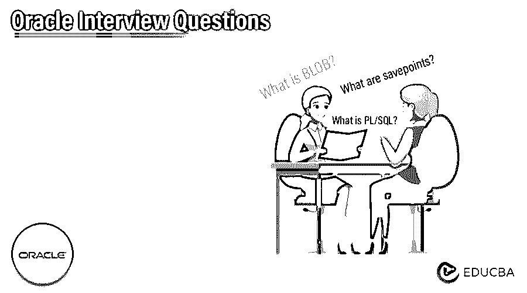

# 甲骨文面试问题

> 原文：<https://www.educba.com/oracle-interview-questions/>

## 甲骨文面试问答简介

学习 SQL 是每个人的必修课。对 SQL 的需求还没有减少，SQL 专业知识在市场上很受重视。有许多供应商提供数据库解决方案，Oracle 是世界上最受欢迎的执行 OLTP(在线事务处理)和 DW(数据仓库)的供应商。

因此，如果你最终在甲骨文找到了你的梦想工作，但不知道如何通过甲骨文的面试，以及 2022 年可能会有哪些甲骨文面试问题。每次面试都不一样，工作范围也不一样。牢记这一点，我们设计了 2021 年最常见的甲骨文面试问题和答案，以帮助您在面试中取得成功。

<small>Hadoop、数据科学、统计学&其他</small>

在本文中，我们将讨论 2022 年甲骨文面试中最常见的问题。这些问题分为以下两部分:

### 第 1 部分—甲骨文面试问题(基础)

第一部分介绍了基本的甲骨文面试问答

#### 1.从下面的 SQL 查询中找到错误？

**回答:** `SELECT Name, YEAR(BirthDate) AS BirthYear
FROM StudentDetails
WHERE BirthYear >= 1998;`
这个查询会在 WHERE 子句上抛出一个错误。尽管在 SELECT 子句中指定了别名，但在 WHERE 子句中却看不到它。正确的代码可以这样写:
`SELECT Name, YEAR(BirthDate) AS BirthYear
FROM StudentDetails
WHERE YEAR(BirthDate) >= 1998;`

#### 2.什么是半连接？如何用 SQL 实现？

**答案:**
Semijoin 返回左表中与右表匹配的记录。即使右表中有多条匹配记录，半连接也会返回左表中的一条记录。它防止重复。可以使用 WHERE EXISTS 子句实现半连接。

#### 3.什么是 PL/SQL？

**答案:**
PL/SQL 是 Oracle 提供的 SQL 之上的过程化语言扩展。它有助于在 SQL 语法中声明变量、函数和条件运算符，从而为开发人员设计复杂的查询提供了更多的自由和便利。

让我们进入下一个甲骨文面试问题。

#### 4.如何处理 PL/SQL 中的错误？

**答:**T3】在 PL/SQL 中，错误条件被称为异常，PL/SQL 错误使用异常块来处理。处理异常的语法如下:
`DECLARE
...
BEGIN
...
EXCEPTION
WHEN exception1 THEN
...
WHEN exception2 THEN
...
WHEN others THEN
...
END;`

#### 5.制约因素是什么？如何在 SQL 中添加命名主键约束？

**答:**
这是甲骨文面试中最常见的面试问题。约束是对数据定义的规则。主键的命名约束可以通过两种方式添加:
1。建表时:
`CREATE TABLE Employees (
Eid int NOT NULL,
Name varchar(255) NOT NULL,
Salary number(8),
Age int,
CONSTRAINT PK_ID PRIMARY KEY (Eid)
);`
2。在 Alter 语句
中`ALTER TABLE Employees
ADD CONSTRAINT PK_ID PRIMARY KEY (Eid);`

#### 6.什么是保存点？

**答案:**
保存点就像标记。当执行长事务时，设置定期保存点是一个很好的编程实践，这样我们就可以在事务失败时回滚到保存点。

让我们进入下一个甲骨文面试问题。

#### 7.BLOB 是什么？

**答案:**
BLOB 是二进制大对象数据类型。它用于存储视频、音频或图像等非结构化数据。在 Oracle 中，一个 BLOB 的最大容量是 4GB-1。

### 第 2 部分—甲骨文面试问题(高级)

现在让我们来看看高级甲骨文面试问题。

#### 8.在下面的代码片段中找到错误，如果有的话？

**答:**
`SELECT student_id s_id, student_name name, birthdate date, student_number s_no FROM students;`
这里，保留关键字‘date’被用作列 birthdate 的别名。此操作在 Oracle SQL 中是非法的。为了将保留的关键字设置为别名，我们可以使用引号。
`SELECT student_id s_id, student_name name, birthdate “date”, student_number s_no FROM students;`

#### 9.编写一个查询来显示用户拥有的表的列表。

**答案:**
查询可以写成:
`SELECT tablespace_name, table_name FROM user_tables;`

#### 10.什么是动态 SQL？何时使用动态 SQL？

**答案:**
动态 SQL 是对静态 SQL 的增强。它支持在运行时编写 SQL 查询。当我们在执行过程中需要定制 SQL 查询时，它就出现了。
可以利用动态 SQL 的几种常见情况:
如果数据库对象在编译时不存在，我们可以使用动态 SQL 来引用它们。
·PL/SQL 中的静态 SQL 不支持某些 DDL(数据定义语言)语句和 SCL(会话控制语言)语句。这些语句可以通过动态 SQL 编程来执行。
动态 SQL 可用于执行动态 PL/SQL 块。通过使用 EXECUTE IMMEDIATE 子句，可以在运行时确定 PL/SQL 调用。

#### 11.什么是数据库触发器？如何创建？

**答案:**
数据库触发器是一个存储的 PL/SQL 块。当满足某些条件时，Oracle 数据库会自动执行它。存储的 PL/SQL 块连接到表、模式或数据库。可以使用 CREATE TRIGGER 子句创建触发器。我们可以使用 ALTER TABLE 或 ALTER TRIGGER 语句的 enable 和 disable 子句来选择启用或禁用它。这是面试中经常被问到的甲骨文面试问题。

让我们进入下一个甲骨文面试问题。

#### 12.说说 SQL 中的集合运算？

**答案:**
UNION、UNION ALL、INTERSECT 和 MINUS 是 Oracle SQL 中不同的集合运算符。UNION 运算符组合两个或更多 SQL 查询的结果，并返回没有重复的结果。UNION ALL 操作符的工作方式与 UNION 操作符相同，同时保留重复的记录。INTERSECT 运算符返回所有查询共有的结果。减号运算符返回第一个查询特有的结果，而第二个查询中没有。

#### 13.以下问题的答案是什么？此外，实现一个修正，使下面的查询行为符合预期。

**答案:**
`SELECT CASE WHEN NULL = NULL THEN 'equals' ELSE 'not equals' END AS ANSWER FROM DUAL;`
这个查询的答案是“不等于”。这是因为使用 is 运算符检查 SQL 中的 NULL 是否相等。对上述查询的修改如下:
`SELECT CASE WHEN NULL IS NULL THEN 'equals' ELSE 'not equals' END AS ANSWER FROM DUAL;`

#### 14.聚结和 NVL 函数的目的是什么？

**答:**
这两个函数都用于检查指定列中的空值，并在空值检查成功的情况下用不同的值替换它。
示例用法:
`SELECT NVL(null, 12) FROM DUAL;
SELECT COALESCE(null, null, 12) FROM DUAL;`
COALESCE 函数可以接受多个参数，而 NVL 可以接受两个参数。

#### 15.HAVING 子句有什么用？

**答案:**
HAVING 子句限制了聚合查询。使用 GROUP BY 子句执行聚合后，我们可以使用 HAVING 子句向结果添加附加条件。

### 最后的想法

通常，Oracle 开发人员应该了解查询的基础知识和高级概念。在这里，我们讨论的问题不仅集中在 SQL 编程的基础上，还集中在理论理解上。快速浏览一下这篇文章会让你更好地准备好在面试中应该做些什么。

### 推荐文章

这是一个甲骨文面试问题和答案的列表，以便候选人可以轻松地回答这些甲骨文面试问题。您也可以阅读以下文章，了解更多信息——

1.  [最有用的集体面试问题|集体面试的 6 个技巧](https://www.educba.com/group-interview/)
2.  [在电话面试中脱颖而出的有效方法](https://www.educba.com/phone-interview/)
3.  [十大最有用的 HBase 面试问题](https://www.educba.com/hbase-interview-questions/)

