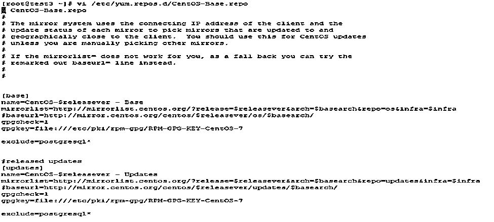
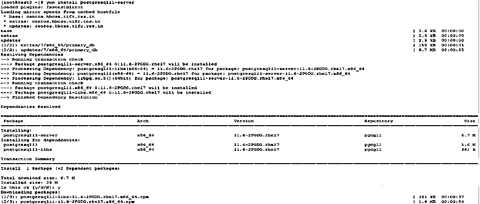
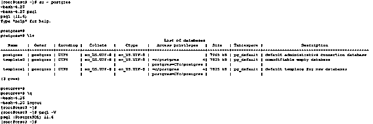

# 安装 PostgreSQL

> 原文：<https://www.educba.com/install-postgresql/>

## 安装 PostgreSQL 简介

以下文章提供了安装 PostgreSQL 的概述。PostgreSQL 是一个对象关系数据库管理系统，它是一个开放源码的数据库管理系统，不属于任何公司或个人。它由在线社区开发者和其他志愿者管理，PostgreSQL 数据库软件于 1990 年中期首次发布。PostgreSQL 数据库软件是用 C 语言编写的，PostgreSQL 的主要竞争对手数据库如 MySQL、MSSQL 和 Oracle DB，PostgreSQL 支持所有数据库特性，也支持 MVCC(多版本并发控制)架构。

### PostgreSQL 安装的先决条件

以下是 PostgreSQL 的先决条件。

<small>Hadoop、数据科学、统计学&其他</small>

1.windows 上的 PostgreSQL 我们需要在 MAC、UNIX 或 Linux 系统上拥有超级用户权限。要在 windows 上安装它，我们需要有管理员权限。

2.要在 windows 上安装，我们需要启用或配置用户帐户控制(UAC)。

3.我们需要有超级用户权限才能在 Linux 上安装它。

4.在运行 SELinux 的系统上安装 PostgreSQL 之前，我们必须在许可模式下将其设置为 SELinux。

5.请在下面的例子中找到在不同环境中设置 SELinux 许可的方法。

*   在安装 PostgreSQL 之前，我们需要将 SELinux 设置为 permissive，请参见下面的命令。

**代码:**

`$ setenforce permissive`

*   安装 PostgreSQL 后，我们需要将 SELinux 设置为强制模式；请找到下面的命令。

**代码:**

`$ Setenforce enforcing`

6.在通过 PostgreSQL enterprise DB 安装程序执行基于控制台的程序之前，我们需要安装 xterm、Konsole 或 genome terminal。

7.对于 Windows 操作系统，我们需要在安装 PostgreSQL 软件之前更新操作系统。如果中途出现错误，我们需要退出并将操作系统版本更新到最新的操作系统版本。

8.我们需要 PostgreSQL 数据库的 RPM (Red hat package manager)来将其安装在类似 Linux 的系统上。

9.我们需要让从 PostgreSQL 的官方网站下载 PostgreSQL RPM 包。

### 在 CentOS 上安装 PostgreSQL 的步骤

让我们详细讨论一下安装 PostgreSQL 的过程。

#### 第一步:

我们使用 CentOS 版来安装 PostgreSQL。

以下是检查 CentOS 版本的命令:

**代码:**

`# cat /etc/Redhat-release`

**输出:**

#### 第二步:

编辑 CentOS base repo(存储库文件)以安装 PostgreSQL DB。

*   我们使用 CentOS 基本存储库在 CentOS 上安装 PostgreSQL。为了从基本存储库中安装 PostgreSQL，我们需要从存储库中排除对它的搜索。
*   然后使用 vi 或 vim 打开存储库文件；我们已经使用 vi 来编辑下面的文件。
*   该文件在存储库中找到 base 和 updates 部分，并在打开存储库文件后按“I”将其插入。
*   然后我们需要在使用 ESC+“wq”保存文件后，在两个部分都插入“Exclude = PostgreSQL*”。

**代码:**

`vi /etc/yum.repos.d/CentOS-Base.repo
[base] name = CentOS-$releasever - Base
mirrorlist =http://mirrorlist.centos.org/?release=$releasever&arch
=$basearch&repo=os&infra=$infra
baseurl = http://mirror.centos.org/centos/$releasever/os/$basearch/
Gpgcheck = 1
Gpgkey = file:///etc/pki/rpm-gpg/RPM-GPG-KEY-CentOS-7
Exclude = postgresql*
released updates
[updates] Name = CentOS-$releasever - Updates
Mirrorlist = http://mirrorlist.centos.org/?release=$releasever&arch
=$basearch&repo=updates&infra=$infra
baseurl = http://mirror.centos.org/centos/$releasever/updates/$basearch/
Gpgcheck = 1
Gpgkey = file:///etc/pki/rpm-gpg/RPM-GPG-KEY-CentOS-7
Exclude = postgresql*`

**输出:**

#### 第三步:

然后，我们需要使用 CentOS 的官方 PostgreSQL 存储库来安装存储库配置包。

**代码:**

`yum install https://download.postgresql.org/pub/repos/yum/reporpms/EL-7-x86_64/pgdg-redhat-repo-latest.noarch.rpm`

执行上述命令后，程序会提示，然后我们按“Y”键确认安装。

**输出:**

#### 第四步:

然后我们使用下面的命令列出所有的包和版本。它将显示所有 PostgreSQL 期望的版本。我们需要 PostgreSQL 11 版本。

**代码:**

`yum list PostgreSQL*`

**输出:**

#### 第五步:

使用以下命令在 CentOS 上安装 PostgreSQL。

*   我们需要安装 PostgreSQL 客户端和 PostgreSQL 服务器来安装 PostgreSQL 数据库。
*   此外，我们需要安装 PostgreSQL libs 包来解决安装 PostgreSQL DB 服务器的依赖性。
*   为了安装这个，我们需要安装如下的软件包。

1.  Postgresql 11 服务器
2.  Postgresql 11
3.  Postgresql 11 库

*   PostgreSQL 11 和 Postgresql 11 libs 是安装 PostgreSQL DB 服务器的依赖包。

**代码:**

`yum install postgresql11-server`

**输出:**

#### 第六步:

安装后，我们需要初始化创建 PostgreSQL 数据库的新数据库集群的步骤。

*   在使用数据库之前，我们需要创建一个 PostgreSQL 数据库集群。
*   PostgreSQL 集群只不过是由单个服务器实例管理的数据库集合。
*   创建数据库集群将创建数据目录和数据库文件的新物理文件。
*   它还将创建目录表，并创建模板 0、模板 1 和 Postgres 数据库。
*   模板 0 和模板 1 数据库用于为用户创建新的数据库。
*   Postgres 数据库是管理用户和应用程序用户连接的默认数据库。
*   下面是初始化 PostgreSQL 数据库集群的命令如下。
*   下面的命令将初始化数据库，数据库文件也初始化管理数据库。

**代码:**

`/usr/pgsql-11/bin/postgresql-11-setup initdb`

**输出:**

#### 第七步:

现在我们需要使用 systemctl 命令启用并启动 PostgreSQL 服务。

**代码:**

`systemctl start postgresql-11
systemctl enable PostgreSQL-11`

**输出:**

#### 第八步:

使用默认身份验证方法登录 PostgreSQL 数据库。

*   默认的 PostgreSQL 数据库使用角色来处理身份验证和授权。
*   默认情况下，它使用 ident 身份验证方法向用户验证数据库。
*   它将管理数据库用户的操作系统认证。
*   默认情况下，该过程创建操作系统级和数据库级用户；它将首次使用 ident 身份验证方法访问数据库。
*   下面是 PostgreSQL 中可用的身份验证方法。

1.  讯息摘要 5
2.  识别
3.  同龄人
4.  轻量级目录访问协议
5.  信任
6.  麻省理工学院开发的安全认证系统

*   下面是第一次访问 PostgreSQL 数据库的过程。

### 结论

这是一个开源的数据库管理系统。它也是一个对象关系数据库管理系统。单个公司或个人无法管理 PostgreSQL 数据库；它由社区开发者或其他志愿者管理。它在关系数据库管理系统中最为流行。

### 推荐文章

这是安装 PostgreSQL 的指南。在这里，我们将讨论在 CentOS 上安装 PostgreSQL 的先决条件和步骤，以及相应的示例。您也可以浏览我们推荐的其他文章，了解更多信息——

1.  [PostgreSQL 数据类型](https://www.educba.com/postgresql-data-types/)
2.  [PostgreSQL 运算符](https://www.educba.com/postgresql-operators/)
3.  [PostgreSQL 删除连接](https://www.educba.com/postgresql-delete-join/)
4.  [PostgreSQL WHERE 子句](https://www.educba.com/postgresql-where-clause/)