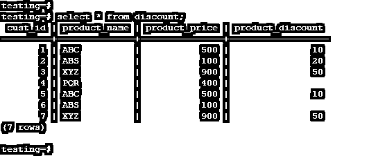
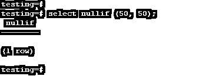
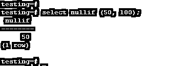
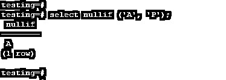

# PostgreSQL NULLIF

> 原文：<https://www.educba.com/postgresql-nullif/>

## PostgreSQL NULLIF 的定义

PostgreSQL nullif 是一种常见的条件表达式，用于处理 PostgreSQL 中的空值或表达式。nullif 还与 coalesce 函数一起使用来处理空值。如果提供的表达式相等，PostgreSQL nullif 函数将返回空值。如果提供的两个表达式相等，那么它提供一个空值；结果，否则，它将返回第一个表达式作为结果。

**语法:**

<small>Hadoop、数据科学、统计学&其他</small>

下面是 nullif 函数的语法。

`Select (Argument1 (First value which is used to handle null values), Argument2 (Second value which is used to handle null values))`

`SELECT Column1, …, ColumnN
COALESCE (
NULLIF (Column_name, ''),   )
FROM table_name;`

**参数:**

*   **Select:** Select 用于使用 PostgreSQL 中的 nullif 函数从表中提取数据。我们可以同时使用多列或单列从表中获取数据。
*   **Coalesce:** Coalesce 声明 PostgreSQL 中函数名，它作为第一个非空值返回。Coalesce 函数在 PostgreSQL 中是必不可少的和有用的。

我们在 PostgreSQL 中使用了 coalesce 函数和 nullif 函数。

*   **参数 1 到参数 2:** 参数只是一个整数或字符值，我们用 nullif 函数传递它。如果我们传递两个参数，并且都包含不同的值，那么 nullif 函数将返回结果中的第一个值。如果我们必须传递相同的值，那么它将在结果中返回一个空值。
*   **第 1 列到第 N 列:**这是表格的列名。如果我们想使用 PostgreSQL 中的 nullif 函数从表中获取数据，我们需要同时传递多个列。此外，我们已经用 PostgreSQL 中的 nullif 函数给出了列名。
*   **From:** From 是 PostgreSQL 中的关键字，与 select 查询中的表名一起使用。
*   **表名:**与 nullif 函数一起使用的表名，用于从表中提取数据。
*   **Nullif:** 用于处理 PostgreSQL 中的空值；nullif 还与 coalesce 函数一起使用来处理空值。如果提供的表达式相等，nullif 函数将返回空值；如果提供的两个表达式相等，那么它提供空值；结果，否则它将返回第一个表达式的结果。

### PostgreSQL 中的 NULLIF 函数是如何工作的？

下面是 PostgreSQL 中 nullif 函数的工作原理。

*   我们可以在 PostgreSQL 中使用 coalesce 函数和 nullif 函数。Coalesce 在 PostgreSQL 中声明函数名，作为结果返回第一个非空值。Coalesce 函数在 PostgreSQL 中是必不可少的和有用的。
*   Nullif 是一个常见的条件表达式，用于处理 PostgreSQL 中的空值或表达式。
*   如果我们传递了两个 nullif 函数参数，并且第一个参数包含一个空值，那么 nullif 函数将在结果中返回第一个值。如果我们传递了相同的值，那么它将在结果中返回一个空值。
*   我们在 PostgreSQL 中使用了 nullif 函数来防止被零除的错误。
*   Nullif 函数用于防止 PostgreSQL 中比较两个值时出现错误。

### PostgreSQL NULLIF 示例

下面是一个 nullif 函数的例子。

*   我们用一个折扣表来描述 nullif 函数的例子如下。
*   下面是折扣表的数据描述，我们已经用它描述了 PostgreSQL 中 nullif 函数的一个例子。

#### 示例#1

`testing=# select * from discount;`

**输出:**

#### 实施例 2

在下面的例子中，我们有像 50 和 50 这样的传递值。Nullif 函数将返回空值，因为我们传递的两个参数是相同的。

`testing=# select nullif (50, 50);`

**输出:**

在上面的示例中，我们将同一个参数传递给 nullif 函数，这样它将返回空值作为结果。

#### 实施例 3

在下面的例子中，我们将值传递为 50 和 100。Nullif 函数将返回第一个值，即 50，因为我们传递的两个参数是不同的。

`testing=# select nullif (50, 100);`

**输出:**

在上面的例子中，我们为 nullif 函数传递了一个不同的参数，这样它将返回第一个值作为结果。

#### 实施例 4

在下面的示例中，我们将值作为 A 传递，P. Nullif 函数将返回第一个值，即 A，因为我们传递的两个参数是不同的。

`testing=# select nullif (‘A’,  ‘P’);`

**输出:**

在上面的例子中，我们为 nullif 函数传递了一个不同的参数，这样它将返回第一个值作为结果。

#### 实施例 5

在下面的例子中，我们必须使用 nullif 函数从折扣表中检索数据。

`testing=# SELECT cust_id, product_name, COALESCE ( NULLIF (Product_price, '')) AS Product_price FROM discount;`

**输出:**

### 推荐文章

这是一个 PostgreSQL NULLIF 的指南。在这里，我们还讨论了介绍和 nullif 函数如何在 PostgreSQL 和不同的例子及其代码实现。您也可以看看以下文章，了解更多信息–

1.  [PostgreSQL 限制](https://www.educba.com/postgresql-limit/)
2.  [PostgreSQL ROLLUP](https://www.educba.com/postgresql-rollup/)
3.  [PostgreSQL 别名](https://www.educba.com/postgresql-alias/)
4.  [PostgreSQL IN 运算符](https://www.educba.com/postgresql-in-operator/)
5.  [PostgreSQL 连载|如何工作？](https://www.educba.com/postgresql-serial/)