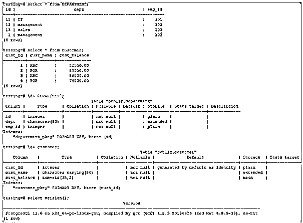
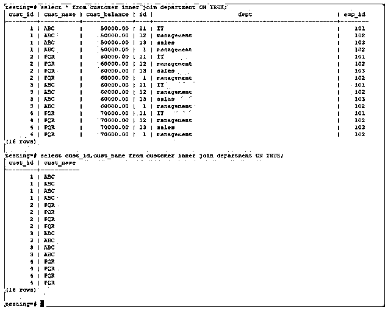
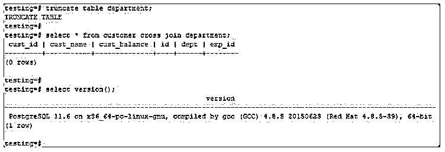
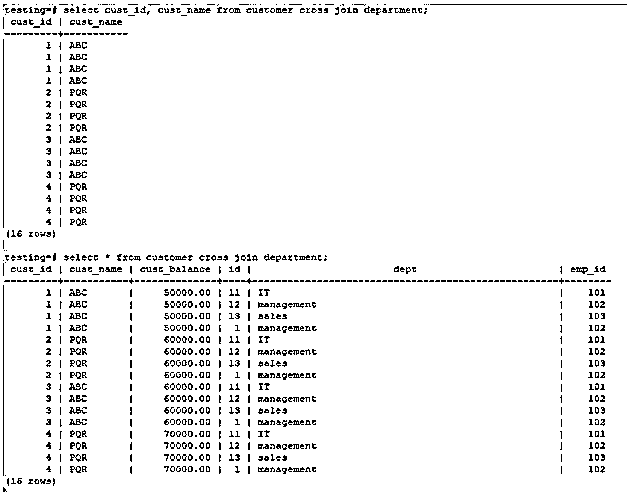

# PostgreSQL 交叉连接

> 原文：<https://www.educba.com/postgresql-cross-join/>

## PostgreSQL 交叉连接简介

PostgreSQL 交叉连接匹配第一个表的每一行和第二个表的每一行。它将显示两个表中的所有列。如果表 1 有 C 列，表 2 有 D 列，那么连接表的结果将有(C+D)列。它将在两个或多个表的两组数据之间创建一个笛卡尔积。它不会维护数据集之间的任何关系。返回两个表相乘的结果，而不是创建关系。它用于连接两个或多个表。

**语法:**

<small>Hadoop、数据科学、统计学&其他</small>

*   它将返回连接集之间行的每个可能组合。
*   结果将使用两个表中的行相乘来显示。

下面是交叉连接的语法如下。

`SELECT column1, column2, … FROM table1 CROSS JOIN table2`

`Select (*) from table1 CROSS JOIN table2`

**描述**

下面给出了上述语法的描述:

*   **列:**用于显示结果的列的名称。我们可以使用一个或多个列来显示结果集中的结果。
*   **Tables:** Tables 用于连接单个结果集中的一个或多个表。
*   **From:** From 用于显示表中的结果，我们在查询中使用该表来显示结果。
*   **星号(*):** 星号(*)用于从选定的表中选择所有列。

### PostgreSQL 交叉连接的工作原理

*   它将在两个数据集或两个数据集表之间创建一个笛卡尔积。
*   它没有维护数据集之间的任何关系。它将返回一个表与第二个表相乘的结果。
*   在 PostgreSQL 中，两个表的交叉连接乘法也称为乘积，因为它将在两个连接的集合之间创建行的组合。
*   连接两个或多个表来检索一组数据是有益的。
*   它会将第一个表格中的行与第二个表格中的行进行匹配。第一个表中的每一行都与第二个表匹配。
*   如果表 1 有一个 ABC 列，表 2 有一个 PQR 列，那么我们使用交叉连接得到的表是(ABC + PQR)。
*   它用于实现两列或更多列的笛卡尔积。
*   在联接一个或多个表的 join 子句中没有任何匹配条件。它将使用表的乘法条件进行匹配；它只是将表 1 中的一列与表 2 中的一列进行匹配。
*   如果我们必须在 table1 和 table2 的 PostgreSQL 中实现交叉连接，table 1 的每一行都将与第二个表的每一行匹配。
*   它由表 1 和表 2 中的所有列组成。它将表 1 和表 2 中的行相乘。
*   假设我们需要说明结果集中的真实条件。使用内部联接。
*   下面是在 PostgreSQL 交叉连接中使用内部连接评估真条件的示例。
*   如果两个表都没有我们想要的输出行，我们就不能使用 PostgreSQL 交叉连接。这时候就需要用全联接来刺激产出了。
*   它用于从两个或多个表中返回多个行组合。
*   当我们希望对两个表中的每一行进行比较时，就会用到它。
*   PostgreSQL 交叉连接的工作原理与 SQL 运算符相同，即在两个不同的表之间执行笛卡尔乘积运算。
*   它是一个笛卡尔积，所以在结果集操作中不允许任何条件。我们只能限制 where 条件。
*   为了避免这种情况，我们可以在 PostgreSQL 中使用 Inner join 或 full join。
*   实现笛卡尔积的结果是必要的。
*   内部连接用于评估 PostgreSQL 交叉连接中的真条件结果。
*   例如，我们使用客户和部门表来描述交叉连接。

请参见下图 1。

#### 示例#1

使用内部连接的真条件评估。

**语法:**

` * from table1 inner join table2 ON TRUE;`

`Select column1, column2, … table1 inner join table2 ON TRUE;`

**代码:**

`select * from customer inner join department ON TRUE;`

`select cust_id, cust_name from customer inner join department ON TRUE;`

#### 实施例 2

我们可以使用交叉连接和 where 条件来过滤 PostgreSQL 中的数据。

下面是 where 子句和交叉连接的查询和语法。

**语法:**

`Select table1.column_name, table2.column_name, table1.column_name, table2.column_name from table1, table2 where table1.column_name = table2.column_name condition;`

**代码:**

`select customer.cust_id, department.id, customer. cust_name, department.dept from customer, department where customer.cust_id = department.id and cust_id=1;`

**图 3:** 交叉连接和 where 条件的例子

*   在上面的查询中，PostgreSQL 查询规划器意识到我们正在 customer 和 department 表之间进行内部连接。但是我们在上面的查询中使用交叉连接来获取客户和部门表之间的结果。
*   交叉联接是使用两个表实现的，并且具有值；如果一个表是空的，那么两个表的连接结果也是空的，因为它将第一个表的行与第二个表的行相乘。

### PostgreSQL 交叉连接示例

我们可以使用各种条件实现交叉连接，比如(where 子句)。

#### 例子

下面是一个交叉连接的例子。

**代码:**

`truncate table department;`

`select * from customer cross join department;`

使用第二个表进行交叉连接的例子是空的。在我们的情况下，我们使用了没有行的部门表。

*   在上面的例子中，customer 表包含行，但是 department 表是空的；它不包含任何行，所以交叉连接的结果是空的结果集。

**代码:**

`select cust_id, cust_name from customer cross join department;`

`select * from customer cross join department;`

### 结论

它用于生成两组表的笛卡尔积结果。在单个结果集中连接一个或多个表是很重要的。如果我们需要两个表的多个组合结果，那么我们使用交叉连接。

### 推荐文章

这是 PostgreSQL 交叉连接的指南。这里我们讨论了 PostgreSQL 交叉连接的基本概念、描述、工作和示例。您也可以看看以下文章，了解更多信息–

1.  [PostgreSQL 数据类型](https://www.educba.com/postgresql-data-types/)
2.  [PostgreSQL 字符串函数](https://www.educba.com/postgresql-string-functions/)
3.  [PostgreSQL WHERE 子句](https://www.educba.com/postgresql-where-clause/)
4.  [PostgreSQL |中的索引如何创建？](https://www.educba.com/indexes-in-postgresql/)
5.  [PostgreSQL 视图完整指南](https://www.educba.com/postgresql-views/)