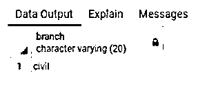

# PostgreSQL 插入到

> 原文：<https://www.educba.com/postgresql-insert-into/>

## PostgreSQL 简介插入到

PostgreSQL 提供了一个插入操作，我们称之为 INSERT INTO 语句。Insert into 语句执行数据库管理系统中的基本功能。借助 insert into 语句，我们可以一次将单个记录或多个记录插入到数据库表中。在插入操作之前，我们只需要一个表，没有表的创建我们就无法执行 insert into 语句。Insert into 属于数据操作类别。操作命令集用于操作存储在数据库中的数据。在 insert into 语句下，我们可以对表执行不同的操作。

**语法:**

<small>Hadoop、数据科学、统计学&其他</small>

`INSERT       INTO   SPECIFIED     TABLE NAME   (COLUMN NAME 1,    COLUMN NAME 2,         COLUMN NAME 3 .............              COLUMN NAME N)       VALUES      (VALUE 1,        VALUE 2,         VALUE 3, .................. VALUE N);`

**说明:**

*   在上面的语法中，insert into、values 是关键字，table name 表示我们需要在列名之后插入数据的指定表名，column name 表示我们需要在表中插入数据的指定列名，value 表示我们需要在表中插入的实际值。
*   用逗号分隔的列和值。如果数据是一个字符串，那么使用双反逗号。

### PostgreSQL INSERT INTO 语句如何工作？

*   我们必须在系统中安装 PostgreSQL。
*   我们需要关于 PostgreSQL 的基础知识。
*   我们必须需要表来执行插入操作。

插入语句的不同方法如下:

让我们使用 create table 语句创建一个表来执行 insert into 语句。所以我们使用下面的语句来创建一个表。

**语法:**

`create table               table name                ( column name_1      data type             (null | not null),          column name_2          data type ( null | not null),…………….  Column name_N);`

**说明:**

*   在上面的语法中，create table 是关键字，table name 表示我们需要创建的新表名，column name 1 和 2 指定了表中的列名以及数据类型和运算符。
*   我们使用逗号来分隔列名。

**举例:**

**代码:**

`CREATE TABLE            emp_info       (
emp_id                     INT PRIMARY KEY       NOT NULL,
emp_name               TEXT                           NOT NULL,
emp_age                  INT                             NOT NULL,
address                    CHAR(50),
salary                       REAL);`

**说明:**

*   在上面的语句中，我们使用 create table 语句创建了一个表名 emp_info。在 emp_info 表中，我们用不同的数据类型创建了 5 列，如 emp_id、emo_name、emp_age、emp_address 和 salary，我们还将 emp_id 定义为具有非空约束的主键，并且我们对 salary 列使用真实数据类型，因为 salary 可能是浮点数。
*   通过使用下面的快照来说明上述声明的最终结果。

**输出:**

**现在我们使用以下方法在表上执行 insert into 语句。**

基本上，我们使用如下两种方法进行插入操作:

#### 1.单行插入操作。

在单行插入操作中，我们可以在表中一次插入一行。

**语法:**

`Inset    into    table name                (column 1, column 2, …………………column n ) values                    (value 1, value 2, …………….value n);`

**说明:**

*   在上面的语法中，其中 insert into 是一个关键字，其中表名是指定的表名，表中第 1 列、第 2 列、第 n 列的列名和值意味着我们需要插入。

**举例:**

**代码:**

`INSERT INTO               emp_info                    (emp_id,         emp_name,             emp_age,                   address,                      salary)
VALUES           (1,        'poll',  28,      'london',        30000.00);`

**说明:**

*   在上面的语句中，表名是 emp_info，我们已经用上面的列创建了这个表，所以我们需要在这个表中添加值。
*   通过使用下面的快照来说明上述声明的最终结果。

**输出:**

#### 2.多行插入操作。

在此方法中，我们使用以下语法一次插入多行。

**语法:**

**代码:**

`Inset    into    table name                (column 1, column 2, …………………column n ) values                    (value 1,         value 1, …………….value n),
(value 2,          value 2, …………….value n),
(value 3,          value 3, …………….value n);`

**说明:**

*   假设我们需要一次插入多行，这一次我们类似地使用上面的语法，其中 insert into 是关键字，表名是指定的表名，column 1 是我们需要插入的表值中的列名。
*   用逗号分隔的列名和值。

**举例:**

**代码:**

`INSERT INTO                     emp_info                           (emp_id,             emp_name,               emp_age, address,         salary)
VALUES               (2,          'alex',   30,        'Hongkong',      40000.00),
(3,          'john',  35,        'Newyork',          50000.00),
(4,          'bob',    32,        'Sydney',            20000.00);`

**说明:**

*   在上面的例子中，我们有 emp_info 表，emp_id、emp_name、e、p_age、address 和 salary 是表中需要插入数据的列名，values 用于在列中插入值。
*   如果数据是一个字符串，那么使用双反逗号。
*   通过使用下面的快照来说明上述声明的最终结果。

**输出:**

使用以下语句执行 insert into 语句的另一种方法。

**举例:**

**代码:**

`INSERT INTO                     emp_info      VALUES      (8,         'paul',  30,        'perth',        40000.00);`

**说明:**

*   在上面的语句中，我们将值直接插入到表中，而不使用列名。
*   通过使用下面的快照来说明上述声明的最终结果。

**输出:**

获取表中的最后一个插入行。

为了获得表中最后插入的行，我们使用下面的语句。

**代码:**

`insert                   into                       college                (branch,             no_of_student)               values ('civil',                   60)        returning           branch;`

**说明:**

*   在上面的语句中，我们将表名创建为 college 和两列分支以及学生编号，并将值 civil in-branch 列和 60 插入到学生编号中，返回分支用于知道表中最后插入的分支。返回子句的结果与 select 子句类似。
*   通过使用下面的快照来说明上述声明的最终结果。

**输出:**

**

** 

**输出批注消息:**

*   **Insert oid 1:** 以上消息的意思是，它只返回一行。
*   **插入 0 #:** 上面消息的意思是，它返回多行。#用于显示插入的行数。

### 结论

从上面的文章中，我们看到了 insert into 语句的基本语法，然后我们还看到了如何通过使用不同的方法来使用 insert into 语句，例如单行、多行和示例。从本文中，我们看到了如何正确处理 insert into 语句。

### 推荐文章

这是一个指导 PostgreSQL 插入到。这里我们讨论一下 PostgreSQL INSERT INTO 语句的介绍和工作原理？您也可以看看以下文章，了解更多信息–

1.  [修改 PostgreSQL 中的列](https://www.educba.com/alter-column-in-postgresql/)
2.  [PostgreSQL 删除数据库](https://www.educba.com/postgresql-drop-database/)
3.  [PostgreSQL DDL](https://www.educba.com/postgresql-ddl/)
4.  [PostgreSQL 为空](https://www.educba.com/postgresql-is-null/)