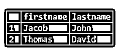
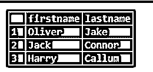

# PostgreSQL WHERE 子句

> 原文：<https://www.educba.com/postgresql-where-clause/>

## PostgreSQL WHERE 子句介绍

PostgreSQL WHERE 子句用于控制查询。WHERE 子句从输出中删除不符合条件的所有行。它通常与 SELECT、UPDATE 和 DELETE 语句一起使用来过滤结果。只有当条件满足时，它才返回特定的结果。WHERE 子句在从表中提取数据或联接多个表时指定条件。WHERE 条件可以与逻辑运算符一起使用，例如>、

**语法**:

<small>Hadoop、数据科学、统计学&其他</small>

`WHERE search_conditions`

**参数:**

| **参数** | **描述** |
| 搜索条件 | 一个值表达式。它返回一个布尔类型的值。 |

### PostgreSQL 中的 WHERE 子句是如何工作的？

条件必须评估为真、假或未知。它可以是布尔表达式，也可以是使用 AND 和 or 运算符的布尔表达式的组合。该查询返回满足 WHERE 子句中条件的行。换句话说，只有导致该条件的行。

如果其中一个条件为空，则检查 OR 条件，如下所示:

`WHERE {user_id} IS NULL OR sr.user_id = {user_id}`

WHERE 子句的计算如下:

如果 user_id 为空，那么 WHERE 子句的计算结果为 true 因此没有过滤。如果 user_id 不为空，它将检查下一个 OR 条件。

### PostgreSQL WHERE 子句示例

让我们用一些例子来练习使用 WHERE 子句的条件。我们将使用学生桌。

**创建表格**

**代码**:

`CREATE TABLE student (
rollno int PRIMARY KEY,
firstname VARCHAR (50) NOT NULL,
lastname VARCHAR (50) NOT NULL,
branch VARCHAR (50) NOT NULL,
result boolean,
joining_date DATE NOT NULL
);`

**插入数据**

**代码:**

`INSERT INTO student (rollno, firstname, lastname, branch, result, joining_date)
values
('101', 'Oliver','Jake', 'Civil', false, '2020-06-01'),
('102', 'Jack','Connor', 'Civil', false, '2020-06-01'),
('103', 'Harry','Callum', 'Civil', false, '2020-06-01'),
('104', 'Jacob','John', 'Civil', false, '2020-06-01'),
('105', 'Thomas','David', 'Civil', false, '2020-06-01');
SELECT * FROM student;`

表中提供的数据:

#### 示例 1–等号(=)运算符

如果你想让所有名字是“托马斯”的学生

**代码:**

`SELECT lastname, firstname
FROM student
WHERE firstname = 'Thomas';`

**输出:**

#### 示例 2–AND 运算符

以下示例通过使用 and 逻辑运算符组合两个布尔表达式来查找名为 Thomas、姓为 David 的学生。

**代码:**

`SELECT lastname, firstname
FROM student
WHERE firstname = 'Thomas' AND lastname = 'David';`

**输出:**

#### 示例 3–OR 运算符

此示例使用 or 运算符查找“姓氏”为“David”或“名字”为“Jacob”的学生。

**代码:**

`SELECT firstname, lastname
FROM student
WHERE lastname = 'David' OR firstname = 'Jacob';`

**输出:**

#### 示例# 4–输入运算符

如果要将一个字符串与列表中的任何字符串进行匹配，可以使用 in 运算符。例如，以下语句返回“名字”为“奥利弗”、“杰克”、“哈里”的学生

**代码:**

`SELECT firstname, lastname
FROM student
WHERE firstname IN ('Oliver', 'Jack', 'Harry');`

**输出:**

#### 示例 5–LIKE 运算符

要查找与指定模式匹配的字符串，可以使用 LIKE 运算符。以下示例返回姓名以字符串“Ja”开头的所有学生。

**代码:**

`SELECT firstname, lastname
FROM student
WHERE firstname LIKE 'Ja%';`

**输出:**

%被称为匹配任何字符串的通配符。“Ja%”模式匹配任何以“Ja”开头的字符串。

#### 示例 6–操作员之间

以下示例使用 between 运算符查找名字以字母 J 开头且长度在 3 到 5 之间的学生。请注意，如果某个值在某个值范围内，BETWEEN 运算符将返回 true。

**代码:**

`SELECT firstname, LENGTH (firstname) namelength
FROM student
WHERE firstname LIKE 'J%' AND   LENGTH (firstname) BETWEEN 3 AND 5
ORDER BY namelength;`

**输出:**

在这个例子中，我们用 LENGTH()函数返回输入字符串的字符数。

#### 示例 7–不等于运算符(<>)或(！=)

本示例查找名字以“Ja”开头而姓氏不是 John 的学生。'

**代码:**

`SELECT firstname, lastname
FROM student
WHERE firstname LIKE 'Ja%' AND lastname <> 'John';`

**输出:**

注意，可以用！=运算符而不是<>运算符。它们具有相同的效果。

#### 示例 8–组合 AND 和 OR 条件

执行以下查询

**代码:**

`SELECT *
FROM student
WHERE (lastname = 'David' AND firstname = 'Thomas') OR (rollno >= 103);`

**输出:**

#### 示例 9–连接表

执行以下查询

**代码:**

`SELECT student.firstname, temp_student.result
FROM student
INNER JOIN temp_student
ON student.rollno = temp_student.rollno
WHERE student.firstname = 'Oliver';`

**输出:**

上面的 WHERE 子句用于在单个 SELECT 语句中将多个表连接在一起。该 SELECT 语句将返回基于 rollno 的 student 和 temp_student 表中有匹配记录的所有 firstname 和 result 值，并且 firstname 是“David”。

### 结论

PostgreSQL WHERE 子句与**的**select、INSERT、UPDATE 或 DELETE 语句一起使用来过滤行。本文旨在向您介绍 PostgreSQL 中的 where 子句。

### 推荐文章

这是一个 PostgreSQL WHERE 子句的指南。在这里，我们讨论介绍，在 PostgreSQL 中 WHERE 子句如何工作以及相应的例子。您也可以浏览我们推荐的其他文章，了解更多信息——

1.  [Python 魔法](https://www.educba.com/python-magic-method/)
2.  [Unix 操作员](https://www.educba.com/unix-operators/)
3.  [PowerShell Set-Location](https://www.educba.com/powershell-set-location/)
4.  [Matlab 和运算符](https://www.educba.com/matlab-and-operator/)
5.  [Matlab 或运算符|工作|示例](https://www.educba.com/matlab-or-operator/)
6.  [具有特性的 PostgreSQL 版本](https://www.educba.com/postgresql-versions/)
7.  [学习 PostgreSQL 架构](https://www.educba.com/postgresql-architecture/)
8.  [SQL 主键完整指南](https://www.educba.com/primary-key-in-sql/)
9.  [PostgreSQL |中的索引如何创建？](https://www.educba.com/indexes-in-postgresql/)