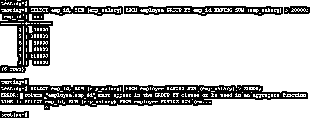

# PostgreSQL 有

> 原文：<https://www.educba.com/postgresql-having/>

## PostgreSQL HAVING 简介

PostgreSQL having 子句用于设置条件，在 group by 子句创建的行组中，我们将 having 子句与 where 条件一起应用于单行。我们不使用不带 group by 子句的子句来过滤不满足条件的行组。我们也可以使用 having 子句，而不使用 PostgreSQL 中的 where 和 group by 子句。在 select a 查询中使用 Having 子句从具有指定条件的表中提取数据。

**语法**

<small>Hadoop、数据科学、统计学&其他</small>

下面是 PostgreSQL having 子句的语法。

`SELECT  column_name1, column_name2, Column_nameN`

(用于提取的列名。表中的数据)aggregate_function(与 having 子句一起使用的聚合函数)(column_name) table_name(用于从表中提取数据的表名)group by(通过使用 GROUP BY 和 having 子句提取数据)Column_name HAVING 条件；

`SELECT expression1, expression2, ... expressionN`

(列名用于取数据)，aggregate _ function(expression)FROM table _ name[WHERE conditions]GROUP BY expression 1，expression2，表达式有条件；

### 因素

下面是对上述语法的参数描述如下:

*   **Select:** Select 用于使用 having 子句从表中选择数据
*   列名 1 到列名 N:我们必须使用 having 子句从指定的列中获取数据
*   **Having 子句:**我们没有使用不带 group by 子句的 Having 子句来过滤不满足条件的行组。我们也可以使用 having 子句，而不使用 PostgreSQL 中的 where 和 group by 子句。
*   **聚合函数:**我们在 PostgreSQL 中使用了带有 having 子句的聚合函数。我们使用 having 子句使用了 SUM、MIN、MAX、AVG 等聚合函数。
*   **表名:**表名用于使用 having 子句从指定的表名中获取数据
*   **Condition:** 我们使用了一个条件语句，通过 where 子句从表中提取数据。
*   **Group by:**Group by 子句在 PostgreSQL 中与 having 子句一起使用。没有 group by 子句，就不能使用 having 子句；在 PostgreSQL 中使用 group by 子句之前，我们需要定义 having 子句。
*   **表达式 1 到表达式 N:** 表达式只不过是用于从表中获取数据的列名。

### PostgreSQL HAVING 子句是如何工作的？

下面是工作:

*   在 PostgreSQL 中，group by 子句与 having 子句一起使用。没有 group by 子句，就不能使用 having 子句；在 PostgreSQL 中使用 group by 子句之前，我们需要定义 having 子句。
*   在下面的例子中，我们从雇员表中检索数据。在第一个示例中，我们在 having 子句中使用了 group by 子句，而在 having 子句中使用 group by 子句时，检索到的数据没有错误。
*   在第二个示例中，它将显示一个错误，即“ERROR: column "employee.emp_id "必须出现在 GROUP BY 子句中或用于聚合函数中。

**代码:**

`SELECT emp_id, SUM (emp_salary) FROM employee GROUP BY emp_id HAVING SUM (emp_salary) > 20000;
SELECT emp_id, SUM (emp_salary) FROM employee HAVING SUM (emp_salary) > 20000;`

**输出:**

*   我们需要在 having 子句中使用 group by 子句的例子。
*   PostgreSQL having 子句用于设置由 group by 子句创建的行组的条件。
*   在 group by 子句之后，我们对单行应用 having 子句 with where 条件。
*   我们也可以使用 having 子句，而不使用 PostgreSQL 中的 where 和 group by 子句。在 select 查询中使用 Having 子句从具有指定条件的表中提取数据。
*   Having 子句在 PostgreSQL 中非常重要和有用，它使用指定的条件从表中提取数据。

我们使用了下面的聚合函数，通过 having 子句从表中检索数据。

*   总和
*   部
*   马克斯(男子名ˌ等于 Maximilian)
*   AVG
*   数数

我们没有使用不带 group by 子句的子句来筛选不满足条件的行组。

### 在 PostgreSQL 中实现 HAVING 的示例

下面是一个例子。使用 employee 表来描述 PostgreSQL 中有一个子句的示例如下。

#### 1.使用 SUM 函数

在下面的例子中，我们使用 having 子句从 employee 表中检索数据。我们从雇员表中检索数据，该表的工资超过 30000 英镑。

**代码:**

`SELECT emp_id, SUM (emp_salary) FROM employee GROUP BY emp_id HAVING SUM (emp_salary) > 30000;`

**输出:**

**说明:**PostgreSQL 中使用 SUM aggregate 函数拥有子句的例子。

#### 2.使用计数功能

以下示例显示了员工 id 大于 1 的员工薪金的总和

**代码:**

`SELECT emp_name, SUM (emp_salary) FROM employee GROUP BY emp_name HAVING count (emp_id) > 1;`

**输出:**

**说明:**PostgreSQL 中使用 count aggregate 函数拥有子句的例子。

#### 3.使用 Avg 函数

以下示例显示了雇员薪金的总和，其中雇员薪金大于 10000。

**代码:**

`SELECT emp_name, SUM (emp_salary) FROM employee GROUP BY emp_name HAVING count (emp_salary) > 10000;`

**输出:**

**解释:**在 PostgreSQL 中使用 AVG 函数拥有子句的例子。

#### 4.使用最小值函数

以下示例显示了雇员薪金的最小值，其中雇员薪金大于 10000。

**代码:**

`SELECT emp_name, MIN (emp_salary) FROM employee GROUP BY emp_name HAVING count (emp_salary) > 10000;`

**输出:**

**说明:**PostgreSQL 中使用 MIN 函数拥有子句的例子。

#### 5.使用 MAX 函数

以下示例显示了员工薪金的最大值，其中员工薪金大于 10000。

**代码:**

`SELECT emp_name, MAX (emp_salary) FROM employee GROUP BY emp_name HAVING count (emp_id) > 1;`

**输出:**

**说明:**PostgreSQL 中使用 MAX 函数拥有子句的例子。

### 在 PostgreSQL 中使用 HAVING 的优势

以下是优点:

*   Having 子句用于从一组结果中有条件地检索结果。
*   Having 子句用于数据分组，而 where 子句用于单行数据。
*   我们需要在使用 PostgreSQL 中的 having 子句检索数据之前定义组。
*   Having 子句允许从特定的行中获取数据，其中相同的行符合某些条件。
*   Having 子句与 grouping 子句一起使用；在 PostgreSQL 中，如果没有分组子句，它就不能使用。

### 结论

在 PostgreSQL 中，拥有一个子句对于从指定的表中获取数据非常重要。PostgreSQL having 子句用于设置由 group by 子句创建的一组行的条件，我们对单行应用 having 子句和 where 条件。

### 推荐文章

这是一个 PostgreSQL 的使用指南。在这里，我们讨论语法，研究 PostgreSQL 中的一个子句，并举例说明其实现和优点。您也可以浏览我们的其他相关文章，了解更多信息——

1.  [PostgreSQL ROLLUP](https://www.educba.com/postgresql-rollup/)
2.  [PostgreSQL IN 运算符](https://www.educba.com/postgresql-in-operator/)
3.  [PostgreSQL 偏移量](https://www.educba.com/postgresql-offset/)
4.  [PostgreSQL NOW 指南()](https://www.educba.com/postgresql-now/)
5.  [PostgreSQL 随机|示例](https://www.educba.com/postgresql-random/)