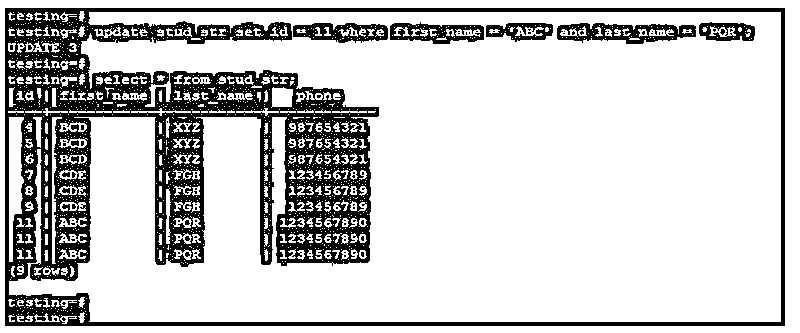
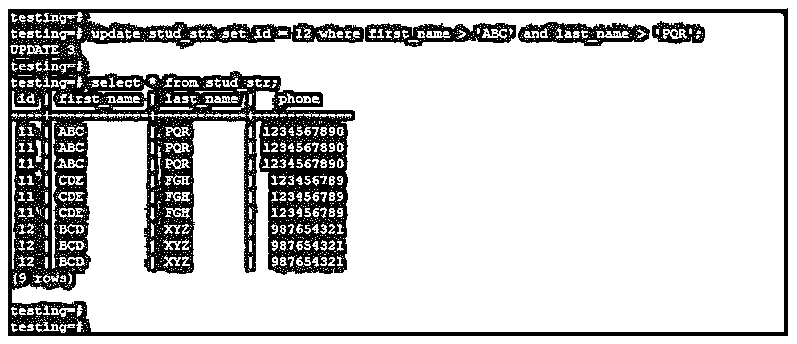
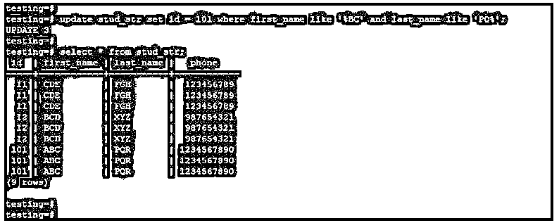
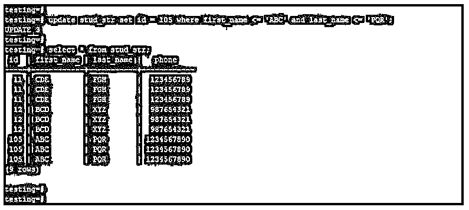

# PostgreSQL 比较字符串

> 原文：<https://www.educba.com/postgresql-compare-strings/>

## PostgreSQL 比较字符串简介

PostgreSQL 比较字符串比较两个字符串并返回结果，因为我们已经指定了输入，我们还可以在 PostgreSQL 中使用比较字符串来更新行。我们可以使用 PostgreSQL 中的 like 子句比较字符串，也可以使用=，！=，<>，，<= and > =字符串运算符。基本上，PostgreSQL 中的字符串运算符用于比较字符串，并在查询中指定输入时返回结果。PostgreSQL 中的比较运算符将两个字符串值相互比较，并检索或更新行。

### 如何在 PostgreSQL 中比较字符串？

我们在 PostgreSQL 中使用 like 和比较运算符来比较两个字符串。比较运算符在比较两个字符串时非常有用。我们使用 stud_str 表来描述 PostgreSQL 中的比较字符串示例，如下所示。

<small>Hadoop、数据科学、统计学&其他</small>

下面是 stud_str 表的表格和数据描述。

**代码:**

`select * from stud_str;
\d+ stud_str;`

**输出:**

下面是我们在 PostgreSQL 中比较字符串时使用的比较运算符。

*   **<(小于):**当左串小于右串时返回真值。
*   **>(大于):**当左串大于右串时返回真值。
*   **< =(小于等于):**当左串小于等于右串时返回真值。
*   **> =(大于):**当左串大于等于右串时返回真值。
*   **< >或者！=(不相等):**当给定的字符串彼此不相等时，返回真值。
*   **= (Equal):** 当两个字符串相同且类型相同时，返回真值。

### PostgreSQL 比较字符串的示例

下面是提到的例子:

#### 示例#1

使用相等运算符比较字符串。

*   我们可以使用等式运算符来比较字符串。下面的例子显示了我们使用等式运算符比较字符串，并使用选择操作检索结果。
*   在下面的示例中，我们比较了字符串 ABC 和 PQR，以从 stud_str 表中检索结果。

**代码:**

`select * from stud_str where first_name = 'ABC' and last_name = 'PQR';`

**输出:**

*   下面的例子显示我们正在比较字符串并使用更新操作更新行。
*   在下面的示例中，我们将字符串 ABC 与 PQR 进行了比较，以更新 stud_str 表中的行。

**代码:**

`update stud_str set id = 11 where first_name = 'ABC' and last_name = 'PQR';
select * from stud_str;`

**输出:**

#### 实施例 2

使用大于运算符比较字符串。

*   我们可以使用大于运算符来比较字符串。下面的例子显示了我们使用大于运算符比较字符串，并使用选择操作检索结果。

**代码:**

`select * from stud_str where first_name > 'ABC' and last_name > 'PQR';`

**输出:**

*   下面的示例显示了我们使用大于运算符比较字符串，并使用更新操作更新行。

**代码:**

`update stud_str set id = 12 where first_name > 'ABC' and last_name > 'PQR';
select * from stud_str;`

**输出:**

#### 实施例 3

使用 like 运算符比较字符串。

*   我们可以使用 like 运算符来比较字符串。下面的例子显示了我们使用 like 操作符比较字符串，并使用 select 操作检索结果。

**代码:**

`select * from stud_str where first_name like '%BC' and last_name like 'PQ%';`

**输出:**

*   下面的例子显示了我们使用 like 操作符比较字符串，并使用 update 操作更新行。

**代码:**

`update stud_str set id = 101 where first_name like '%BC' and last_name like 'PQ%';
select * from stud_str;`

**输出:**

#### 实施例 4

使用小于运算符比较字符串。

*   我们可以使用小于运算符来比较字符串。下面的例子显示了我们使用小于运算符比较字符串，并使用选择操作检索结果。

**代码:**

`select * from stud_str where first_name < 'ABC' and last_name < 'PQR';`

**输出:**

#### 实施例 5

使用小于等于运算符比较字符串。

*   我们可以使用小于等于运算符来比较字符串。下面的例子显示了我们使用小于等于运算符比较字符串，并使用选择操作检索结果。

**代码:**

`select * from stud_str where first_name <= 'ABC' and last_name <= 'PQR';`

**输出:**

*   下面的示例显示我们使用小于等于运算符比较字符串，并使用更新操作更新行。

**代码:**

`update stud_str set id = 105 where first_name <= 'ABC' and last_name <= 'PQR';
select * from stud_str;`

**输出:**

#### 实施例 6

使用大于等于运算符比较字符串。

*   我们可以使用大于等于运算符来比较字符串。下面的示例显示了我们使用大于等于运算符比较字符串，并使用选择操作检索结果。

**代码:**

`select * from stud_str where first_name >= 'ABC' and last_name >= 'PQR';`

**输出:**

### 结论

我们已经用过=，！=，<>，，<= and > =比较 PostgreSQL 中字符串的比较运算符。我们还使用 like 运算符来比较字符串。我们已经使用 PostgreSQL 中的 select 和 update 操作比较了该字符串。

### 推荐文章

这是一个 PostgreSQL 比较字符串的指南。这里我们讨论一下入门，PostgreSQL 中如何比较字符串？和示例。您也可以看看以下文章，了解更多信息–

1.  [PostgreSQL 递归查询](https://www.educba.com/postgresql-recursive-query/)
2.  [hstore in PostgreSQL](https://www.educba.com/hstore-in-postgresql/)
3.  [PostgreSQL 解码()](https://www.educba.com/postgresql-decode/)
4.  [PostgreSQL 内部连接](https://www.educba.com/postgresql-inner-join/)