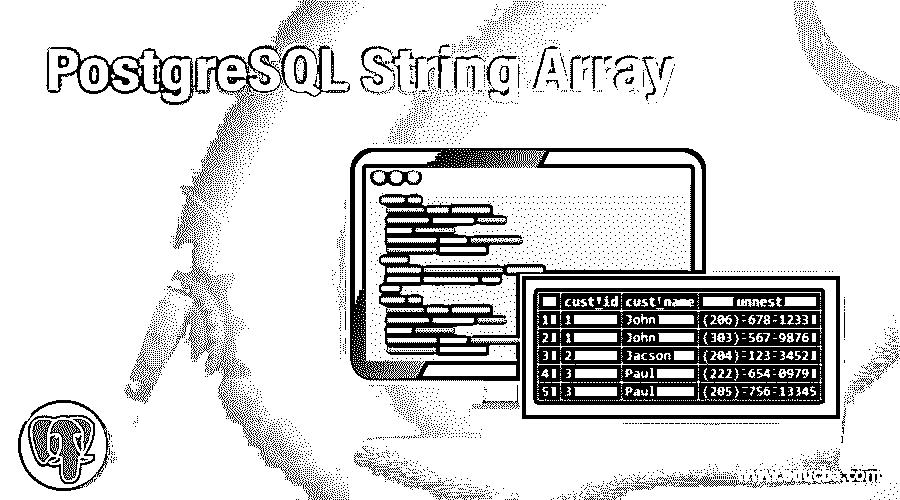
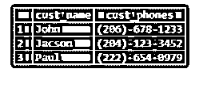
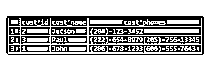
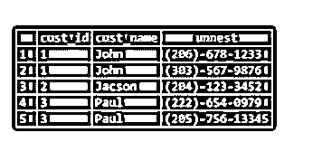

# PostgreSQL 字符串数组

> 原文：<https://www.educba.com/postgresql-string-array/>

## PostgreSQL 字符串数组简介

PostgreSQL 提供不同类型的数据类型。字符串数组是 PostgreSQL 提供的数据类型之一，数组是用户自定义的数据类型或内置的数据类型。PostgreSQL 数组在数据库系统中起着重要的作用，PostgreSQL 提供了一个将列定义为任意有效数据类型的数组的工具，数组应该是 integer []类型，character []类型。有时我们需要创建自己的数据类型。当时 PostgreSQL 在后端创建了一个等价的数组数据类型。我们可以使用一组数据类型对字符串执行不同的操作。

### 句法

`create table                            table_name                           (column 1 data type [], column 2 data type []………..,                                                  column n data type[]);`

<small>Hadoop、数据科学、统计学&其他</small>

**解释**

在上面的语法中，我们可以在创建表时声明一个字符串数组数据类型。其中，表名是我们需要创建的指定表名，第 1 列、第 2 列和第 n 列声明为数组数据类型，用逗号分隔。

### 如何在 PostgreSQL 中创建字符串数组？

1.  我们必须在您的系统中安装 PostgreSql。
2.  我们需要关于 PostgreSql 的基础知识。
3.  我们必须要求表执行字符串数组操作。

### 字符串数组的运算

我们可以对字符串数组执行不同的操作，如下所示。

为了执行数组操作，我们需要一个表，所以首先，我们使用下面的语句创建一个表。

`CREATE TABLE                        customer                    (cust_id serial PRIMARY KEY,
cust_name VARCHAR (100),                                             cust_phones TEXT []);`

**说明:**

在上面的语句中，我们创建了一个名为 customer 的表，其中包含三列，如数据类型为 integer 的 cust_id、数据类型为 varchar 的 cust_name 和数据类型为 text (string)的 cust_phones。

#### 1.插入字符串数组操作

在这个操作中，我们可以使用下面的语法将一个字符串数组插入到表中。

**语法**

`Insert into                   table name                 (column name1, column name 2, ………….column nameN) values (value1 ARRAY[], value2 ARRAY[],…………valueN );`

**解释**

在上面的语法中，其中 insert into 是关键字，column name1，column name2 是表中指定的列名，values 表示我们需要插入到表中的实际字符串数组值。

**例子**

现在使用下面的语句在上表中执行插入操作。

`Insert into                   customer                     ( cust_name,              cust_phones)
values                          ('John',             ARRAY [ '(206)-678-1233',      '(303)-567-9876' ]);`

**解释**

在上面的语句中，我们向表中插入了一条记录。看到客户名称是 john，我们为 john 客户插入了两个电话号码。电话实际上是一个整数值，但是在这个例子中，我们将其声明为一个字符串(文本)。

我们可以使用以下语句用花括号对字符串数组执行插入操作。

`Insert               into                 customer                    (cust_name,               cust_phones)
Values             ('Jacson','{"(204)-123-3452"}'),       ('Paul','{"(222)-654-0979","(205)-756-13345"}');
select * from customer;`

**解释**

在上面的语句中，客户 Jacson 有一个电话号码，而客户 Paul 有两个电话号码，我们使用花括号来构造字符串数组。通过使用下面的快照来说明上述声明的结果。

#### 2.显示字符串数组操作

在此操作中，我们使用以下语法显示数组字符串。

**语法**

`select               column name              from               table name ;`

**解释**

在上面的语法中，我们使用 select 子句从表中检索数据，其中列名是我们需要显示的表中指定的列名，表名是数据库中指定的表名。

**例子**

*   假设用户需要显示一个客户的单个电话号码，那么这时我们使用下面的语句。

`select             cust_name,                cust_phones [ 1 ]        from   customer;`

**解释**

我们可以通过使用下标括号[]来访问任何单个数组。但是 PostgreSQL 中下标括号的默认值是 1。通过使用下面的快照来说明上述声明的结果。

*   在某些情况下，用户需要表中的第二个电话号码，因此使用下面的语句。

`select               cust_name,                 cust_phones [ 2 ]        from               customer;`

通过使用下面的快照来说明上述声明的结果。

#### 3.更新字符串数组操作

PostgreSQL 还提供了更新字符串数组(单个或整个数组)的工具。

**语法**

`update               tableName                set                               columnName[] =’value’
where             condition;`

**解释**

在上面的语法中，我们使用 update 命令，其中 table name 表示指定的表名，set 是关键字，column name 是我们需要更新的指定列名，where 用于条件。

**例子**

`Single String Array Update
update            customer         set       cust_phones [1] = '(707)-111-2222'
where cust_id = 1;
select * from customer;`

**解释**

在上面的例子中，我们更新了字符串数组中 cust_id 为 1 的第一个电话号码。通过使用下面的快照来说明上述声明的结果。

同样，我们可以使用下面的语句更新客户的第二个电话号码。

`update            customer         set       cust_phones [2] =                  '(606)-555-7643'
where cust_id = 1;
select * from customer;`

通过使用下面的快照来说明上述声明的结果。

#### 4.整个字符串数组更新

在这个操作中，我们更新了整个字符串数组。

**例子**

假设我们需要更新表中的整个字符串，这时我们使用下面的语句来更新 PostgreSQL 中的整个字符串。

`update customer                    set                   cust_phones = '{"(909)-555-11111"}'
where                          cust_id = 1;
select * from customer;`

**解释**

在上面的例子中，我们更新了整个字符串数组。通过使用下面的快照来说明上述声明的结果。

#### 5.展开字符串数组操作

PostgreSQL 提供了 unnest 数组函数来扩展整个字符串数组。

**语法**

`select              column name1,                      column name2,                      unnest(String Array column) from table name;`

**例子**

假设我们需要扩展所有客户的电话号码，这时我们使用下面的语句。

`select              cust_id ,           cust_name,                 unnest             (cust_phones)             from               customer;`

通过使用下面的快照来说明上述声明的结果。

### 结论

我们希望从这篇文章中你已经了解了 PostgreSQL 字符串数组语句。从上面的文章中，我们学习了字符串数组的基本语法以及不同的字符串数组操作和不同的例子。从本文中，我们了解了如何实现字符串数组操作。

### 推荐文章

这是一个 PostgreSQL 字符串数组的指南。这里我们讨论如何在 PostgreSQL 中创建一个字符串数组，以及语法、例子和解释。您也可以看看以下文章，了解更多信息–

1.  [PostgreSQL 存储过程](https://www.educba.com/postgresql-stored-procedures/)
2.  [PostgreSQL 扩展](https://www.educba.com/postgresql-extensions/)
3.  [PostgreSQL 克隆数据库](https://www.educba.com/postgresql-clone-database/)
4.  [PostgreSQL DDL](https://www.educba.com/postgresql-ddl/)