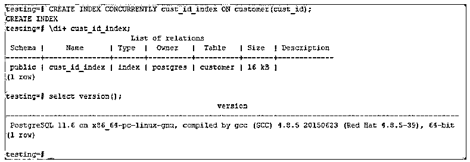
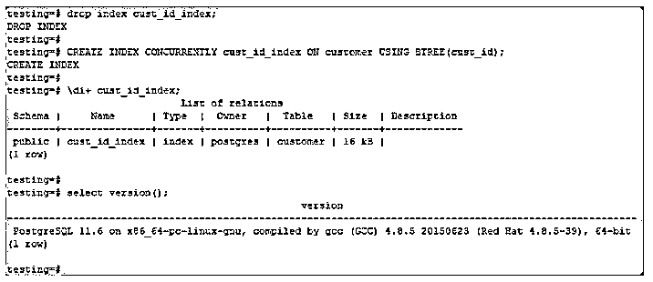
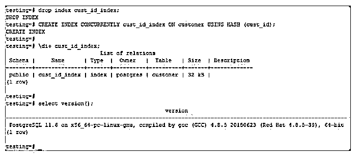
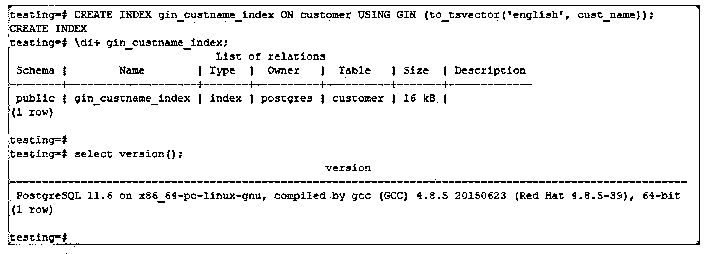
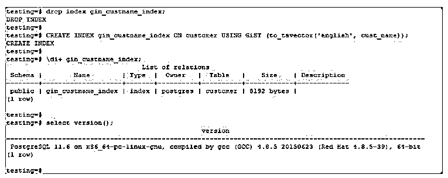
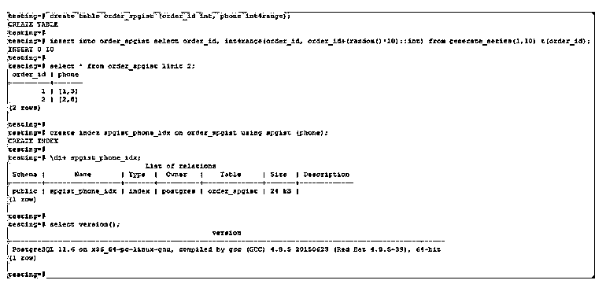
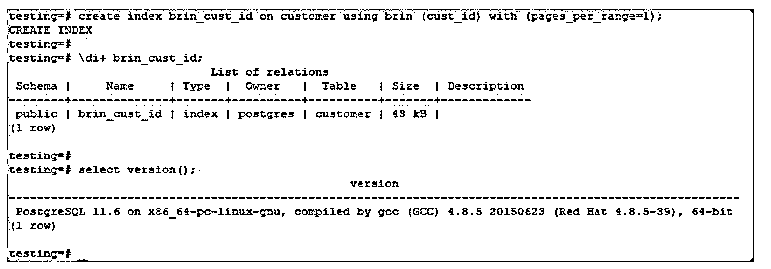

# PostgreSQL 中的索引

> 原文：<https://www.educba.com/indexes-in-postgresql/>

## PostgreSQL 中的索引简介

在 PostgreSQL 中，索引便于快速检索数据；我们可以在 select 操作中使用的表的列上创建一个索引来检索快速数据；PostgreSQL 索引与表上的指针相同；例如，如果一本书，我们想要一个所有页面的参考，以便以后讨论主题，那么我们首先引用索引页，它按顺序或字母顺序列出了所有要点或主题。然后我们引用特定页码和我们想要搜索的主题；同样的事情也发生在 PostgreSQL 索引中。

**语法:**

<small>Hadoop、数据科学、统计学&其他</small>

该索引用于提高数据库性能。

`Create [UNIQUE] INDEX [CONCURRENTLY] [index_name] ON table_name [Using
Method (Type of index)] ( { column_name | ( expression ) } [ COLLATE collation ] [ opclass (name of operator class) ] [ ASC | DESC ] [ NULLS { FIRST | LAST (Specify the sort order of index)}] [, ...] )
[WITH (name of storage parameter)] [TABLESPACE tablespace_name] [WHERE predicate]`

下面是对上述语法的描述:

*   **唯一:**使系统检查表格中的重复值。
*   **并发:**使用该参数后，PostgreSQL 将创建一个索引，而不锁定其他会话，如表上的(插入、更新或删除)。如果不使用此参数，PostgreSQL 会在写操作时锁定表。
*   **索引名称:**索引的任何名称。
*   **表名:**被索引的表名。
*   **方法:**索引的方法或类型，如 Btree、Hash 等。
*   **列:**我们在其上创建索引的列的名称。
*   **表达式:**表达式会写在括号里。
*   **排序规则:**索引中使用的排序规则的名称；如果我们没有声明，那么索引将自动默认。
*   **Opclass:** 这是运算符类的名称。
*   **ASC:** 它将指定升序排序。
*   **DESC:** 它将指定降序排序。
*   **空值优先:**这指定空值在非空值之前排序。
*   **空值最后:**这指定空值在非空值之后排序。
*   **存储参数:**这是存储参数的名称。
*   **表空间:**我们在其中创建了索引的表空间名称。
*   **谓词:**这是一个约束表达式。

### 如何在 PostgreSQL 中创建索引？

*   PostgreSQL 索引用于提高数据库性能。通过使用索引，我们提高了数据库性能。
*   我们使用了 customer 表来描述 PostgreSQL 中的索引。
*   请在下面找到在 PostgreSQL 中创建新索引的详细信息。

**1。创建一个客户表并将数据插入其中。**

`testing=#CREATE TABLE customer ( cust_id INT NOT NULL, cust_name character(10) NOT NULL, cust_address character(20) NOT NULL, cust_phone character(14), PRIMARY KEY (cust_id));`

`testing=#INSERT INTO customer (cust_id, cust_name, cust_address, cust_phone) VALUES (1, 'ABC', 'Pune', '1234567890');`

`testing=#INSERT INTO customer (cust_id, cust_name, cust_address, cust_phone) VALUES (2, 'PQR', 'Pune', '1234567890');`

**输出:**

**2。在 customer 表中的 cust_id 列上创建索引。**

`testing=#CREATE INDEX CONCURRENTLY cust_id_index ON customer (cust_id);`

**输出:**

### PostgreSQL 中的索引类型

PostgreSQL 支持不同类型的索引。请查找以下 PostgreSQL 索引类型:

*   b 树
*   混杂
*   广义倒排索引
*   广义倒排搜索树
*   空间分割的广义倒排搜索树
*   BRIN(块范围索引)

让我们详细讨论每一个问题。

#### 1.b 树

Btree index 是 PostgreSQL 中最受欢迎的索引，在创建索引时被广泛使用。Btree 索引将创建一棵树，并将数据存储在一个节点中；节点可以是一个可变的数字。以下示例显示 Btree 索引如下:

**举例:**

`testing=#CREATE INDEX CONCURRENTLY cust_id_index ON customer USING BTREE(cust_id);`

**输出:**

#### 2.散列索引

哈希索引比 Btree 索引快，但是哈希索引仅限于相等操作。以下示例显示哈希索引如下:

**举例:**

`testing=#CREATE INDEX CONCURRENTLY cust_id_index ON customer USING HASH (cust_id);`

**输出:**

#### 3.广义倒排索引

当数据类型在一列中包含多个值时，Gin 索引最有用。GIN 指数也被称为广义倒排指数。以下示例显示轧棉指数如下。

**举例:**

`testing=#CREATE INDEX gin_custname_index ON customer USING GIN (to_tsvector('English', cust_name));`

**输出:**

#### 4.广义倒排搜索树

当我们的数据是几何格式时，要点索引是有用的。它也被称为广义搜索树。下面的例子显示要点索引如下。

**举例:**

`testing=#CREATE INDEX gin_custname_index ON customer USING GiST (to_tsvector('English', cust_name));`

**输出:**

#### 5.空间分割的广义倒排搜索树

SP-GiST 索引被称为空间分区的广义倒排搜索树。当我们的数据是聚类元素或聚类格式时，SP-Gist 索引最有用。最好的例子就是电话号码。以下示例显示了如下 SP-GiST 索引。

**举例:**

为创建 SP-GiST 索引创建一个表。

`testing=#create table order_spgist (order_id int, phone int4range);`

`testing=#insert into order_spgist select order_id, int4range(order_id, order_id+(random()*10)::int) from generate_series(1,10) t(order_id);`

创建一个 SP-GiST 索引。

`testing=#CREATE INDEX gin_custphone_index ON customer USING SPGiST (to_tsvector('English', cust_phone));`

**输出:**

#### 6.BRIN(块范围索引)

布林索引在大量自然聚集格式数据时很有用。布林指数也称为区块范围指数。下面的例子显示了布林指数如下。

**举例:**

`testing=#create index brin_cust_id on customer using brin (cust_id) with (pages_per_range=1);`

**输出:**

### 如何在 PostgreSQL 中删除索引？

在 PostgreSQL 中使用 drop 命令删除索引，下面是相同的语法和示例。

**语法:**

`DROP INDEX index_name;`

**举例:**

`testing=#drop index cust_id_index;`

**输出:**

**例子:**

下面是一个在 PostgreSQL 中创建索引的例子。

`testing=#CREATE UNIQUE INDEX custid_idx ON customer (cust_id);`

`testing=#CREATE INDEX custname_idx ON customer ((lower(cust_name)));`

`testing=#CREATE INDEX custaddress_idx ON customer (cust_address COLLATE "de_DE");`

`testing=#CREATE INDEX custname_idx1 ON customer (cust_name NULLS FIRST);`

`testing=#CREATE INDEX custid_idx1 ON customer (cust_id) TABLESPACE pg_default;`

**输出:**

### 结论

它用于快速检索数据。PostgreSQL 索引有其特定的结构来查看数据和最快的数据检索操作。如果我们在创建索引时没有提到索引类型，默认情况下 PostgreSQL 基本上使用 Btree 索引。

### 推荐文章

这是 PostgreSQL 中的索引指南。这里我们讨论一下 PostgreSQL 中索引的简介、类型以及如何创建索引？您也可以看看以下文章，了解更多信息–

1.  [Oracle 中的排序依据](https://www.educba.com/order-by-in-oracle/)
2.  [SQL 中的数据库](https://www.educba.com/database-in-sql/)
3.  [Django 框架](https://www.educba.com/django-framework/)
4.  [关系数据库](https://www.educba.com/relational-database/)
5.  [SQL |中的主键如何使用？](https://www.educba.com/primary-key-in-sql/)
6.  [配置单元中索引的不同操作](https://www.educba.com/indexes-in-hive/)