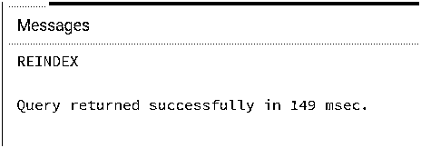

# PostgreSQL 重新索引

> 原文：<https://www.educba.com/postgresql-reindex/>

## PostgreSQL REINDEX 简介

为了重建一个或多个索引，我们通常使用 PostgreSQL REINDEX 语句。有时由于软件问题或错误或一些硬件故障，索引被破坏；在这种情况下，我们可以使用这个语句来恢复索引。我们可以为表、模式、数据库或系统数据库重新创建索引，并重新创建索引。PostgreSQL REINDEX 语句首先删除所有索引，然后创建所有索引，这意味着它从头开始构建所有索引。PostgreSQL REINDEX 语句使用锁定机制来重建索引的内容。

### PostgreSQL 重新索引的语法

请考虑以下语法来理解这些语句:

<small>Hadoop、数据科学、统计学&其他</small>

**语法:**

`REINDEX
[ ( VERBOSE ) ] {SCHEMA | DATABASE  | TABLE |SYSTEM  | INDEX  }
name;`

#### PostgreSQL REINDEX 的解释

*   **VERBOSE:** 这个关键字是可选的。在索引被重新索引时，如果定义了 VERBOSE，该语句将显示进度报告。
*   **索引:**重建已定义的索引。
*   **表:**重建已定义表的所有索引。
*   **数据库:**重建已定义数据库的所有索引。
*   **系统:**重建已定义数据库的系统上的所有索引。
*   **名称:**该字段定义索引、表、数据库或模式的名称。

我们可以为表、模式、数据库或索引重新创建索引。

让我们按如下方式理解它们的语法:

**1。重新创建一个索引。**

`REINDEX INDEX index_name;`

**2。重新创建表的所有索引。**

`REINDEX TABLE table_name;`

**3。重新创建模式中的所有索引。**

`REINDEX SCHEMA schema_name;`

**4。在特定数据库中重新创建所有索引。**

`REINDEX DATABASE database_name;`

**5。在系统数据库中重新创建所有索引。**

`REINDEX SYSTEM database_name;`

### PostgreSQL REINDEX 如何工作？

它删除并重新创建索引，这意味着从头开始重建所有索引。该语句使用锁定机制来重新创建索引。

要使用 REINDEX 语句，我们需要索引或表或数据库的所有者。超级用户可以对任何内容使用 PostgreSQL REINDEX 语句。

### 要实现的示例

以下是 PostgreSQL 重新索引的示例:

#### 示例# 1–重新创建一个索引

考虑下面的语句，其中我们需要在 PostgreSQL REINDEX INDEX 子句后定义索引名；假设我们有一个名为 student_index 的索引，那么我们可以使用 PostgreSQL REINDEX 语句重新创建它。

**查询:**

`REINDEX INDEX student_index;`

**输出:**

#### 示例 2——重新创建一个表的所有索引

考虑下面的语句，其中我们需要在 REINDEX TABLE 子句后定义表名。假设我们有一个名为 student_table 的表，那么我们可以使用 PostgreSQL REINDEX 语句重新创建它的所有索引。

**查询:**

`REINDEX TABLE student_table;`

**输出:**

#### 示例# 3–重新创建模式中的所有索引

考虑下面的语句，我们需要在 REINDEX SCHEMA 子句后定义模式名。假设我们有一个名为 student_schema 的模式，那么我们可以使用 PostgreSQL REINDEX 语句重新创建它的所有索引。

**查询:**

`REINDEX SCHEMA student_schema;`

**输出:**

#### 示例# 4–在特定数据库中重新创建所有索引

考虑以下语句，其中我们需要在 PostgreSQL REINDEX DATABASE 子句后定义数据库名称。假设我们有一个名为 student_database 的数据库，那么我们可以使用 REINDEX 语句重新创建它的所有索引。

**查询:**

`REINDEX DATABASE student_database;`

**输出:**

#### 

#### 示例 5–在系统数据库中重新创建所有索引

考虑以下语句，其中我们需要在 PostgreSQL REINDEX 系统子句后定义数据库名称。假设我们有一个名为 system_db 的系统数据库，那么我们可以使用 REINDEX 语句重新创建所有索引。

**查询:**

`REINDEX SYSTEM system_db;`

**输出:**

### 推荐文章

这是一个 PostgreSQL REINDEX 的指南。这里我们讨论 PostgreSQL REINDEX 的介绍，以及实际的例子和不同的子查询表达式。您也可以浏览我们推荐的文章，了解更多信息——

1.  [如何在 PostgreSQL 中通知 Works？](https://www.educba.com/postgresql-notify/)
2.  [PostgreSQL 时间戳简介](https://www.educba.com/postgresql-timestamp/)
3.  [PostgreSQL NOW() |如何工作？](https://www.educba.com/postgresql-now/)
4.  [PostgreSQL 随机|示例](https://www.educba.com/postgresql-random/)