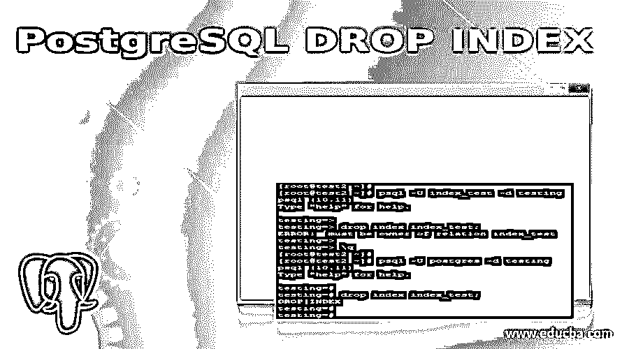
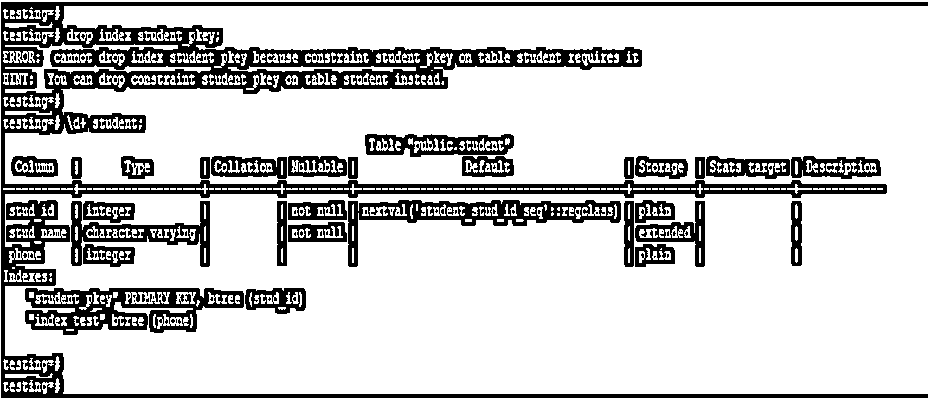
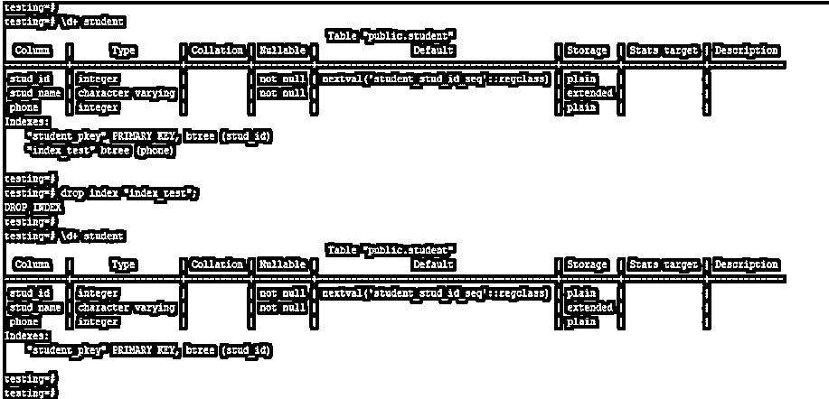
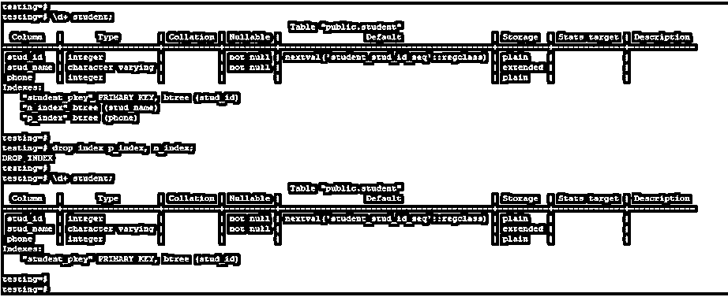
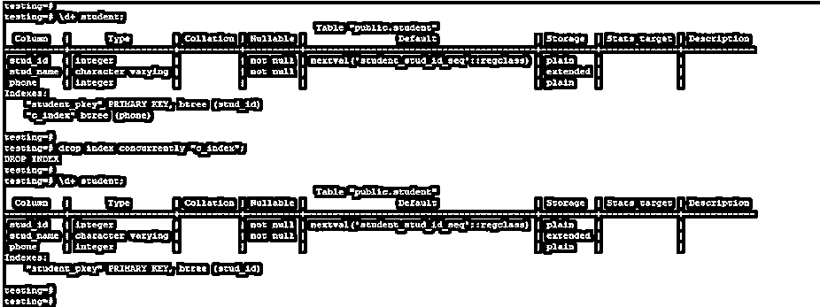

# PostgreSQL 删除索引

> 原文：<https://www.educba.com/postgresql-drop-index/>

## PostgreSQL 删除索引的定义

PostgreSQL drop index 语句用于从表列中删除现有索引；我们已经使用 drop index 命令删除了 PostgreSQL 中的现有索引。要使用 drop index 命令，我们需要拥有超级用户权限，或者需要拥有该特定索引的所有者。如果对象依赖于索引，则该索引不会被删除，将给出该索引不会被删除的错误；基本上，PostgreSQL drop index 命令不支持带并发的级联操作。Drop index 命令在 PostgreSQL 中是非常有用和重要的，用于删除未使用的索引。

### 语法和参数

下面是 PostgreSQL 中 drop index 语句的语法。

<small>Hadoop、数据科学、统计学&其他</small>

*   删除索引 index _ name—使用 drop index 命令删除的索引的名称。
*   删除索引 index_name1，index_name2，index_name3，…，index_nameN。
*   Drop index [Concurrently(在不影响或锁定其他操作(如 select、insert、update 和 delete)的情况下删除索引)][如果存在(如果数据库中存在则删除索引，如果索引不存在也不抛出错误)] name_of_index(要删除的索引的名称)[Cascade | Restrict ]

**参数:**

下面是 drop index 语句的参数描述语法。

*   **Drop index:** 该命令用于删除现有的索引，并从 PostgreSQL 的数据库表列中删除未使用的索引。
*   **索引名称:**它被定义为索引的名称，这是我们从数据库表中删除的。
*   **并发:**删除索引，而不影响其他操作，如选择、插入、更新和删除。PostgreSQL 中的 Drop index 将获取表上的排他锁；它将阻止对操作的访问，直到删除索引没有成功完成。在 drop index 命令中使用并发选项后，不支持级联操作。
*   **如果存在:**如果索引不在数据库表上，则使用该选项；使用这些选项后，它不会显示索引不能存在的错误。如果该索引没有出现在数据库表中，它会发出通知。
*   **级联:**当我们必须自动删除索引对象时，使用该选项，这取决于索引。但是 PostgreSQL 中的并发选项不支持级联选项。
*   **Restrict:** 当我们不得不在索引上强制使用 drop index 选项时使用。当任何其他对象依赖于该索引时，它将拒绝 drop index 命令。这是删除索引命令的默认参数。

### 如何在 PostgreSQL 中去掉索引语句工作？

*   下面是 PostgreSQL 中 drop index 语句的工作方式。
*   该索引将提高从表中选择操作的性能。但是它会降低插入和更新操作的性能。
*   如果我们的数据库表包含的 insert 和 update 操作多于 select，那么我们需要在使用 drop index 语句从数据库中删除未使用的索引时从表中删除相同的索引。
*   我们需要有一个超级用户或索引特权的所有者来从数据库表中删除索引。
*   下面的例子表明，我们需要有一个超级用户或索引特权所有者来删除索引。

`psql -U index_test -d testing
drop index index_test;
psql -U postgres -d testing
drop index index_test;`

*   在上面的第一个例子中，我们使用了用户 index_test 从 student 表中删除了索引名 index_test。但是会抛出“错误:必须是关系 index_test 的所有者”的错误。
*   在第二个例子中，我们使用了数据库的超级用户，即 Postgres 使用超级用户，可以删除 PostgreSQL 中的索引。
*   使用 PostgreSQL 中的 drop index 命令，我们可以在一条语句中删除多个索引。
*   如果对象依赖于索引，则不会使用删除索引操作删除相同的索引。
*   下面的例子表明，如果任何对象依赖于索引，它将不会被删除。

`drop index student_pkey;`

*   在上面的例子中，我们不得不尝试删除 student_pkey 的索引，但是由于其他对象依赖于这个索引，所以它不会被删除。
*   它将显示错误“错误:无法删除索引 student_pkey，因为表 student 上的约束 student_pkey 需要它”。

### PostgreSQL 删除索引的示例

下面是 PostgreSQL 中 drop index 命令的示例。

#### 1.使用删除索引命令删除单个索引

在下面的示例中，我们使用 drop index 命令删除了一个索引。在下面的例子中，我们从 student 表中删除了索引名 index_test。

`\d+ student
drop index "index_test";
\d+ student`

#### 2.使用删除索引命令删除多个索引

在下面的示例中，我们使用 drop index 命令删除了多个索引。在下面的例子中，我们从 student 表中删除了索引名 p_index 和 n_index。

`\d+ student
drop index p_index, n_index;
\d+ student`

#### 3.使用 if Exists 参数删除索引

在下面的例子中，我们使用了如果存在一个参数与下降索引命令。如果存在，参数将跳过索引。

`\d+ student
drop index IF EXISTS p_index;`

#### 4.使用并发参数删除索引

在下面的例子中，我们在删除索引命令中同时使用了参数。我们已经从 student 表中删除了 c_index。

`\d+ student
drop index concurrently "c_index";
\d+ student`

### 推荐文章

这是一个 PostgreSQL 删除索引的指南。在这里，我们还将讨论定义和 drop index 语句在 postgresql 中的工作方式，以及它的不同示例和代码实现。您也可以看看以下文章，了解更多信息–

1.  [PostgreSQL 物化视图](https://www.educba.com/postgresql-materialized-views/)
2.  [PostgreSQL 唯一索引](https://www.educba.com/postgresql-unique-index/)
3.  [PostgreSQL 真空](https://www.educba.com/postgresql-vacuum/)
4.  [PostgreSQL 重新索引](https://www.educba.com/postgresql-reindex/)