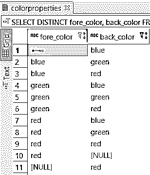
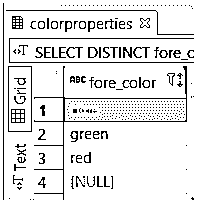
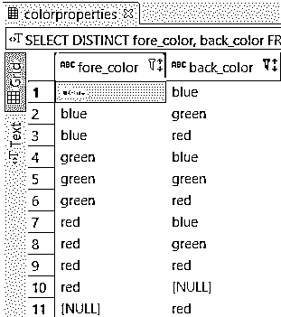
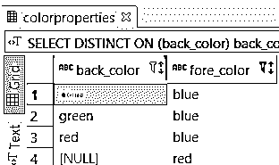
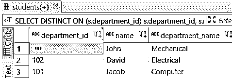

# PostgreSQL DISTINCT

> 原文：<https://www.educba.com/postgresql-distinct/>

## PostgreSQL DISTINCT 概述

通过在 SELECT 语句中使用 PostgreSQL DISTINCT 子句，我们可以从语句的结果集中删除重复的行。对于所有重复行组，PostgreSQL DISTINCT 子句只保留一行。PostgreSQL DISTINCT 删除所有重复的行，并且只保留一组重复行中的一行。我们可以在一个表的多个列上使用 PostgreSQL DISTINCT 子句。

### PostgreSQL 中如何使用 DISTINCT？

让我们按如下方式理解 DISTINCT 子句语法:

<small>Hadoop、数据科学、统计学&其他</small>

**语法#1**

`SELECT
DISTINCT column_name1
FROM
table_name;`

**解释:**为了评估重复的行，我们使用来自 column_name1 列的值。

**语法#2**

如果我们用多个列名指定了 DISTINCT 子句，PostgreSQL DISTINCT 子句将计算所有已定义列的不同值的组合，以计算重复行。

`SELECT
DISTINCT column_name1, column_name2
FROM
table_name;`

**解释:**在上面的语句中，为了计算重复行，组合使用了 column_name1 和 column_name2 的值。

**语法#3**

我们可以使用 PostgreSQL DISTINCT ON 子句或表达式来维护结果集中一组重复项的“第一”行，语法如下:

`SELECT
DISTINCT ON (column_name1) column_name_alias,
column_name2
FROM
table_name
ORDER BY
column_name1,
column_name2;`

**说明:**SELECT 语句返回随机排序的行；因此，每个结果组的第一行也是随机的。为了使结果集更明显，我们可以使用 DISTINCT ON 子句和 ORDER BY 子句。

### PostgreSQL DISTINCT 的示例

我们将创建一个名为 ColorProperties 的表。此外，向 ColorProperties 表中添加一些数据，以便理解 DISTINCT 子句。

使用以下语句创建由三列组成的 ColorProperties 表:

*   颜色标识，
*   背景颜色和
*   前景色。

**代码:**

`CREATE TABLE ColorProperties (
color_id serial NOT NULL PRIMARY KEY,
back_color VARCHAR,
fore_color VARCHAR
);`

*   我们将借助 insert 语句在 ColorProperties 表中插入一些行，如下所示:

**代码:**

`INSERT INTO ColorProperties (back_color, fore_color)
VALUES
('blue', 'red'),
('green', 'blue'),
('red', 'red'),
('blue', 'green'),
('green', 'red'),
('blue', 'blue'),
('green', 'green'),
('red', 'red'),
('red', NULL),
(NULL, 'red'),
('red', 'green'),
('red', 'blue');`

*   现在，借助 SELECT 语句从 ColorProperties 表中检索数据，如下所示:

**代码:**

`SELECT
color_id,
back_color,
fore_color
FROM
ColorProperties;<c/doe>`

**输出:**执行上述语句后，我们将跟踪结果。

#### 1.单列

为了获取名为 fore_color 的列的唯一值，我们将使用下面的语句。此外，为了按字母顺序对输出结果进行排序，我们将对 fore_color 列中的值使用 ORDER BY 子句。

**代码:**

`SELECT
DISTINCT fore_color
FROM
ColorProperties
ORDER BY
fore_color;`

**输出:**

#### 2.多列

让我们通过下面的语句来理解如何在多个列上使用 DISTINCT 子句:

**代码:**

`SELECT
DISTINCT fore_color,
back_color
FROM
ColorProperties
ORDER BY
fore_color,
Back_color;`

**输出:**

*   由于 SELECT DISTINCT 子句包含 back_color 和 fore_color，因此为了删除结果中的重复行，set PostgreSQL 将 back_color 和 fore_color 等列的值组合起来。
*   PostgreSQL 语句将为 ColorProperties 表中的 back_color 和 fore_color 列提供唯一的值。在 ColorProperties 表中，红色同时出现在 back_color 和 fore_color 列中。因为我们用 DISTINCT 子句添加了 back_color 和 fore_color，所以对于重复的行只保留一行条目。

#### 3.打开 DISTINCT 的 PostgreSQL

要获得排序后的结果集，我们应该如下定义语句:删除所有重复的行，并为所有行保留一行条目。

**代码:**

`SELECT
DISTINCT ON
(back_color) backgroundcolor,
fore_color
FROM
ColorProperties
ORDER BY
back_color,
fore_color;`

**输出:**

#### 4.多个表格

假设我们有两个名为:学生和部门的表。

`CREATE TABLE students (
name text not null,
department_id text not null,
CONSTRAINT students_pk PRIMARY KEY (name)
);
INSERT INTO students (name, department_id) VALUES
('Jacob', '101'),
('David', '102'),
('John', '103');
CREATE TABLE departments (
department_id text not null,
department_name text not null
);
INSERT INTO departments (department_id, department_name) VALUES
('101', 'Computer'),
('102', 'Electrical'),
('103', 'Mechanical');`

让我们看一下下面的语句，它连接了学生表和系表。

**代码:**

`SELECT DISTINCT ON (s.department_id) s.department_id, s.name, d.department_name
FROM students s
JOIN departments d ON d.department_id = s.department_id
ORDER BY s.department_id DESC`

*   我们为 DISTINCT ON 子句定义了一个表达式(s.department_id ),以便对上述语句中的结果集进行排序。

**输出:**

### 结论

我们希望通过上面的文章，您已经理解了如何使用 PostgreSQL SELECT DISTINCT 语句通过从结果集中删除重复行来返回唯一的行。

### 推荐文章

这是 PostgreSQL DISTINCT 的指南。在这里，我们讨论 PostgreSQL DISTINCT 的语法和各种示例，以及相应的代码和输出。您也可以浏览我们的其他相关文章，了解更多信息——

1.  [PostgreSQL 分组依据](https://www.educba.com/postgresql-group-by/)
2.  [PostgreSQL 排序依据](https://www.educba.com/postgresql-order-by/)
3.  [PostgreSQL 视图|如何创建？](https://www.educba.com/postgresql-views/)
4.  [PostgreSQL |中的序列如何工作？](https://www.educba.com/sequence-in-postgresql/)