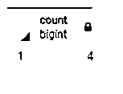

# PostgreSQL 限制偏移量

> 原文：<https://www.educba.com/postgresql-limit-offset/>

## 

## PostgreSQL 限制偏移量的定义

PostgreSQL 为用户提供了 limit 和 offset 子句，以便根据需要对数据库表执行不同的操作。当我们只想从数据库中检索特定行时使用的限制和偏移量。LIMIT 子句只返回写在 LIMIT 关键字之后的特定值。另一方面，OFFSET 子句用于在开始从数据库表返回记录之前跳过任意数量的记录。这意味着当我们在查询中使用 OFFSET 子句时，有时用户不需要显示某些记录。

**语法:**

`select              column name1, column name2, column name N,              from table name     [order by clause Sort Expression….]                                    [LIMIT  number of count(value)][OFFSET number of count(value)]`

<small>Hadoop、数据科学、统计学&其他</small>

**解释:**借助上述语法，我们将在 PostgreSQL 中实现 LIMIT 和 OFFSET 子句。在上面的语法中，我们使用 select 子句，然后 column name 表示我们要从表中打印的列名，然后传递 LIMIT 值和 OFFSET 值。

### PostgreSQL 中的极限偏移量是如何工作的？

*   我们必须在您的系统中安装 PostgreSql。
*   我们需要关于 PostgreSql 的基础知识。
*   我们必须需要一个数据库表来执行限制和偏移。
*   我们必须了解极限和偏移语法的基本知识，这意味着如何使用它。
*   我们可以在 psql 和 pgAdmin 的帮助下对数据库表执行不同的操作。

### 实现 PostgreSQL 限制偏移量的示例

让我们看看如何使用下面的例子来实现 LIMIT 和 OFFSET。

#### 示例#1

**使用限制**

首先，我们使用如下语句创建一个表 employee。

`create table employee (emp_id serial PRIMARY KEY, emp_name varchar(30), emp_dept varchar[],emp_city varchar[],emp_salary text[]);`

**说明:**

在上述语句的帮助下，我们创建了一个具有不同属性的 employee 表，例如 emp_id、emp_name、emp_dept、emp_city 和 emp_salary。使用下面的快照说明上述声明的最终结果。

之后，我们使用如下语句将一些记录插入到雇员数据库表中。

`Insert              into                employee                   (emp_name,              emp_dept,  emp_city, emp_salary)
Values
('Jacson',         '{"comp"}' ,        '{"City W"}', '{"40000"}'),
('Paul',            '{"mech"}',         '{"City A"}',  '{"20000"}'),
('sam',             '{"Account"}',             '{"City B"}',  '{"10000"}'),
('John',     '{"Purchase"}',      '{"City C"}',  '{"30000"}');`

**说明:**

使用下面的快照说明上述声明的最终结果。

所以让我们来看一个简单的 LIMIT 子句，实现如下。

首先使用下面的语句计算数据库表中的行数，如下所示。

`select count(*) from public."employee";`

使用下面的快照说明上述声明的最终结果。

然后应用限制条款

`select * from public."employee" limit 2;`

**说明:**

当我们当时在一个语句中使用 LIMIT 来添加 ORDER BY 子句时，这对以特定顺序返回结果很有用。否则你会得到意想不到的结果。在上面的示例中，数据库表 employee 有 4 条记录，如应用限制 2 后的前一个快照所示。使用下面的快照说明上述声明的最终结果。

#### 实施例 2

**使用偏移量**

当我们使用 OFFSET 子句时，它返回偏移值之后的记录，并跳过偏移值之前的行。

`select * from public."employee" ;`

**说明:**

当我们执行上面的语句时，它显示了数据库表的所有记录。使用下面的快照说明上述声明的最终结果。

`select * from public."employee" offset 2 ;`

**说明:**

在上面的例子中，数据库表 employee 有 4 条记录，但是当我们使用值为 2 的 OFFSET 时，它会跳过数据库表的前两行，返回剩余的记录。使用下面的快照说明上述声明的最终结果。

#### 实施例 3

**在同一语句中使用 LIMIT 和 OFFSET 子句**

`select * from public."employee" offset 2 limit 1 ;`

**说明:**

在本例中，我们在同一个语句中同时使用了 LIMIT 和 OFFSET 子句，这里我们使用了 OFFSET value is 2 和 LIMIT 1。在 employee 数据库表中有 4 条记录，OFFSET 跳过前 2 条记录，然后使用 LIMIT 1。使用下面的快照说明上述声明的最终结果。

当我们用极限和 2。使用下面的快照说明上述声明的最终结果。

#### 实施例 4

**使用 LIMIT、OFFSET 和 ORDER BY 子句。**

`select * from public."employee" order by "emp_salary" offset 3 limit 1 ;`

**说明:**

在本例中，我们使用 ORDER BY 子句。使用下面的快照说明上述声明的最终结果。

#### 实施例 5

如果数据库在数据库表中没有足够的记录。

`select * from public."employee" order by "emp_salary"  limit 5 ;`

**解释**

如果在该时间限制下数据库表中不存在的记录数返回数据库表中的所有记录。使用下面的快照说明上述声明的最终结果。

**关于极限和偏移的一些提示如下**

1.  当我们使用 LIMIT 0 时，它用于返回数据库表中的数字列。

**举例:**

`select * from public."employee" limit 0 ;`

**解释:**在上面的例子中我们使用极限 0。使用下面的快照说明上述声明的最终结果。

2.  当我们将 LIMIT 子句与 ALL 一起使用时，它将返回数据库表中的所有记录。

**举例:**

`select * from "employee" limit ALL ;`

解释:在上面的例子中，我们使用了带有 ALL 的 LIMIT 子句。使用下面的快照说明上述声明的最终结果。

3.  当我们在语句中使用带有 0 值的 OFFSET 子句时，它返回数据库表中的所有记录。

**举例:**

`select * from "employee" offset 0;`

**解释:**在上面的例子中我们使用了带值的 OFFSET 子句。使用下面的快照说明上述声明的最终结果。

### PostgreSQL 限制偏移量的使用

*   LIMIT 子句用于从数据库表中检索特定记录，意思是最大记录数。
*   OFFSET 子句用于从结果中跳过记录。
*   极限和偏移的执行速度很快，所以大多数应用程序都使用极限和偏移。

### 结论

我们希望从上面的文章中，您已经了解了 PostgreSQL 的 LIMIT 和 OFFSET 子句。从上面的文章中，我们学习了 LIMIT 和 OFFSET 子句的基本语法，然后我们还学习了如何通过使用不同的方法和示例来使用 LIMIT 和 OFFSET 子句。从本文中，我们了解了如何正确处理 LIMIT 和 OFFSET 子句。

### 推荐文章

这是一个 PostgreSQL 限制偏移量的指南。在这里，我们还将讨论 postgresql 中极限偏移量的定义和工作原理。以及一个不同的示例及其代码实现。您也可以看看以下文章，了解更多信息–

1.  [PostgreSQL WITH 子句](https://www.educba.com/postgresql-with-clause/)
2.  [PostgreSQL 格式化程序](https://www.educba.com/postgresql-formatter/)
3.  [修改 PostgreSQL 中的列](https://www.educba.com/alter-column-in-postgresql/)
4.  [修改 PostgreSQL 中的列](https://www.educba.com/alter-column-in-postgresql/)