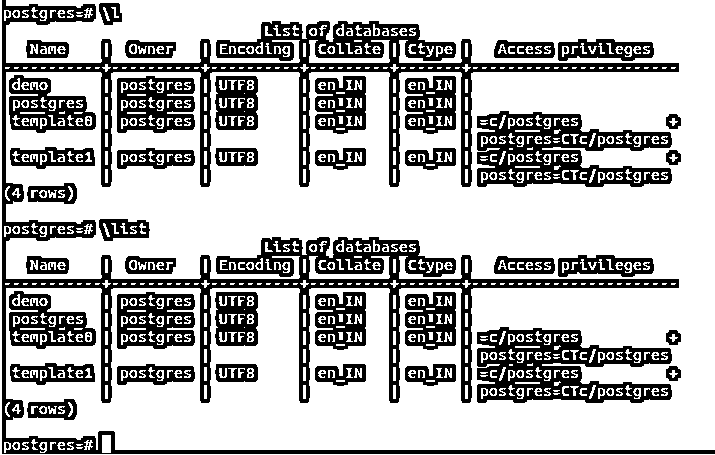
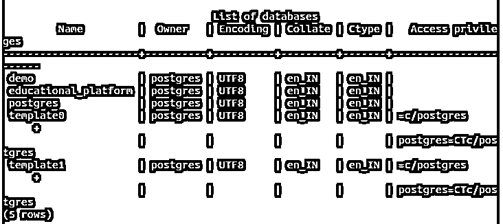
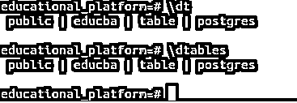
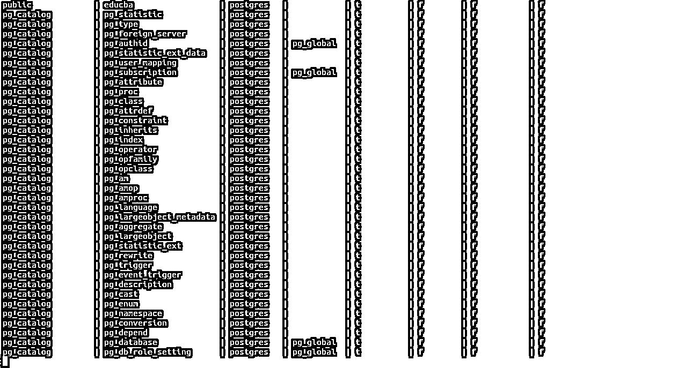
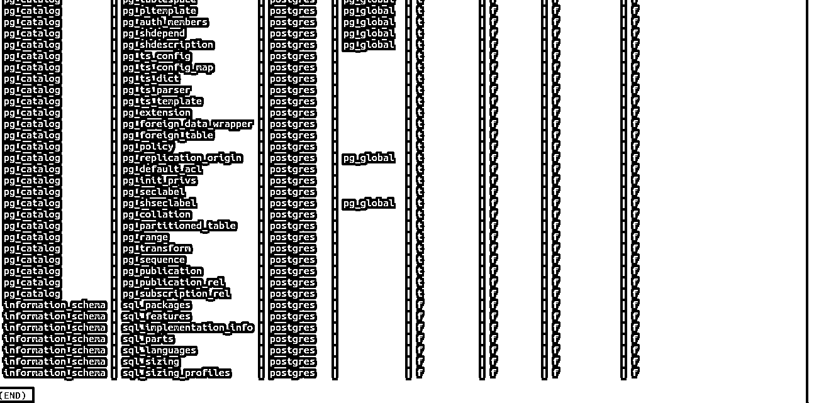

# PostgreSQL 列表

> 原文：<https://www.educba.com/postgresql-list-tables/>

## PostgreSQL 列表表简介

每当处理数据库时，检索数据库中的表及其结构是很常见的，因为这可以让您大致了解数据库中存储的所有实体。每当在 PostgreSQL 中创建新数据库时，它都包含许多默认表，这些表称为系统表。数据库内部使用这些表来执行操作和存储系统变量、运算符和函数。除此之外，系统表还维护有关 SQL 和策略参数的数据，这些数据决定了任何操作将如何执行，以及在执行任何命令时要注意的主要约束。此外，如果对哪些表启动了检索查询，那么关于哪些表当前被锁定进行更新的信息将在系统表中维护。

除了系统表，我们还可以创建许多用户定义的表供我们使用。本文将学习各种方法，这些方法可用于检索数据库中的表并列出它们。

<small>Hadoop、数据科学、统计学&其他</small>

### 在 PostgreSQL 中列出表

如果你在此之前熟悉 MySQL，你一定会考虑使用 SHOW TABLES 查询；检索当前数据库中所有表的列表。但是，在 PostgreSQL 中，没有这样的查询。在 PostgreSQL 中，我们可以在使用 psql 时使用\dt 命令来检索表列表，或者使用 SELECt 查询从 pg_catalog 模式的 pg_tables 表中检索表列表。我们将看到如何逐一使用这两种方法。为此，您首先需要打开终端，使用您的用户名和命令登录 PostgreSQL

`sudo su – postgres`

然后输入您的密码。然后按回车键。然后通过键入以下命令打开 psql shell

`psql`

然后点击回车。输出如下所示。

下一步是检查当前数据库服务器中的所有数据库。为此，您可以键入

`\l or \list`

列出所有数据库和模式的命令。它将列出所有的模式和数据库，输出如下所示。

Postgres、template0、template1 三个数据库是默认数据库，而 demo 数据库是我之前创建的。要创建新的数据库，可以使用 createdb 命令和数据库的名称。例如，让我们创建一个名为 educational_platform 的数据库。为此，我们将发出以下命令。

`createdb educational_platform`

让我们检查我们的数据库是否是通过输入\l 命令创建的

`\l`

现在，要在数据库之间切换并使用您选择的数据库，您可以使用命令\c 或\connect 以及您想要连接的数据库的名称。现在，开火命令

`\c educational_platform`

输出如下所示:

### 使用 psql 元命令列出表格

现在我们将学习如何使用 psql 元命令列出表格。元命令是简短的命令，对于数据库管理员来说简洁易用，因为 psql 会对此进行评估，并在需要时将其转换为 sql 查询，然后存储在系统表中。我们可以使用任何一种

`\dt or \dtables`

元命令列出用户创建的和用户定义的表。输出将如下所示

因为在我们新创建的数据库中没有表，所以说没有找到任何关系。让我们创建一个新表，并检查它是否被检索到。

`CREATE TABLE educba
(id INTEGER PRIMARY KEY,
technologies VARCHAR,
workforce INTEGER,
address VARCHAR);`

现在，让我们通过输入命令来检查是否添加了表

`\dt or \dtables`

现在我们可以看到，我们的表已经成功添加。

### 使用选择查询列出表

现在我们将学习如何使用简单的 SQL 查询 SELECT 来检索当前数据库中所有表的信息。所有表的信息都存储在 pg_catalog 模式的名为 pg_tables 的表中。现在，由于我们要对当前连接的数据库或模式之外的其他数据库或模式中的表执行查询，我们需要显式指定模式的名称，然后点(。)分隔的表名来列出表。所以我们的查询应该是这样的。

`select * from pg_catalog.pg_tables;`

上述查询的输出类似于下面所示。

这将是一个很长的列表，显示所有系统表和用户定义的表。如果我们只想检索用户定义的表，而不是系统表，该怎么办？为此，我们必须在 WHERE 子句中应用约束，指定表不应属于 pg_catalog 或 information_schema 模式，因为这两种模式中只存在内部系统表。所以我们的查询应该按照如下所示的方式排列。

`SELECT * FROM pg_catalog.pg_tables
WHERE schemaname != 'information_schema' AND
schemaname != 'pg_catalog';`

上述查询的输出如下所示。

可以看出，只检索了我们创建的自定义表“educba ”,这是预期的输出。pg_tables 表显示表名和许多与表相关的属性，包括 schemaname、tableowner、表空间、hasindexes、hasrules、hastriggers 和 rowsecurity。大多数字段的答案都有值 t 和 f，它们是布尔类型参数，指定表是否具有该属性。例如，在我们的表中，列 hastriggers 的值为 f，这意味着当前表 educba 没有定义任何触发器。其他列的情况也类似。除此之外，列 schemaname 和 tableowner 包含该表属于哪种模式以及谁拥有该表。

### 结论

在 PostgreSQL 中，我们可以用两种方式列出表:在 pg_catalog 模式的表 pg_tables 上使用简单 SELECT 子句查询的 psql 元命令。这两个查询产生相同的输出。不同之处在于元命令只返回用户创建的表，而选择查询会得到系统表和用户定义的表。我们需要对 SELECT 查询应用约束，以便只列出用户创建的表。

### 推荐文章

这是一个 PostgreSQL 列表的指南。在这里，我们还将讨论 postgresql 中的简介和表列表，以及如何使用 select 查询。您也可以看看以下文章，了解更多信息–

1.  [PostgreSQL 限制](https://www.educba.com/postgresql-limit/)
2.  [PostgreSQL 主键指南](https://www.educba.com/postgresql-primary-key/)
3.  [PostgreSQL 表空间](https://www.educba.com/postgresql-tablespaces/)
4.  [PostgreSQL IF 语句|如何工作？](https://www.educba.com/postgresql-if-statement/)
5.  [PostgreSQL 自动增量|类型](https://www.educba.com/postgresql-auto-increment/)