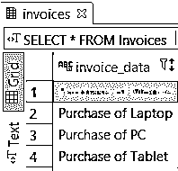
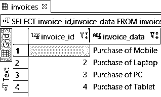

# PostgreSQL 主键

> 原文：<https://www.educba.com/postgresql-primary-key/>

## PostgreSQL 主键介绍

可以使用称为主键的一列或一组列来唯一标识表中的行。我们可以使用主键约束来指定主键。PRIMARY KEY 约束是 UNIQUE 约束和 NOT NULL 约束的组合。该表只能包含一个主键；在每个表上添加一个主键是数据库管理系统中的最佳实践。

### 句法

以下是主键中使用的语法:

<small>Hadoop、数据科学、统计学&其他</small>

**语法# 1–定义主键**

**1。**创建表时添加主键。我们可以在使用 CREATE TABLE 语句创建表本身时向表添加 primary key 约束。

`CREATE TABLE table_name (
column_name1 data_type PRIMARY KEY,
column_name2 data_type,
.
.
.
);`

**2。**我们可以创建包含两列或更多列的主键约束，如下所示:

`CREATE TABLE table_name (
column_name1 data_type,
column_name2 data_type,
.
.
.
PRIMARY KEY (column_name1, column_name2)
);`

**语法# 2–更新主键**

我们可以为现有的表添加一个主键约束，这种情况很少见。我们可以使用 ALTER TABLE 语句达到同样的目的，如下所示:

`ALTER TABLE table ADD PRIMARY KEY (column1, column);`

**语法# 3–删除主键**

在 ALTER TABLE 语句的帮助下，我们可以删除表的现有 primary key 约束，如下所示:

`ALTER TABLE table_name DROP CONSTRAINT primary_key_constraint;`

### PostgreSQL 中主键是如何工作的？

如果我们使用表中的一列或一组列在表上添加了主键，PostgreSQL 会在主键列上创建一个唯一的 B 树索引。如果我们没有显式定义主键约束名，那么 PostgreSQL 会为主键约束指定一个默认名称。PostgreSQL 将 table_name_pkey 指定为 primary key 约束的默认名称。如果我们有一个名为 CITIES 的表，那么 PostgreSQL 将为该表创建一个名为 cities_pkey 的主键约束。我们可以使用如下的 CONSTRAINT 子句为其指定名称:

**代码:**

`CONSTRAINT constraint_name PRIMARY KEY(column_name1, column_name2,...);`

### 在 PostgreSQL 中实现主键的示例

为了理解示例，让我们使用 CREATE TABLE 语句创建一个名为 COUNTRIES 的表。

#### 示例# 1–单列主键

**代码:**

`CREATE table COUNTRIES
(
country_id serial PRIMARY KEY,
country_name VARCHAR (256) NOT null,
last_updated DATE NULL
);`

country_id 是 COUNTRIES 表的主键，用于唯一标识 COUNTRIES 表中的国家。

#### 示例 2–多列主键

以下语句将创建一个名为“CITIES”的表，其主键是 city_id 和 country_id 的组合。

**代码:**

`CREATE table  CITIES
(
city_id serial,
country_id INT,
city_name VARCHAR (256) NOT NULL,
last_updated DATE null,
PRIMARY KEY (CITY_id, country_id)
);`

#### 示例# 3–添加主键

创建表后更改表以添加主键的示例。以下语句创建一个名为 invoices 的表，该表没有任何主键。

**代码:**

`CREATE TABLE invoices (
invoice_id INT,
invoice_data VARCHAR (256) NOT NULL
);`

*   现在，借助下面的语句，我们可以向发票表添加一个主键约束。

**代码:**

`ALTER TABLE invoices
ADD PRIMARY KEY (invoice_id);`

#### 示例# 4–自动递增的主键

创建表后更改表以添加自动递增主键的示例。现在，借助以下语句，我们可以向发票表添加一个自动递增的主键约束。

**代码:**

`CREATE TABLE invoices (invoice_data VARCHAR(255));`

*   现在使用 insert 语句在发票表中插入一些数据。

**代码:**

`INSERT INTO invoices (invoice_data)
VALUES
('Purchase of Mobile'),
('Purchase of Laptop'),
('Purchase of PC'),
('Purchase of Tablet');`

*   借助下面的 SQL 语句和快照说明 INSERT 语句的结果。

**代码:**

`SELECT   * FROM   Invoices;`

**输出:**

*   这里，我们将借助以下语句向发票表中添加一个名为 invoice_id 的自动递增的主键:

**代码:**

`ALTER TABLE invoices ADD COLUMN invoice_id SERIAL PRIMARY KEY;`

*   借助以下 SQL 语句和快照说明 ALTER 语句的结果。

**代码:**

`SELECT   invoice_id,invoice_data FROM   invoices;`

**输出:**

*   现在，发票表有了主键 invoice_id。

#### 示例 5–删除表的主键

为了删除发票表的主键约束，我们必须使用以下语句:

**代码:**

`ALTER TABLE invoices
DROP CONSTRAINT invoices_pkey;`

### 在 PostgreSQL 中使用主键的优势

1.  PostgreSQL 主键帮助我们快速搜索记录，因为索引是基于主键使用的。
2.  通过使用 PostgreSQL 主键，我们可以唯一地标识更新或删除操作的表记录。
3.  PostgreSQL 主键用于根据它对数据进行排序。
4.  通过使用 PostgreSQL 主键，我们可以避免在表中插入重复的行。

### 结论

我们希望从上面的文章中，您已经理解了如何使用 CREATE TABLE 和 ALTER TABLE 语句添加、更新和删除主键约束。同时，借助例子和语法进行详细解释。

### 推荐文章

这是一个 PostgreSQL 主键的指南。这里我们讨论 PostgreSQL 主键的介绍以及相应的语法和例子。您也可以浏览我们的其他相关文章，了解更多信息——

1.  [PostgreSQL 数据库](https://www.educba.com/postgresql-database/)
2.  [PostgreSQL 交集](https://www.educba.com/postgresql-intersect/)
3.  [PostgreSQL 约束](https://www.educba.com/postgresql-constraints/)
4.  [PostgreSQL 交叉连接](https://www.educba.com/postgresql-cross-join/)
5.  [PostgreSQL 表空间|如何创建？](https://www.educba.com/postgresql-tablespaces/)
6.  [PostgreSQL IF 语句指南](https://www.educba.com/postgresql-if-statement/)
7.  [学习 PostgreSQL 自动增量](https://www.educba.com/postgresql-auto-increment/)