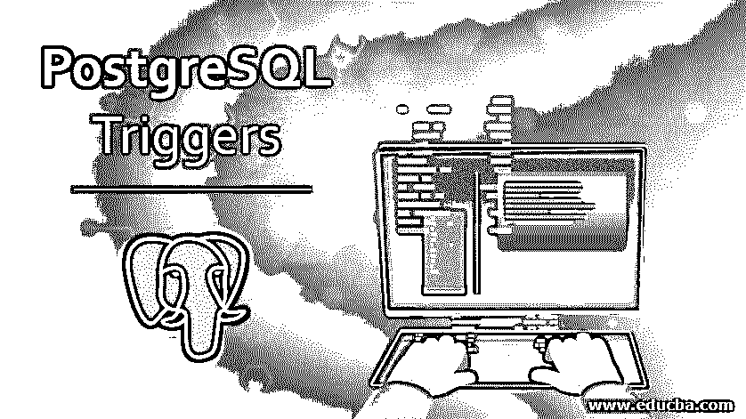
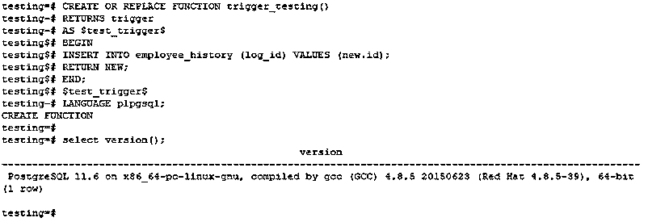

# PostgreSQL 触发器

> 原文：<https://www.educba.com/postgresql-triggers/>

## PostgreSQL 触发器简介

PostgreSQL 触发器将与特定视图或表相关联；当某个事件发生时，它将执行指定的函数。PostgreSQL 触发器用于使用事件在特定时间执行指定的事件。当表或视图上发生任何事件(插入、更新或删除)时，PostgreSQL 触发器将自动调用。要在 PostgreSQL 中创建新的触发器，我们需要首先定义触发器函数，然后将这个触发器函数绑定到指定的表。

PostgreSQL 触发器和用户定义函数的主要区别在于触发器是在指定事件发生时自动调用的。

<small>Hadoop、数据科学、统计学&其他</small>

### PostgreSQL 触发器的语法和参数

create trigger 语句用于在 PostgreSQL 中创建新的触发器。当表或视图上发生任何特殊或特定事件时，将触发该触发器。

**语法**

`CREATE [ CONSTRAINT ] TRIGGER name(must be distinct of any other trigger in same table) { BEFORE | AFTER | INSTEAD OF } { event (Event Name)[ OR ... ] }
ON table (Table_name)
[FROM referenced_table_name] [NOT DEFERRABLE | [DEFERRABLE] {INITIALLY IMMEDIATE | INITIALLY DEFERRED} ] [FOR [EACH] {ROW | STATEMENT} ] [WHEN (condition) ] EXECUTE PROCEDURE function name (arguments)`

其中事件可以是下列事件之一:

`INSERT
UPDATE [OF Column_name [, ... ] ] DELETE
TRUNCATE`

**参数**

*   **名称—**触发器的名称。该名称将不同于同一表中的任何其他触发器。
*   **Before—**确定我们在事件之前调用函数。
*   **After—**确定我们在事件之后调用函数。
*   **而不是–**确定我们调用的是函数而不是事件。
*   **事件–**插入、更新、删除或截断等任何事件都会触发触发器。
*   **表格名称—**表格或视图的名称
*   **被引用的表名-**这是被约束引用的其他表的名称。此选项仅用约束触发器指定。
*   **可延迟、不可延迟、初始立即和初始延迟–**这是 PostgreSQL 触发器的默认时间。
*   **对于每一行，这个**将指定触发器将为受触发事件影响的每一行触发一次。
*   **For each statement—**如果我们没有指定任何行或语句，这将是默认的。这将指定它将为受触发事件影响的每个语句触发一次。
*   **条件—**条件将是决定触发功能将被执行的布尔表达式。
*   **函数名-**用户提供的非参数函数，它将返回触发器。
*   **Arguments–**这是提供给函数的可选逗号分隔参数，然后触发器执行。

### PostgreSQL 触发器正在工作

下面是 PostgreSQL 触发器的工作原理。

*   它是一组当特定的数据库事件(如插入、更新、删除和截断)将在表上执行时自动运行的操作。
*   它将提供两种重要的触发器。
*   行级触发器
*   语句级触发器
*   如果触发器被标记为 FOR EACH ROW，那么它将为修改操作的每一行调用一次。
*   如果触发器被标记为 FOR EACH 语句，那么它将为修改操作的每个语句调用一次。
*   行级触发器和语句级触发器的主要区别在于，如果我们在一个表中更新 20 行，行级触发器将被调用 20 次。相反，语句级触发器只执行一次。
*   默认情况下，如果我们没有定义触发器的级别，就会调用语句级触发器。
*   我们还可以指定触发器是在事件发生之前还是之后被调用。如果触发器是在事件之后调用的，则所有更改都适用于该触发器。如果它以前被调用过，它将从当前行跳过操作。
*   当一个数据库被多个应用程序访问时，这是非常必要和有用的。
*   当我们维护复杂的数据完整性规则时，它也是有用的，这些规则我们不能在除了数据库级别之外的其他地方实现。
*   在 PostgreSQL 中创建新触发器首先，我们需要创建一个触发器函数。这不需要任何争论；它将返回触发器类型的值。
*   下面是创建触发器函数的语法如下。

#### 创建触发功能

下面是创建触发函数的语法:

**语法:**

`CREATE FUNCTION trigger_function_name ()
RETURNS trigger AS`

*   我们可以用 PostgreSQL 支持的任何语言创建一个触发函数。它将通过一个称为触发器数据的特殊结构从其调用环境中接收数据。
*   触发器数据包含 PostgreSQL 触发器函数中的一组局部变量。
*   创建触发函数后，我们可以将其绑定到一个或多个触发事件，如更新、截断、删除和插入。

该函数在以下兼容语言中定义:

*   PL/pgsql
*   PL/Python
*   Pl/ Java

### PostgreSQL 触发器示例

请在下面找到在 PostgreSQL 中创建触发器的步骤。

#### 示例 1–创建一个表并插入一条测试记录

**代码:**

`testing=# CREATE TABLE employee ( emp_name character(100) NOT NULL, emp_email character(20) NOT NULL, emp_phone character(14));
testing=# CREATE TABLE employee_history ( log_id character(100) NOT NULL);
testing=# INSERT INTO EMPLOYEE (emp_name, emp_email, emp_phone) VALUES ('ABC', 'abc@gmail.com', '1234567890');
testing=# INSERT INTO EMPLOYEE (emp_name, emp_email, emp_phone) VALUES ('PQR', 'pqr@gmail.com', '1234567890');
testing=# INSERT INTO EMPLOYEE (emp_name, emp_email, emp_phone) VALUES ('XYZ', 'xyz@gmail.com', '1234567890');`

**输出:**

#### 示例 2–创建一个触发函数

我们已经创建了一个名为 trigger_testing 的触发函数。

**代码:**

`CREATE OR REPLACE FUNCTION trigger_testing()
RETURNS trigger
AS $test_trigger$
BEGIN
INSERT INTO employee_history (log_id) VALUES (new.id);
RETURN NEW;
END;
$test_trigger$
LANGUAGE plpgsql;`

**输出:**

#### 示例 3–创建触发器

我们必须创建一个触发器名作为 trigger_test。

**代码:**

`CREATE TRIGGER trigger_test
AFTER INSERT ON employee
FOR EACH ROW
EXECUTE PROCEDURE trigger_testing();`

**输出:**

#### 示例 4–PostgreSQL 中的 Drop 触发器

在 PostgreSQL 中使用 drop trigger 语句来删除触发器。

**语法**

`DROP TRIGGER trigger_name on table_name;`

**例子**

`testing=#  drop trigger trigger_test on the employee;`

**输出:**

### 结论

为了在 PostgreSQL 中创建新的触发器，使用 CREATE TRIGGER 语句。行级和语句级触发器是 PostgreSQL 触发器的两种主要类型。

它总是指数据库表或视图上发生事件时自动触发的函数。

### 推荐文章

这是一个 PostgreSQL 触发器指南。这里我们讨论 PostgreSQL 触发器的基本概念、示例，以及步骤和语法。您也可以看看以下文章，了解更多信息–

1.  [什么是 PostgreSQL？](https://www.educba.com/what-is-postgresql/)
2.  [PostgreSQL 字符串函数](https://www.educba.com/postgresql-string-functions/)
3.  [PostgreSQL 视图](https://www.educba.com/postgresql-views/)
4.  [PostgreSQL 获取](https://www.educba.com/postgresql-fetch/)