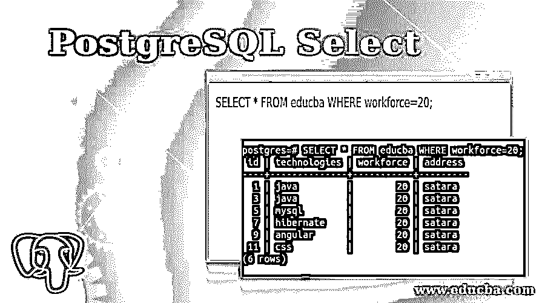
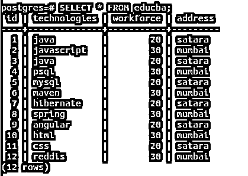
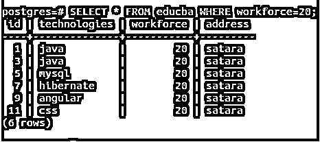
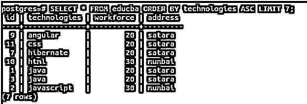

# PostgreSQL 选择

> 原文：<https://www.educba.com/postgresql-select/>

## PostgreSQL Select 简介

任何数据库最重要的目的之一就是存储数据，以便我们可以根据需要随时检索和获取数据。检索到的记录主要用于用户的报告和分析，或者有时检索现有的结果以对其进行修改。SELECT 子句用于获取 PostgreSQL 数据库中的数据。我们可以使用 select 子句从零个、一个或多个表中检索结果。本文将学习如何使用 select 子句构建查询语句、它们的语法和示例，以便更好地理解 PostgreSQL 中的查询构建。

### PostgreSQL Select 的语法

postgresql select 的语法如下所示:

<small>Hadoop、数据科学、统计学&其他</small>

**语法:**

`SELECT [ ALL | DISTINCT | DISTINCT ON (column_or_expression) ] columns_or_expressions
FROM tables
[WHERE conditional_restrictions] [GROUP BY column_or_expression] [HAVING conditional_restrictions] [ORDER BY column_or_expression [ ASC | DESC | USING operator ] [ NULLS FIRST | NULLS LAST ]] [LIMIT [ row_count | ALL] [OFFSET value_of_offset [ ROW | ROWS ]] [FETCH { FIRST | NEXT } [ rows_to_be_fetched ] { ROW | ROWS } ONLY] [FOR { UPDATE | SHARE } OF table [ NOWAIT ]];`

select 子句的语法非常复杂，涉及许多可能的组合，为用户提供了灵活性。我们将通过学习上面所有使用的 select 子句来学习语法。

*   **ALL** :在应用所有条件、限制和表达式后，检索查询将获取的所有记录。
*   **DISTINCT** :仅从检索结果中检索列和表达式的唯一值，并进一步过滤出 DISTINCT 参数中提到的列或表达式的唯一条目。
*   **columns_or_expressions** :这是您希望使用 select 查询检索的列名或表达式的列表。
*   **FROM** :这个关键字帮助指定您希望从中检索记录的表的名称。此外，我们可以使用左连接、右连接、自然连接等类型的连接。，在检索记录时合并两个或多个表的结果。
*   **WHERE** :该子句帮助指定条件、限制和表达式，以便在选择查询中检索记录时过滤出结果。
*   **分组依据**:使用 GROUP BY 语句可以根据某一列或某一表达式对结果集进行分组。这在检索聚合函数操作的列(如某些列的和或积)时最常用。
*   **HAVING** :通过对检索到的列和表达式应用条件和限制，可以进一步过滤出结果，如果在检索结果时使用的话，还包括聚合值。
*   **ORDER BY:** 当在 ORDER BY 关键字后指定时，结果集可以根据某些列和表达式以有序的格式排列。我们可以通过使用 ASC 或 DESC 关键字来按升序或降序排列数据。
*   **LIMIT** :可以使用 LIMIT 关键字将检索到的记录限制在一定的行数内。例如，如果查询结果会产生 55 条记录，并且在 select 查询中应用了 10 条语句的限制后，将只检索前 10 条记录。
*   **OFFSET** :这是您想要开始检索记录的行号。例如，如果偏移量为 5，从第 5 条记录开始，将检索结果的行。
*   **FETCH** 这个功能类似于 limit 关键字，它把要检索的记录数量限制为一个特定的数量。
*   的**:如果指定了 FOR UPDATE，则可以限制对记录的访问，并对记录进行写锁定；如果指定了 FOR SHARE，则允许其他事务执行读取操作，但不允许执行更新和插入操作。**

除 FROM 之外，上述 select 子句语法中使用的所有其他子句/关键字本质上都是可选的。

### PostgreSQL Select 示例

以下是 postgresql select 的示例:

让我们创建一个示例，并在表中插入几条记录，以了解如何使用 select 子句检索记录。打开 PostgreSQL 命令行提示符，输入以下命令创建一个名为 educba 的表

`CREATE TABLE educba
(id INTEGER PRIMARY KEY,
technologies VARCHAR,
workforce INTEGER,
address VARCHAR);`

让我们使用下面的语句在 educba 表中插入一些值

`INSERT INTO educba VALUES (1,'java',20,'satara'),(2,'javascript',30,'mumbai'),(3,'java',20,'satara'),(4,'psql',30,'mumbai'),(5,'mysql',20,'satara'),(6,'maven',30,'mumbai'),(7,'hibernate',20,'satara'),(8,'spring',30,'mumbai'),(9,'angular',20,'satara'),(10,'html',30,'mumbai'),(11,'css',20,'satara'),(12,'reddis',30,'mumbai');`

让我们创建一个简单的 select 查询语句，从 educba 表中检索所有记录。我们的查询语句如下:

`SELECT * FROM educba;`

这里，*表示要检索的所有列，并在下面的输出中触发上述查询结果

现在，我们将使用 where 子句应用条件，并只检索那些拥有 20 名员工的记录。为此，我们必须在 where 子句中提到条件 workforce = 20，我们的查询语句如下

`SELECT * FROM educba WHERE workforce=20;`

现在，假设我们只想检索员工人数为 20 的技术名称列表，那么查询语句将如下所示

`SELECT technologies FROM educba WHERE workforce=20;`

让我们看看如何根据劳动力数量对结果进行分组，并检索技术的逗号分隔字符串。为此，查询语句如下:

`SELECT string_agg(technologies,','), workforce FROM educba GROUP BY workforce;`

假设我们不是以 string_agg 的形式检索列标题，而是使用“as”关键字为其指定别名，如下所示:

`SELECT string_agg(technologies,',') as "List Of Technologies", workforce FROM educba GROUP BY workforce;`

让我们根据技术名称按字母顺序对结果进行排序，并使用 limit 子句将记录限制为 7 条。我们的查询语句如下

`SELECT * FROM educba ORDER BY technologies ASC LIMIT 7;`

### 推荐文章

这是 PostgreSQL Select 的指南。这里我们也讨论 postgresql select 的介绍和语法，以及不同的例子和它的代码实现。您也可以看看以下文章，了解更多信息–

1.  [PostgreSQL Like](https://www.educba.com/postgresql-like/)
2.  [PostgreSQL 回合](https://www.educba.com/postgresql-round/)
3.  [PostgreSQL 授权](https://www.educba.com/postgresql-grant/)
4.  [PostgreSQL 内部连接](https://www.educba.com/postgresql-inner-join/)