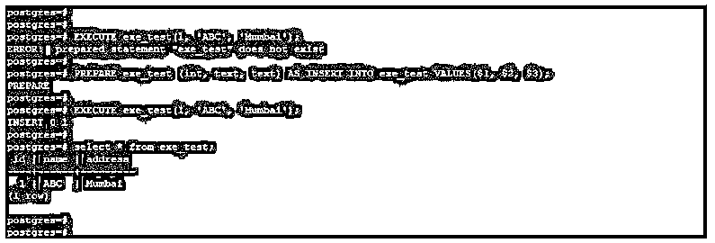
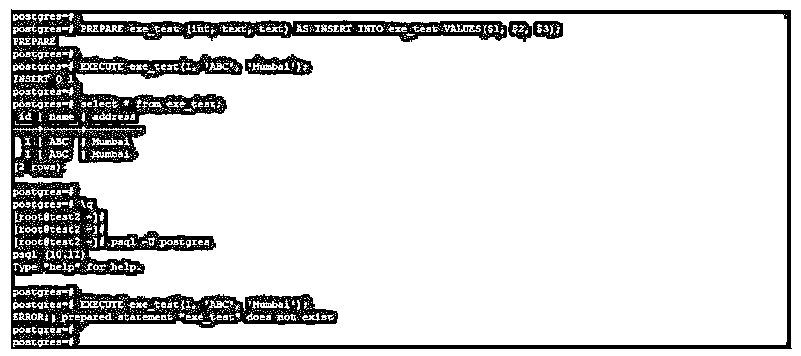
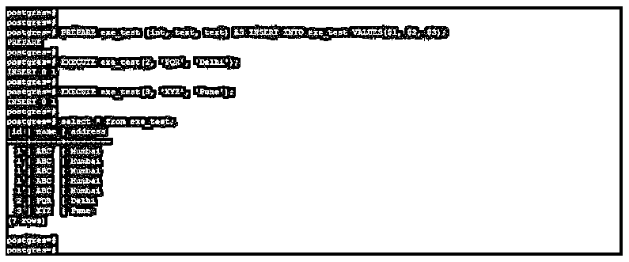

# PostgreSQL 执行

> 原文：<https://www.educba.com/postgresql-execute/>

## PostgreSQL 执行简介

PostgreSQL EXECUTE 语句用于执行之前创建的预处理语句，要使用 EXECUTE 命令执行该语句，我们需要给出预处理语句的名称和参数。PostgreSQL 中的 Prepare 语句只存在于我们所使用的当前会话期间，会话断开后，prepare 语句将自动从数据库服务器中删除。我们可以在预处理语句中使用 execute 命令来使用 select、delete 和 insert 语句。

**语法:**

<small>Hadoop、数据科学、统计学&其他</small>

下面是语法:

`Execute (name of prepared statement) [(parameter)]`

**参数**

下面是 PostgreSQL 中 EXECUTE 语句的参数描述语法:

*   **执行:**该语句用于执行 PostgreSQL 中的预准备语句。
*   **Name:** 这是 PostgreSQL 中与 execute 语句一起使用的预准备语句的名称。
*   **参数:**定义为参数准备语句的实际值。这是与 PostgreSQL 中预处理语句的参数兼容的数据类型值。

### PostgreSQL EXECUTE 语句如何工作？

下面是 EXECUTE 语句的工作原理:

*   要在 PostgreSQL 中使用 execute 语句，我们首先需要创建预处理语句。如果不创建预准备语句，我们就不能使用 execute 语句。
*   它将在执行语句时返回语法错误。

在下面的例子中，我们需要首先创建准备好的语句。

**代码:**

`EXECUTE exe_test(1, 'ABC', 'Mumbai');
PREPARE exe_test (int, text, text) AS INSERT INTO exe_test VALUES($1, $2, $3);
EXECUTE exe_test(1, 'ABC', 'Mumbai');
select * from exe_test;`

**输出:**

*   在上面的第一行代码中，我们使用了 exe_test prepare 语句和 exe_test 语句，但是它会显示错误。
*   因此我们需要创建准备好的语句来使用 execute 语句。
*   在第二行代码中，我们成功地执行了 execute 语句，因为在该语句中我们使用了 prepared 语句。
*   在创建了我们在 execute 语句中使用的预准备语句名称后，我们创建了 exe_test。

在下一个示例中，我们将看到 prepare 语句仅在我们已连接的当前会话中有效，从会话断开连接后，prepare 语句将自动从数据库服务器中删除。

**代码:**

`PREPARE exe_test (int, text, text) AS INSERT INTO exe_test VALUES($1, $2, $3);
EXECUTE exe_test(1, 'ABC', 'Mumbai');
select * from exe_test;
psql -U postgres
EXECUTE exe_test(1, 'ABC', 'Mumbai');`

**输出:**

*   在上面的代码中，我们已经创建了名为 exe_test 的预准备语句，在创建相同的语句后，我们使用了 using execute 语句。
*   执行此操作后，我们断开了与会话的连接，并再次尝试使用相同的用户凭据登录。
*   通过以上步骤，我们再次连接到会话，但是准备好的语句将不存在于数据库中，因为它将在从当前会话断开后自动从服务器中删除。

### PostgreSQL EXECUTE 示例

下面是提到的例子:

#### 示例#1

使用 execute 语句将数据插入表中。

以下示例显示了如何使用 PostgreSQL 中的 execute 语句将数据插入到表中。

*   在示例中，我们首先创建了名为 exe_test 的预准备语句。
*   使用这个准备好的语句，我们通过使用 execute 命令将数据或行插入 exe_test 表中。

**代码:**

`PREPARE exe_test (int, text, text) AS INSERT INTO exe_test VALUES($1, $2, $3);
EXECUTE exe_test(2, 'PQR', 'Delhi');
EXECUTE exe_test(3, 'XYZ', 'Pune');
select * from exe_test;`

**输出:**

#### 实施例 2

使用 execute 语句从表中选择数据。

以下示例显示了如何使用 PostgreSQL 中的 execute 语句从表中选择数据。

*   在本例中，我们已经创建了名为 exe_test1 的预准备语句。使用这个准备好的语句，我们通过执行命令从 exe_test 表中选择数据。

**代码:**

`PREPARE exe_test1 (int, text, text) AS SELECT id, name, address FROM exe_test;
EXECUTE exe_test1(1, 'ABC', 'Mumbai');`

**输出:**

#### 实施例 3

使用 execute 语句从表中删除数据。

以下示例显示了如何使用 PostgreSQL 中的 execute 语句从表中删除数据。

*   在本例中，我们已经创建了名为 exe_test2 的预准备语句。使用这个准备好的语句，我们通过执行命令从 exe_test 表中删除数据。

**代码:**

`PREPARE exe_test2 (int) AS delete from exe_test where id =1;
EXECUTE exe_test2(1);
select * from exe_test;`

**输出:**

### 推荐文章

这是一个 PostgreSQL 执行指南。在这里，我们讨论 PostgreSQL EXECUTE 的介绍、语句如何工作以及查询示例。您也可以看看以下文章，了解更多信息–

1.  [PostgreSQL 平均值](https://www.educba.com/postgresql-average/)
2.  [PostgreSQL 事务](https://www.educba.com/postgresql-transaction/)
3.  [PostgreSQL 唯一索引](https://www.educba.com/postgresql-unique-index/)
4.  [PostgreSQL CTE](https://www.educba.com/postgresql-cte/)