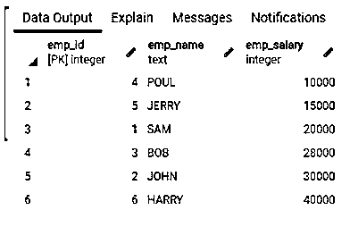
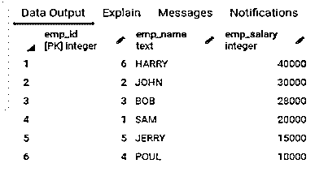
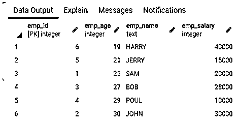
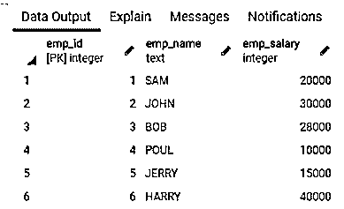
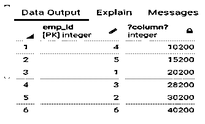
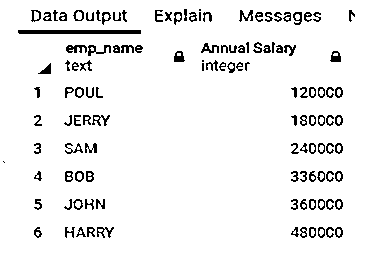
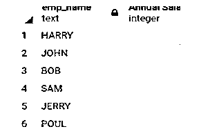
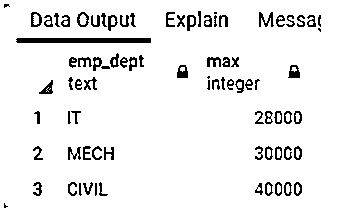

# PostgreSQL 排序

> 原文：<https://www.educba.com/postgresql-sort/>

## PostgreSQL 排序的定义

PostgreSql 为用户提供了排序功能。排序功能在数据库管理系统中起着重要的作用。在排序功能的帮助下，我们可以按照我们的要求排列数据，如升序或降序。通过使用 group by 和 order by 子句，我们可以对单个列或多个列应用排序函数。在执行排序功能之前，我们必须需要一个包含记录的表。为了执行 sort 函数，我们在 select 语句中使用 order by 子句对表记录进行排序。我们也可以用不同的算术运算符实现排序函数。

**语法:**

<small>Hadoop、数据科学、统计学&其他</small>

`select              column named1,       column named2…… column namedN         from table name order by    column name1,          column name2,…………. column nameN;`

**解释:**在上述语法中，我们在 select 语句中使用 order by 子句，其中列名 1、列名 2 和列名 dn 用于显示表中的列，其中表名表示数据库中指定的表名，列名 1、列名 2 和列名 n 用于应用 order by 子句。

### PostgreSQL 中排序函数的工作原理

*   我们必须在您的系统中安装 PostgreSql。
*   我们需要关于 PostgreSql 的基础知识。
*   我们必须要求表格执行排序功能。
*   我们必须了解 order by 子句的基本知识，也就是如何使用它。

### PostgreSQL 中实现排序函数的例子

实现排序功能的不同方法如下

基本排序技术我们使用 order by 子句对数据库表中的记录进行排序，所以首先我们使用下面的语句创建表。

`create table company                       (emp_id int primary key not null,
emp_name text not null,                  emp_age int not null,
emp_salary int not null);`

通过使用下面的快照来说明上述声明的最终结果。

#### 1.按升序排序

在这种方法中，我们按升序对数据库表中的记录进行排序。有关更多详细信息，请参见以下示例。

**举例:**

`Select        emp_id,   emp_name,   emp_salary     from    company    order by
emp_salary asc;`

**说明:**在上面的例子中，假设我们需要对员工的工资进行升序排序，这时使用上面的语句对员工的工资进行排序。通过使用下面的快照来说明上述声明的最终结果。

#### 2.按降序排序

在这种方法中，我们按照降序对数据库表的记录进行排序。有关更多详细信息，请参见以下示例。

**举例:**

`select          emp_id,     emp_name,     emp_salary  from company    order by  emp_salary               desc;`

**说明:**上例中，假设我们需要对员工工资进行降序排序。当时我们用上面的语句对员工工资进行排序。通过使用下面的快照来说明上述声明的最终结果。

#### 3.按多列升序排序

在这种方法中，我们使用下面的语句对多个列进行升序排序。

**举例:**

`select        emp_id,          emp_age,         emp_name,      emp_salary from company order by   emp_age,       emp_salary asc;`

**解释:**在上面的例子中，假设我们需要对多个列进行升序排序，在这个例子中我们使用上面的语句对 emp_age 和 emp_salary 进行升序排序。通过使用下面的快照来说明上述声明的最终结果。

#### 4.按多列降序排序

在这种方法中，我们按照数据库表的降序对一列或多列进行排序。有关详细信息，请参见以下示例。

**举例:**

`select          emp_name,       emp_age,     emp_salary   from company    order by             emp_id,        emp_salary            desc;`

**解释:**在上面的例子中，假设我们需要使用上面的语句对 emp_id 和 emp_salary 进行降序排序。通过使用下面的快照来说明上述声明的最终结果。

#### 5.使用算术运算符对列进行排序

在这种方法中，我们通过对指定的列使用算术运算符来对数据库表的列进行排序。

**举例:**

`select         emp_id,      emp_salary+200        from       company     order by  emp_salary+200 asc;`

**解释:**在这个例子中，假设我们需要添加 Rs。200，并且需要按升序排序，这时我们使用上面的语句。通过使用下面的快照来说明上述声明的最终结果。

#### 6.使用列别名排序

在这种方法中，我们使用别名对数据库表中的记录进行排序。有关更多详细信息，请参见以下示例。

`select        emp_name,       emp_salary*12      "Annual Salary"       from       company       order by "Annual Salary";`

**解释:**在上面的例子中，假设我们需要计算一个员工的年薪，我们需要使用 alias 将他们按升序排列。默认情况下，order by 子句的顺序是升序。通过使用下面的快照来说明上述声明的最终结果。

在同一个示例中，我们使用以下语句按降序排列数据库表的记录。

`select           emp_name,         emp_salary*12     "Annual Salary"        from       company      order by      "Annual Salary"        desc;`

**说明:**上例中我们需要用别名来排列员工年薪，需要按降序排列。这里我们还使用了一个算术运算符。通过使用下面的快照来说明上述声明的最终结果。

#### 7.使用分组依据和排序依据进行排序

在这种方法中，我们使用 Group by 和 Order by 子句来排列记录。有关详细信息，请参见下面的示例。

**举例:**

`select          emp_dept,          max(emp_salary)           from            company        group by emp_dept         order by       max(emp_salary) ;`

**解释:**在上面的例子中，假设我们在使用上面的语句时，需要使用 group by 和 order by 子句计算每个部门的一个员工的最高工资。在这个例子中，IT 部门的最高工资是 28000，机械部门的最高工资是 30000，民用部门的最高工资是 40000。通过使用下面的快照来说明上述声明的最终结果。

### 结论

我们希望通过这篇文章，您已经了解了 PostgreSQL 排序语句。从上面的文章中，我们学习了排序的基本语法，例如 order by 子句，我们还学习了如何使用 group by 子句的不同方法实现排序功能。从这篇文章中，我们了解了如何处理数据库的排序表。

### 推荐文章

这是一个 PostgreSQL 排序的指南。在这里，我们还将讨论 postgresql 中排序函数的定义和工作方式，以及不同的示例和代码实现。您也可以看看以下文章，了解更多信息–

1.  [PostgreSQL 命令](https://www.educba.com/postgresql-commands/)
2.  [PostgreSQL 集合](https://www.educba.com/postgresql-set/)
3.  [PostgreSQL 整数](https://www.educba.com/postgresql-integer/)
4.  [PostgreSQL 不在](https://www.educba.com/postgresql-not-in/)中