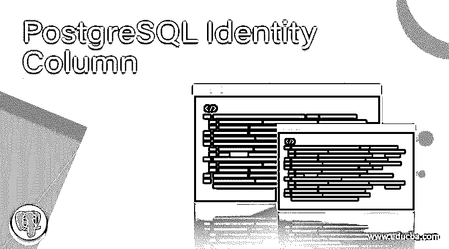
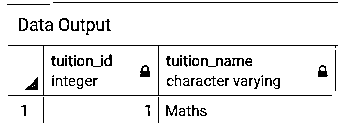
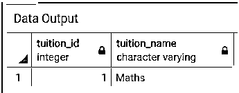
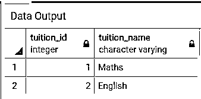

# PostgreSQL 标识列

> 原文：<https://www.educba.com/postgresql-identity-column/>

## PostgreSQL 标识列的定义

在 PostgreSQL 版本 10 中，它引入了一个名为 GENERATED AS IDENTITY constraint 的新特性。GENERATED AS IDENTITY 约束允许用户自动为列分配唯一值。串行列约束和生成为标识约束是 PostgreSQL 提供的类似约束。PostgreSQL 允许用户在单个表中拥有多个标识列。“生成为标识”约束使用与序列约束相同的序列对象。我们可以更改现有标识列的特征，或者我们可以修改表，将一个列作为标识列。

**语法:**

<small>Hadoop、数据科学、统计学&其他</small>

为了说明 PostgreSQL 标识列，请考虑以下语法:

`column_name data_type
GENERATED { ALWAYS | BY DEFAULT }
AS IDENTITY
[ ( sequence_option ) ]`

**说明:**

*   column_name:这定义了我们要对其应用生成的 AS 标识约束的列的名称。
*   data_type:数据类型可以是以下任何一种:

1.  斯莫列特，
2.  INT，
3.  或者 BIGINT。

### PostgreSQL 标识列是如何工作的？

当我们使用 GENERATED AS IDENTITY 约束时，有两种类型的指令提供给 PostgreSQL，让我们按照下面的定义来理解它们。

**生成总:**

如果我们生成了 ALWAYS defined，这意味着 PostgreSQL 必须始终为 identity 列创建新值。在带有生成的 ALWAYS 约束的列的情况下，如果我们试图插入或更新 same 的值，那么 PostgreSQL 会抛出一个错误或异常。

**默认生成:**

如果我们已经默认生成了 defined means，PostgreSQL 将为 PostgreSQL 标识列创建一个新值。对于具有默认生成约束的列，如果我们尝试插入或更新 same 的值，则 PostgreSQL 使用 same 值，并且不使用任何系统生成的值，PostgreSQL 也不会引发任何错误或异常

### 例子

让我们讨论 PostgreSQL 标识列的例子。

#### 示例# 1–始终作为身份生成

考虑下面的例子，我们将使用 CREATE TABLE 语句创建一个新表，该表将存储学费的详细信息。

`DROP TABLE tuitions;
CREATE TABLE tuitions (
tuition_id INT GENERATED ALWAYS AS IDENTITY,
tuition_name VARCHAR NOT NULL
);`

现在，我们将使用 INSERT INTO 语句在学费表中插入一行，如下所示:

`INSERT INTO tuitions(tuition_name)
VALUES('Maths');`

通过使用以下 SQL 语句和一个快照来说明 tuitions 表的结果。

`SELECT * FROM tuitions;`

现在，我们将尝试通过提供学费 id 和学费名称在学费表中插入另一条记录，如下所示:

`INSERT INTO tuitions(tuition_id, tuition_name)
VALUES(2, 'English');`

由于我们使用 GENERATED ALWAYS 作为身份约束，PostgreSQL 将抛出一个错误或异常。

使用下面的快照说明上面的 INSERT INTO 语句的结果。

#### 示例# 2–默认情况下作为身份生成

考虑下面的例子，我们将使用 CREATE TABLE 语句创建一个新表，该表将存储学费的详细信息。

`DROP TABLE tuitions;
CREATE TABLE tuitions (
tuition_id INT GENERATED BY DEFAULT AS IDENTITY,
tuition_name VARCHAR NOT NULL
);`

现在，我们将使用 INSERT INTO 语句在学费表中插入一行，如下所示:

`INSERT INTO tuitions(tuition_name)
VALUES('Maths');`

通过使用以下 SQL 语句和一个快照来说明 tuitions 表的结果。

`SELECT * FROM tuitions;`

现在，我们将尝试通过提供学费 id 和学费名称在学费表中插入另一条记录，如下所示:

`INSERT INTO tuitions(tuition_id, tuition_name)
VALUES(2, 'English');`

如我们所见，在生成 ALWAYS AS IDENTITY 约束的情况下，PostgreSQL 会抛出一个错误或异常，因为默认情况下生成 AS IDENTITY 约束将按预期工作。

使用下面的 SQL 语句和快照来说明上面的 INSERT INTO 语句的结果。

`SELECT * FROM tuitions;`

#### 示例# 3–添加列标识

为了将标识列添加到现有表中，PostgreSQL 提供了以下语法:

`ALTER TABLE
table
ALTER COLUMN
column
ADD
{ ALWAYS | BY DEFAULT }
AS IDENTITY
{ ( sequence_option ) }`

考虑下面的例子，我们将使用 CREATE TABLE 语句创建一个新表，该表将存储学费的详细信息。

`DROP TABLE tuitions;
CREATE TABLE tuitions (
tuition_id int NOT NULL,
tuition_name VARCHAR NOT NULL
);`

现在，我们将使用以下 SQL 语句和快照来描述表函数的标识列状态:

`SELECT
column_name, is_identity, identity_generation
FROM
information_schema.columns
WHERE
TABLE_NAME = 'tuitions';`

我们可以使用以下语法将 tufty _ id 列更改为 Identity 列，在将任何列定义为 Identity 列之前，我们必须使其为 NOT NULL 列。

`ALTER TABLE
tuitions
ALTER COLUMN
tuition_id
ADD
GENERATED ALWAYS AS IDENTITY;`

我们将使用以下 SQL 语句和快照来描述表函数的标识列状态:

`SELECT
column_name, is_identity, identity_generation
FROM
information_schema.columns
WHERE
TABLE_NAME = 'tuitions';`

#### 示例# 4–更改现有标识列的特征

为了更改现有表的标识列的特征，PostgreSQL 提供了以下语法:

`ALTER TABLE
table
ALTER COLUMN
Column
{
SET
GENERATED { ALWAYS| BY DEFAULT }
}`

为了理解这个主题，请考虑在上一节中创建的表。

我们可以使用以下语法更改标识列 tutory _ id 列的约束

`ALTER TABLE
tuitions
ALTER COLUMN
tuition_id
SET GENERATED BY DEFAULT;`

我们将使用以下 SQL 语句和快照来描述表函数的标识列状态:

`SELECT
column_name, is_identity, identity_generation
FROM
information_schema.columns
WHERE
TABLE_NAME = 'tuitions';`

#### 示例 5–删除列标识

为了删除现有表的标识列，PostgreSQL 提供了以下语法:

`ALTER TABLE
table
ALTER COLUMN
column
DROP
IDENTITY [ IF EXISTS ]`

为了理解这个主题，请考虑在上一节中创建的表。

我们可以使用以下语法删除 tufty _ id 列的标识:

`ALTER TABLE
tuitions
ALTER COLUMN
tuition_id
DROP
IDENTITY IF EXISTS;`

我们将使用以下 SQL 语句和快照来描述表函数的标识列状态:

`SELECT
column_name, is_identity, identity_generation
FROM
information_schema.columns
WHERE
TABLE_NAME = 'tuitions';`

### 结论

我们希望通过上面的文章，您已经理解了如何使用 PostgreSQL 标识列以及 PostgreSQL 标识列是如何工作的。此外，我们还添加了几个 PostgreSQL Identity 列的示例来详细了解它。

### 推荐文章

这是一个 PostgreSQL 标识列的指南。这里我们讨论一下定义，PostgreSQL 标识列是如何工作的？和代码实现的例子。您也可以看看以下文章，了解更多信息–

1.  [PostgreSQL 角色](https://www.educba.com/postgresql-roles/)
2.  [PostgreSQL MIN()](https://www.educba.com/postgresql-min/)
3.  [PostgreSQL 当前日期](https://www.educba.com/postgresql-current-date/)
4.  [PostgreSQL 集合](https://www.educba.com/postgresql-set/)