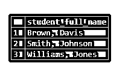

# PostgreSQL CONCAT()

> 原文：<https://www.educba.com/postgresql-concat/>

## PostgreSQL CONCAT()简介

为了连接两个以上的字符串，我们可以使用 PostgreSQL 提供的字符串连接运算符(||)或 CONCAT()函数。CONCAT()函数是 PostgreSQL 从 9.1 版开始提供的内置函数。我们可以将一个字符串元素数组传递给 PostgreSQL CONCAT()函数，因为它是一个可变函数，并接受一个元素列表作为输入。如果传递，PostgreSQL CONCAT()函数将忽略 NULL 输入，这意味着即使所提供的参数列表中有一个输入字符串为 NULL，我们也可以连接这些字符串。

**语法:**

<small>Hadoop、数据科学、统计学&其他</small>

考虑 CONCAT()函数的以下语法:

`CONCAT(string_1, string_2, ...)`

**解释:**PostgreSQL CONCAT()函数以一个参数列表作为输入。

### PostgreSQL CONCAT()函数是如何工作的？

*   PostgreSQL CONCAT()将列表中的每个元素视为一个参数，因为该函数是一个可变函数，可以接受任意数量的元素作为输入。
*   提供给函数的输入参数应该是字符串类型或可转换为字符串类型。
*   字符串类型意味着输入参数应该是以下任何一种数据类型:
    *   可变长字符串
    *   茶
    *   文本

### 实现 PostgreSQL CONCAT()函数的示例

考虑以下示例，该示例使用 PostgreSQL CONCAT()函数连接两个字符串。通过使用以下 SELECT 语句和快照来说明 CONCAT 函数

`SELECT CONCAT ('Edu', 'CBA') as CONCAT_TABLE;`

**输出:**

-1.1")

我们将使用 CREATE TABLE 语句创建一个名为“student”的表，如下所示:

`create table student
(
stud_id serial PRIMARY KEY,
stud_fname VARCHAR(80) NOT NULL,
stud_lname VARCHAR(80) NOT NULL
);`

我们将使用 INSERT INTO 语句向 student 表中插入一些数据，如下所示。

`INSERT INTO student(stud_fname,stud_lname)
VALUES
('Smith','Johnson'),
('Williams','Jones'),
('Brown','Davis');`

通过使用下面的 SQL 语句和快照来说明上面的 INSERT 语句的结果。

`select * from student;`

**输出:**

-1.2")

我们将使用下面的 SQL 语句和快照连接 student 表的 stud_fname 和 stud_lname 列的值。

`SELECT
CONCAT  (stud_fname, ' ', stud_lname) AS "Students fullname"
FROM
Student;`

**输出:**

-1.3")

通过使用以下 SQL 语句和快照，我们可以使用 CONCAT()函数将空值与字符串连接起来。

`SELECT CONCAT('EduCBA is',  NULL, ' awesome.') AS NULL_concatenated_string;`

**输出:**

我们可以看到 PostgreSQL CONCAT()函数在连接输入参数时忽略了空字符串。同时，我们将看到下面的 SQL 语句结果，它使用字符串连接运算符(||)来连接字符串。

`SELECT 'EduCBA is'|| NULL || 'awesome'  AS NULL_string;`

**输出:**

我们可以看到返回的结果是一个空字符串，而 CONCAT 函数可以忽略这个空字符串。

我们可以使用 PostgreSQL CONCAT()函数进行各种操作，例如我们需要构建一个语句，通过组合以下字符串来给出结果字符串:

*   学生姓名是的。
*   学生名字的长度。
*   人物。

`SELECT
stud_fname,
CONCAT('Student name is of ', LENGTH (stud_fname), ' characters'   )
FROM
student;`

**输出:**

PostgreSQL 还为我们提供了名为 CONCAT_WS 的函数，这意味着用分隔符连接。

我们将使用以下语句连接 student 表的 stud_fname 和 stud_lname，语句之间用逗号和空格分隔。

`SELECT
concat_ws (', ', stud_fname, stud_lname) AS student_full_name
FROM
student
ORDER BY
stud_fname;`

**输出:**

### 优势

*   因为我们可以使用字符串连接操作符(||)来连接两个或更多的字符串，如果 CONCAT()函数忽略了连接它们的空参数，那么使用空参数会失败。
*   CONCAT()函数是一个可变函数，它可以将参数列表作为输入。
*   我们可以通过连接多个字符串来构建所需的输出字符串。
*   CONCAT()函数只对字符串类型的输入进行操作。

### 推荐文章

这是一个 PostgreSQL CONCAT()的指南。这里我们还讨论 PostgreSQL Concat()函数的定义和工作原理。以及不同的示例及其代码实现。您也可以看看以下文章，了解更多信息–

1.  [PostgreSQL JSON](https://www.educba.com/postgresql-json/)
2.  [PostgreSQL 唯一约束](https://www.educba.com/postgresql-unique-constraint/)
3.  [PostgreSQL 限制](https://www.educba.com/postgresql-limit/)
4.  [PostgreSQL 时间戳](https://www.educba.com/postgresql-timestamp/)
5.  【PostgreSQL HAVING 如何工作？
6.  [PostgreSQL 随机|示例](https://www.educba.com/postgresql-random/)