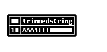

# PostgreSQL TRIM()

> 原文：<https://www.educba.com/postgresql-trim/>

")

## PostgreSQL TRIM()的定义

PostgreSQL TRIM()函数用于消除空格或一组特殊的字符，这些字符可能出现在字符串的开头、结尾或两边。trim()函数可以删除最长的字符串，该字符串的开头、结尾或者开头和结尾都有字符。如果没有明确提到任何要删除的字符，该函数的默认功能是删除空格。该字符串的数据类型可以是 char、varchar 或任何文本。

**语法:**

<small>Hadoop、数据科学、统计学&其他</small>

`Trim( [ leading | trailing | both ] [ trim character ] from string )`

这是 trim 函数的基本语法。在这里，trim 函数后面是像前导字符、尾随字符、修剪字符这样的选项。让我们详细看看这些。上述语法可以通过以下方式进行延迟。

*   **Trim(从字符串开始):**这将删除字符串开头的空格。
*   **Trim(从字符串中删除):**这将删除出现在字符串末尾的空格。
*   **Trim(均来自字符串):**这将删除出现在字符串开头和结尾的空格。这也可以通过简单地使用 Trim (string)函数来实现。这也是 trim 功能的默认工作方式。

### PostgreSQL TRIM()函数是如何工作的？

修剪工作在上述规定的变化。让我们详细看一下其中的每一项。

*   Trim(从字符串开始):使用这个函数，可以删除给定字符串开头的空格或字符。

`select TRIM(LEADING FROM '     This is removing leading spaces');`

在这里，字符串开头的空格被删除。

-1.1")

这里领先是关键词。它会删除开头出现的所有空格。

*   Trim(字符串末尾):使用这个函数，可以删除给定字符串末尾的空格或字符。

`select TRIM(Trailing FROM 'This is removing trailing spaces           ');`

-1.2")

在这里，字符串末尾的空格被删除。尾随是关键词。

*   Trim(均来自字符串):使用该函数，可以删除给定字符串末尾的空格或字符。

`select TRIM(Both FROM '           This is removing trailing spaces           ');`

-1.3")

这里字符串两端的空格都被删除了，both 是关键字。

### PostgreSQL 中 TRIM()函数的示例

让我们看看配平函数的不同例子。

*   通过使用 trim 功能，我们可以很容易地删除不需要的字符。

`SELECT TRIM('00 ' FROM '    00  AAA   ') AS TrimmedString;`

-2.1")

在这个例子中，我们正在修剪文本中出现的多余的 0。正文是‘00 AAA’。我们删除了字符串开头的多余空格和 00。这里的输出存储在 TrimmedString 中。下面的屏幕截图显示了这段代码运行后我们得到的输出。它只给出‘AAA’。多余的 0 和空格将从字符串中删除，并存储在声明的变量中。

*   RTRIM 的功能与 LTRIM 类似。它删除字符串中出现的尾随空格或字符。

`SELECT RTRIM('AAA TTT     ') AS TrimmedString;`

*   第三种是缺省方式，从字符串的两边去掉空格。

`SELECT TRIM(Both '00 ' FROM ' 00   AAA  000 ') AS NewString;`

这是从字符串两端移除空格和“00”时的函数。给定的字符串在字符串“00 AAA 00”的开头和结尾都有空格。因此，当 trim 函数按原样使用时，它完成了从字符串两端删除空格的工作，我们得到的输出是:“AAA”。从字符串中删除所有不必要的空格。

`SELECT TRIM(Trailing '00 ' FROM '         AAA    000  ') AS NewString;`

在这里，TRIM 函数修剪多余的空格和“00”，它们出现在字符串的末尾或 AAA 后面的空格。它删除它们，然后输出没有空格的数据。然后，这个输出字符串存储在声明的变量中。您可以观察到开始区域的空格，因为我们在这里没有使用前导修剪功能。

trim 函数也可以用于数组。我们可以利用程序查询。通过使用 declare，我们可以初始化一个变量，然后在 while 循环中，我们可以在需要时使用 trim 函数。

### 在 PostgreSQL 中使用 TRIM()函数的优势

trim()函数有如下优点，这使得它的使用变得简单而高效。其中一些列举如下:

*   这是 SQL 中最简单的字符串函数。您可以很容易地将它用于任何字符串，因此，我们可以去掉不必要的空格或不需要的字符。
*   当创建的脚本很长且无法从特定字符串中删除空格时，使用 trim()函数会很有效，它会从字符串中删除所有空格。
*   它不仅适用于空格，而且用户还可以删除不需要的字符。
*   它可以与数组、存储过程一起使用，或者只是用来删除任何空格。它有多种用途。
*   由于这是一个内置函数，因此速度很快，并且提高了使用它的脚本或过程的性能。
*   它提供了各种变化，比如只从字符串的开头或结尾删除空格。

### 结论

因此，trim()函数非常有用，可以在简单到复杂的 SQL 脚本中使用。它提供了快速的结果和增强的性能。数据仓库和数据清理中使用的所有现代工具都支持这一功能。这个函数的所有这些能力使得它非常重要，也是它被广泛使用的原因。

### 推荐文章

这是一个 PostgreSQL TRIM()的指南。在这里，我们还将讨论 postgresql trim()函数的介绍和工作原理，以及不同的示例和代码实现。您也可以看看以下文章，了解更多信息–

1.  [PostgreSQL 不为空](https://www.educba.com/postgresql-not-null/)
2.  [PostgreSQL 通知](https://www.educba.com/postgresql-notify/)
3.  [PostgreSQL 唯一约束](https://www.educba.com/postgresql-unique-constraint/)
4.  [PostgreSQL 查询指南](https://www.educba.com/postgresql-queries/)