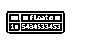
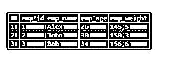
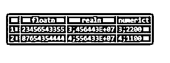
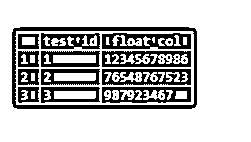

# PostgreSQL 浮点型

> 原文：<https://www.educba.com/postgresql-float/>

## PostgreSQL 浮点数据类型简介

PostgreSQL 提供不同类型的数据类型。单个表由具有不同数据类型的不同列组成，我们需要在浮点列中存储包含小数点的浮点数，并且值不是近似值。，所以在这种情况下，我们使用浮点数据类型。浮点数据类型属于数值数据类型的类别。Float 数据类型支持浮点数、实数和 4 或 8 字节数字。在浮点数据类型中，我们使用位大小，位大小表示字符串的长度。例如 3.4、654.3 和-345.32，这些都是浮点数。系统内存是有限的，你不能无限精确地存储数字，所以我们使用浮点数据类型，这也是浮点数据类型的主要用途。

**语法和参数:**

<small>Hadoop、数据科学、统计学&其他</small>

考虑下面的语法来理解我们如何使用 float 数据类型。

**1。浮动(p)**

`Column_name flaot`

**解释**

其中 float 是数据类型，p 定义了可接受的最小二进制数字，它接受 4 或 8 字节的数字。其中，列名表示创建的表中的特定列名，float 表示 float 数据类型

2 .实数(num)

**解释**

其中，实数类型和 num 是数字，并且是单精度的。

**3。数字或数字(p，s):**

**解释**

其中 Numeric 是数据类型，p 表示数字，s 表示小数点后的数字，它是双精度的。

### PostgreSQL 中的 Float 数据类型是如何工作的？

以 float 数据类型存储的双精度浮点小数。浮点数据类型对应于 IEEE 4 字节浮点到双浮点。通常，float 数据类型存储科学数字，这些数字可以计算得接近数值。在 float 数据类型中输入的数字可能略有不同，因为 float 数据类型返回最高有效位。这是浮点数据类型 1E-307 到 1E+308 的范围。

### 例子

PostgreSQL 中主要有以下三种浮点数

#### 1.浮动(n):

在这种类型中，浮点数的精度至少为 n，最多为 8 个字节。

**例子**

`Create table float_point (floatn float4 not null);
insert into float_point (floatn) values (543.23);
select * from float_point;`

**解释**

在上面的语句中，我们在 float_point 表中创建了一个名为 floatn 的列，它的数据类型是 float4，它以实数形式显示结果。通过使用下面的快照来说明上述声明的最终结果

**T2】**

 **和我们为浮点 8 写的例子一样

`create table float_point1  (floatn float8 not null);
insert into  float_point1 (floatn) values (5434533453);
select * from float_point1;`

**解释**

在上面的语句中，我们在 float_point1 表中创建了一个名为 floatn、数据类型为 float 的列，它以双精度显示结果。通过使用下面的快照来说明上述声明的最终结果。

#### 2.真实:

这是 float 的第二种数据类型，用作 4 字节浮点数。real 的范围至少为 1E-37 到 1E+37，精度高达 6 位小数。

**例子**

`Create  table  float_point_r  (real_no real not null);
insert  into float_point_r (real_no) values (12345623);
select * from float_point_r;`

通过使用下面的快照来说明上述声明的最终结果。

实数据类型的另一个例子

`CREATE TABLE emp (emp_id INTEGER PRIMARY KEY, emp_name TEXT, emp_age INTEGER, emp_weight REAL);
INSERT INTO emp (emp_id,emp_name,emp_age,emp_weight) VALUES (1, 'Alex', 26, 145.5), (2, 'John', 30, 150.3),  (3, 'Bob', 34, 156.6);
select * from emp;`

**说明**

在上面的语句中，emp 是表名，我们为 emp_weight 创建了一个具有不同数据类型的表，比如 text integer 和 real 数据类型。

通过使用下面的快照来说明上述声明的最终结果

#### 3.数字或数字(p，s):

这是 float 下的第三种数据类型，numeric 意味着它使用两种记数法表示数字，用 p 和 s 表示实数，其中 p 表示数字，s 表示小数点后的数字。数字(p，s)表示精确的数字，并且是双精度的。双精度的范围是 1E-307 到 1E+308，精度至少为十五位。

**例子**

`Create  table  float_point_numeric (numeric_no numeric(2,2) );
insert  into  float_point_numeric (numeric_no) values (0.3);
select   * from float_point_numeric;`

通过使用下面的快照来说明上述声明的最终结果

**现在我们在下面的例子中说明三种数据类型**

`create table float_data_type
(floatn float8 not null, realn real not null, numerict numeric(3, 2));
insert  into  float_data_type (floatn,realn,numerict)values
(23456543355, 34564433, 3.22),
(87654354444, 45564333, 4.11);
select * from float_data_type;`

**解释**

在上面的语句中，我们执行了所有三种类型的 float 数据类型，在本例中，我们创建了一个名为 float_data_type 的表，并创建了具有不同数据类型的不同列，如具有 float8 数据类型的列名 floatn、具有 real 数据类型的 realn 和具有 numeric 数据类型的 numerict。通过使用下面的快照来说明上述声明的最终结果。

**例子**

如果你想存储大量的十进制数字，这时你需要正确的数据类型，所以 PostgreSQL 提供了这样一种数据类型，我们称之为双精度。它是数字数据类型，使用 8 个字节或 15 个数字。双精度的另一个名字是 float8。

`create table test ( test_id SERIAL PRIMARY KEY, test_name VARCHAR(100), float_col double precision);
insert  into test (test_id, test_name, float_col) VALUES (1, 'unit testing',12345678986), (2, 'fun_testing', 76548767523), (3, 'system_testing',0987923467);
select test_id, float_col from test;`

**解释**

在上面的语句中，我们实现了双精度数据类型。通过使用下面的快照来说明上述声明的最终结果。

### 结论

我们希望从上面的文章中您已经理解了 PostgreSQL FLOAT 数据类型。从上面的文章中，我们了解了不同类型的浮点数据类型，如浮点、实数和数字，通过不同的例子，我们还看到了双精度的例子。最后，这种数据类型的主要目的是在表中给出正确的数字表示，并避免整数表示的复杂性。

### 推荐文章

这是一个 PostgreSQL Float 的指南。这里我们讨论一下 PostgreSQL 中 Float 数据类型的定义和工作原理。您也可以看看以下文章，了解更多信息–

1.  [PostgreSQL 删除](https://www.educba.com/postgresql-delete/)
2.  [PostgreSQL 最大值](https://www.educba.com/postgresql-max/)
3.  [PostgreSQL 排除](https://www.educba.com/postgresql-exclude/)
4.  [PostgreSQL WITH 子句](https://www.educba.com/postgresql-with-clause/)**