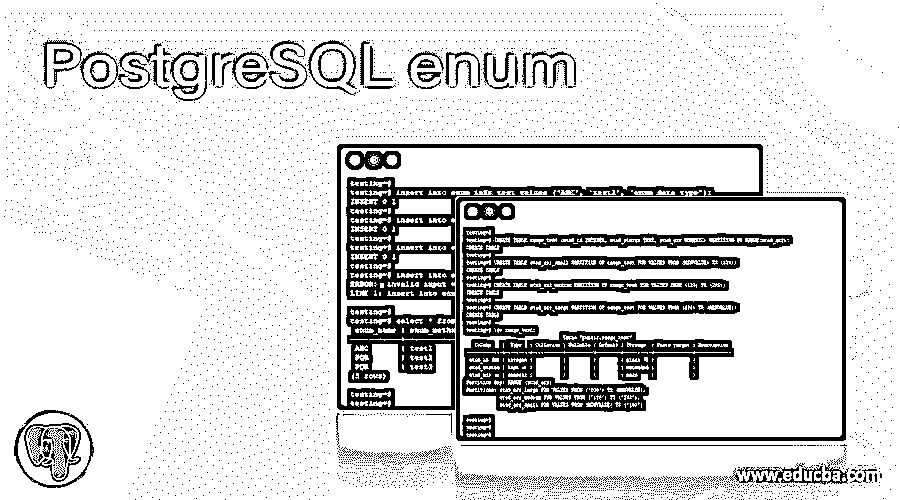
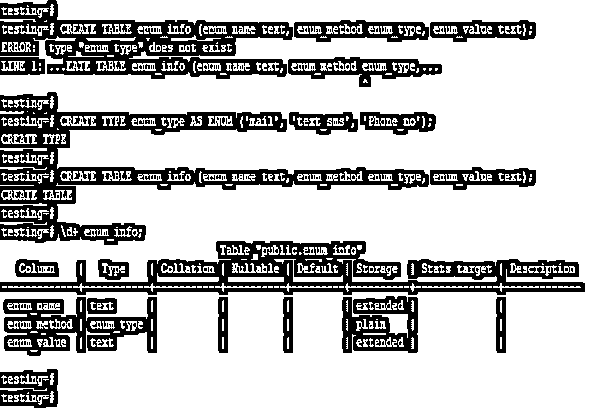
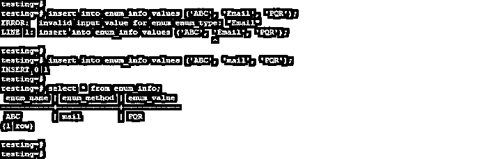
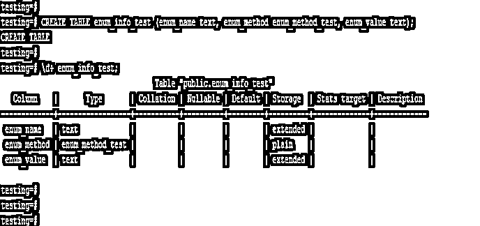
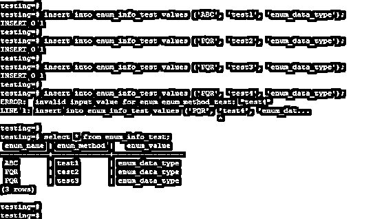

# PostgreSQL 枚举

> 原文：<https://www.educba.com/postgresql-enum/>

## PostgreSQL 枚举的定义

PostgreSQL 枚举是在 PostgreSQL 中用来在列字段中存储相同类型的值的数据类型，我们可以使用枚举来存储相同类型的值。为了定义枚举数据类型，我们需要首先创建枚举类型，以便在表中使用它，我们可以在枚举类型中定义多个值，以便在表中使用相同的值。如果我们需要表中相同的列值，同时我们使用枚举。

**语法:**

<small>Hadoop、数据科学、统计学&其他</small>

下面是 PostgreSQL 中 enum 的语法:

*   **创建枚举类型**

`Create type name_of_enum_type (value_of_enum_type1, value_of_enum_type2, value_of_enum_type3, …, value_of_enum_typeN);`

*   **使用枚举类型**创建表格

`Create table name_of_table (name_of_column1 data_type, name_of_column2 enum_type, name_of_column3 data_type, …, name_of_columnN data_type);`

*   **插入枚举数据类型列的值**

`Insert into name_of_table (name_of_column1, name_of_enum_type_column2, name_of_column3, …, name_of_columnN) values (value1, value_of_enum_type, value2, value3, …., ValueN);`

*   **改变枚举类型**

`Alter type name_of_enum_type add value ‘value_of_enum_type’ AFTER ‘value_of_enum_type’;`

**下面是 PostgreSQL 中 enum 类型的参数描述语法。**

*   **创建类型–**这被定义为使用 PostgreSQL 中的创建类型创建枚举数据类型。
*   **枚举类型的名称–**这被定义为创建枚举类型，并在创建表格时在表格中使用。我们可以在创建表时在列上使用这种数据类型。
*   **表格名称–**这被定义为表格的名称，我们在该表格的列上定义了枚举数据类型。
*   **枚举类型 1 的值到枚举类型 N 的值–**这被定义为我们在枚举数据类型中使用的一组值。我们可以在枚举类型中定义多个值，在定义相同的值后，我们在插入时将它用在表中。
*   **创建表–**这被定义为使用枚举类型创建一个表，我们可以在 PostgreSQL 中为列定义枚举类型。
*   **列 1 的名称到列 N 的名称–**这被定义为我们在创建表时使用的列的名称。我们还为列定义了枚举类型。
*   **值 1 到值 N–**这被定义为插入表格时使用的列字段值。
*   **Alter type–**我们可以在创建后更改枚举类型，我们可以使用 Alter type 命令修改枚举类型。我们可以向 enum 数据集中添加一个新值，以便在表中使用该值。
*   **添加值–**这被定义为使用 alter type 命令向枚举类型添加一个新值。

### PostgreSQL 中的 enum 是如何工作的？

*   下面是 PostgreSQL 中 enum 类型的工作方式。
*   如果我们在列中使用了相同类型的值，同时我们在表列中使用了枚举类型。
*   对于使用枚举类型，我们需要首先创建它，没有创建我们不能使用到表中。
*   下面的例子表明，我们需要先创建枚举类型，没有创建我们就不能使用 into 表。

**代码:**

`CREATE TABLE enum_info (enum_name text, enum_method enum_type, enum_value text);
CREATE TYPE enum_type AS ENUM ('mail', 'text_sms', 'Phone_no');
CREATE TABLE enum_info (enum_name text, enum_method enum_type, enum_value text);
\d+ enum_info;`

*   在第一个示例中，我们在没有创建的情况下创建了枚举类型表，但它会显示枚举类型不存在的错误。
*   在第二个示例中，我们创建了 enum_type 类型的枚举类型。在第三个示例中，我们已经在 enum_method 列上使用了它，同时这也不会产生错误，因为我们已经在表中使用它之前创建了 enum 类型。
*   在表列上使用枚举类型后，我们不能使用未包含在枚举类型数据集中的其他值。
*   下面的例子表明，我们不能使用不包含在枚举类型数据集中的其他值。

**代码:**

`insert into enum_info values ('ABC', 'Email', 'PQR');
insert into enum_info values ('ABC', 'mail', 'PQR');
select * from enum_info;`

*   在第一个示例中，我们在枚举类型列值中将 use-value 作为电子邮件，但它会发出错误“枚举的输入值无效”,因为我们使用的值未存储在枚举数据集中。
*   在第二个示例中，我们将 use-value 作为邮件，它不会发出错误，因为邮件值可用于枚举数据集中。

### 例子

下面是 PostgreSQL 中枚举类型的示例。

#### 示例#1:创建枚举类型

下面的例子显示了创建枚举类型。我们已经将枚举类型名称创建为 enum_method_test。此外，我们还增加了测试 1、测试 2 和测试 3 的价值。

**代码:**

`CREATE TYPE enum_method_test AS ENUM ('test1', 'test2', 'test3');`

#### 示例 2:使用枚举类型创建一个表

以下示例显示了如何使用枚举类型创建表。我们已经将表名创建为 enum_info_test。此外，我们还在列名中添加了 enum type 作为 enum_method。

**代码:**

`CREATE TABLE enum_info_test (enum_name text, enum_method enum_method_test, enum_value text);
\d+ enum_info_test;`

#### 示例#3:插入枚举数据类型列的值

以下示例显示了将值插入枚举数据类型列。

**代码:**

`insert into enum_info_test values ('ABC', 'test1', 'enum_data_type');
insert into enum_info_test values ('PQR', 'test2', 'enum_data_type');
insert into enum_info_test values ('PQR', 'test3', 'enum_data_type');
insert into enum_info_test values ('PQR', 'test4', 'enum_data_type');
select * from enum_info_test;`

#### 示例#4: **改变枚举类型**

**代码:**

以下示例显示了更改枚举类型。我们将新值 test4 添加到 enum_method_test 类型中。

`ALTER TYPE enum_method_test ADD VALUE 'test4' AFTER 'test3';`

#### 示例 5:删除枚举类型

下面的示例显示了删除枚举类型。

**代码:**

`drop type enum_method_test;`

### 推荐文章

这是一个 PostgreSQL 枚举的指南。这里我们讨论一下定义，enum 在 PostgreSQL 中是如何工作的？以及代码实现的例子。您也可以看看以下文章，了解更多信息–

1.  [PostgreSQL 缓存](https://www.educba.com/postgresql-caching/)
2.  [PostgreSQL 比较字符串](https://www.educba.com/postgresql-compare-strings/)
3.  [PostgreSQL OID](https://www.educba.com/postgresql-oid/)
4.  [PostgreSQL group_concat](https://www.educba.com/postgresql-group_concat/)