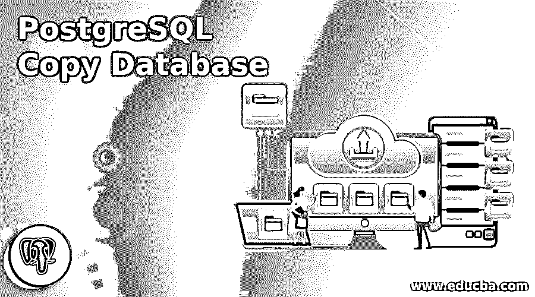

# PostgreSQL 复制数据库

> 原文：<https://www.educba.com/postgresql-copy-database/>

## PostgreSQL 复制数据库简介

我们可以在任何需要的时候复制数据库。在 PostgreSQL 中，我们需要从一台服务器到另一台服务器或在同一台服务器内复制数据库，这种情况有很多种。数据库复制操作在很多情况下都很有用，比如在测试中，我们只制作数据库的副本，并在不影响原始数据库副本的情况下对其进行操作。如果数据库很大，我们可以为它创建一个转储文件，以后我们可以根据需要将它恢复到远程服务器。创建副本所需的时间取决于数据库的大小，如果原始数据库较大，则可能需要较长的时间。我们可以使用 PostgreSQL 提供的名为‘pg _ dump’的实用程序将数据库转储到文件中。当我们使用 pg_dump 命令时，这不会阻塞任何其他数据库操作。

### 如何在 PostgreSQL 中复制数据库？

我们将理解 PostgreSQL 复制数据库操作在同一个服务器或不同服务器中的过程如下:

<small>Hadoop、数据科学、统计学&其他</small>

#### 1.同一服务器内的 PostgreSQL 复制数据库操作

**步骤 1:** 我们可以使用如下的 PostgreSQL CREATE DATABASE 语句来做数据库的复制:

**代码:**

`CREATE DATABASE target_database
WITH TEMPLATE source_database;`

**输出:**

**解释**上面这条语句将把 source_database 数据库复制到 target_database 数据库。如果给定的模板在 PostgreSQL 中不存在，那么它将在出错时抛出一个异常。为了创建一个空数据库，我们可以使用 template0 来避免本地添加，否则，我们可以使用模板。

**步骤 2:** 考虑以下示例，我们将使用以下语句将使用 template0 创建的“eduCBA”数据库复制到“NewEduCBA”中:

**代码:**

`CREATE DATABASE NewEduCBA
WITH TEMPLATE template0;`

**输出:**

展示数据库列表，以验证“eduCBA”数据库的拷贝是使用名为“NewEduCBA”的新数据库创建的，方法是使用“\l”命令和快照。

**步骤 3:** 如果给定的模板在 PostgreSQL 中不存在，那么它将在出错时抛出异常。考虑下面的例子，我们将得到一个错误或异常，因为模板“educba”不存在。

**代码:**

`CREATE DATABASE NewEduCBA
WITH TEMPLATE educba;`

**输出:**

#### 2.PostgreSQL 将数据库从一台服务器复制到另一台服务器的操作

现在考虑数据库文件是否较大，服务器之间的连接是否较慢。我们可以执行以下步骤，pg_dump 实用程序用于备份 PostgreSQL 数据库的单个部分或所有部分。pg_dump 实用程序创建一个一致的数据库副本，它是启动 pg_dump 程序时数据库的映像。pg_dump 实用程序不限制用户在执行备份时访问数据库(读取或写入数据库对象)。

为了使用 pg_dump 程序，不需要拥有超级用户权限，但是用户应该拥有对所有数据库对象的读取权限。

**步骤 1:** 使用以下命令从源数据库创建转储文件。我们在其中导出数据的转储文件可以是归档文件或脚本格式(例如。sql 它是一个包含 SQL 命令/语句的脚本文件。pg_dump 命令正在执行 SELECT 语句。

**代码:**

`pg_dump -U postgres -O source_database source_database.sql`

**步骤 2:** 步骤 1 中创建的转储文件必须复制到远程服务器。

**步骤 3:** 现在，在远程服务器中创建一个新的数据库，我们将在其中恢复转储文件。

**代码:**

`CREATE DATABASE target_database;`

**步骤 4:** 现在，在步骤 3 中创建的数据库中恢复远程服务器上复制的转储文件。

**代码:**

`psql -U postgres -d target_database -f source_database.sql`

现在考虑下面的例子，我们将数据库“eduCBA”到“remote_educba”

1.现在，我们使用以下命令从“eduCBA”数据库创建一个转储文件“eduCBA.sql”

**代码:**

`pg_dump -U postgres -O eduCBA eduCBA.sql;`

2.必须将步骤 1 中创建的转储文件复制到远程服务器。

3.现在，在远程服务器中创建一个名为“remote_educba”的新数据库，我们将在其中恢复转储文件。

**代码:**

`CREATE DATABASE remote_educba;`

4.现在，将远程服务器上复制的转储文件恢复到步骤 3 中创建的数据库中。

**代码:**

`psql -U postgres -d remote_educba -f eduCBA.sql`

**输出:**

### 结论

我们希望从上面的文章中您已经理解了 PostgreSQL 复制数据库操作是如何工作的。此外，我们还添加了几个 PostgreSQL 复制数据库操作的示例来详细理解它。

### 推荐文章

这是一个 PostgreSQL 复制数据库的指南。这里我们讨论 PostgreSQL 复制数据库的介绍，以及它如何与各种方法一起工作。您也可以浏览我们的其他相关文章，了解更多信息——

1.  [PostgreSQL 重新索引](https://www.educba.com/postgresql-reindex/)
2.  PostgreSQL 中的[数组](https://www.educba.com/array-in-postgresql/)
3.  [hstore in PostgreSQL](https://www.educba.com/hstore-in-postgresql/)
4.  [PostgreSQL 更新连接](https://www.educba.com/postgresql-update-join/)
5.  [PostgreSQL 解码()](https://www.educba.com/postgresql-decode/)