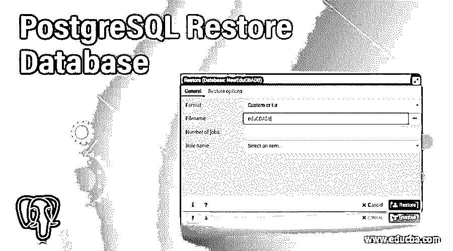
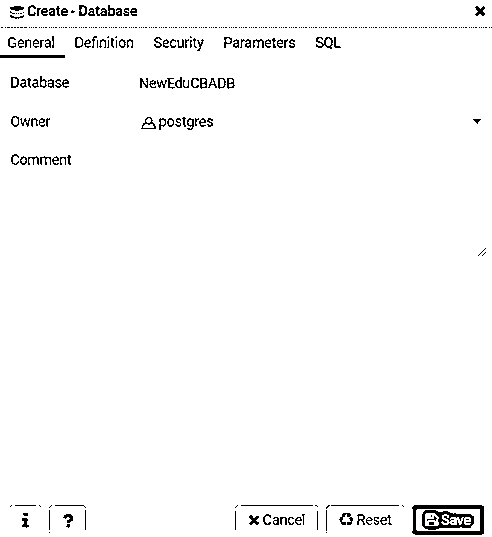
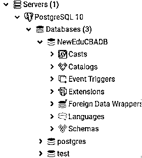
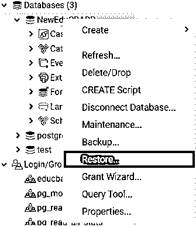
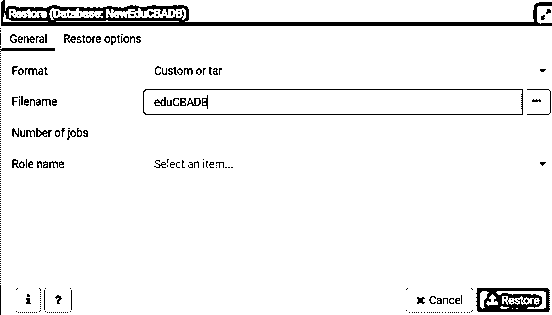
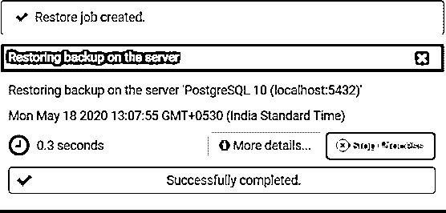

# PostgreSQL 还原数据库

> 原文：<https://www.educba.com/postgresql-restore-database/>

## PostgreSQL 恢复数据库简介

PostgreSQL 中的数据库恢复过程用于从备份中复制数据。这意味着我们使用数据库备份文件，并将其转换成数据库。通过使用数据恢复，我们创建了数据的副本，用于重新生成损坏的数据或丢失的数据；我们确保丢失数据在特定时间完全恢复并保持一致；通常是指数据损坏或破坏发生之前的时间。在几种情况下，我们需要执行数据恢复；第一个人为失误，如误用户，删除了数据。第二，由于断电或某些自然灾害、某种盗窃或硬件或软件故障，数据被黑客攻击、窃取或暴露于外界或数据被破坏。

### 如何在 PostgreSQL 中恢复数据库？

要在 PostgreSQL 中执行数据库恢复，我们必须终止要恢复的数据库的所有活动连接。在 PostgreSQL 中有两种方法可以执行数据恢复，如下所示:

<small>Hadoop、数据科学、统计学&其他</small>

#### 方法 1

**1。**使用 psql 实用程序恢复由‘pg _ dump’和‘pg _ dumpall’创建的 SQL 脚本。

考虑下面的例子来理解 psql 实用程序命令。

要执行完整备份，我们必须使用以下命令，并通过跳过选项–set ON _ ERROR _ STOP(如下所述)来忽略恢复过程中出现的所有错误。

**代码:**

`psql
-U username
-f backupSqlFile.sql`

如果在 PostgreSQL 中执行数据库恢复时出现错误，我们希望立即停止该过程，我们可以使用以下命令和选项–set ON _ ERROR _ STOP = ON。

**代码:**

`psql
-U username
--set ON_ERROR_STOP=on
-f backupSqlFile`

我们可以使用下面的命令来恢复 PostgreSQL 中的特定数据库，如下所述。

**代码:**

`psql
-U username
-d databaseName
-f objectDB.sql`

#### 方法 2

**2。**恢复 tar 文件和目录格式

*   我们可以借助 PostgreSQL 中的 pg_restore 程序来恢复 pg_dump 或 pg_dumpall 工具生成的备份文件。
*   通过使用 pg_restore 程序，我们可以使用多个线程来恢复数据库，为此，我们指定了选项-j，用于定义恢复过程中使用的线程数量。
*   我们可以使用 pg_restore 程序在不同的数据库版本上执行转换，这意味着我们可以将旧版本的数据库备份恢复到新版本。
*   如果我们有一个完整的数据库备份文件，我们可以使用 pg_restore 程序恢复一个特定的数据库。

考虑下面的例子来理解 PostgreSQL 中的 pg_restore 程序。

我们将使用下面的 CREATE DATABASE 语句创建一个名为 eduCBADB 的数据库。假设我们在路径 c:\ PostgreSQLEduCBA \ educbad . tar 创建了备份 eduCBADB.tar 文件

**代码:**

`CREATE DATABASE eduCBADB;`

我们可以使用以下命令以 tar 文件格式恢复 eduCBADB 数据库:

**代码:**

`pg_restore
--dbname=eduCBADB
--verbose c:\PostgreSQLEduCBA\eduCBADB.tar`

如果我们想要恢复 PostgreSQL 中的数据库，它类似于备份的数据库，那么我们可以使用以下命令:

**代码:**

`pg_restore
--dbname=eduCBADB
--create
--verbose c:\PostgreSQLEduCBA\eduCBADB.tar`

### 使用 pgAdmin 工具恢复数据库

我们可以使用 pgAdmin 恢复工具在 PostgreSQL 中执行数据库恢复。

考虑下面的例子，它展示了我们如何从 eduCBADB.tar 文件中恢复 NewEduCBADB 数据库

1.  **删除现有的 NewEduCBADBdatabase:** 删除数据库 NewEduCBADB
2.  **新建一个空的 eduCBADB 数据库:**创建数据库 NewEduCBADB

考虑下面的屏幕截图，它用于使用 pgAdmin 4 在 PostgreSQL 中创建一个数据库:

考虑下面的屏幕截图，它显示了使用 pgAdmin 4 在 PostgreSQL 中的数据库列表:

**3。**现在，我们可以在 UI 上执行以下操作

*   选择 eduCBADB 数据库
*   鼠标右键单击
*   选择恢复…

然后

*   选择所需选项，如作为用户、备份文件和恢复选项
*   单击“恢复”按钮开始恢复数据库。

我们必须一步一步地完成以下对话:

**步骤 1:** 考虑下面的屏幕截图，它显示了 pgAdmin 4 中数据库上可用的上下文菜单项:

**步骤 2:** 考虑下面的屏幕截图，当我们单击 pgAdmin 4 中数据库上的“Restore…”上下文菜单项时，会显示恢复对话框:

**步骤 3:** 考虑下面的屏幕截图，它显示了在 pgAdmin 4 中成功创建作业以恢复数据库的情况:

### 推荐文章

这是一个 PostgreSQL 恢复数据库的指南。这里我们讨论 PostgreSQL 恢复数据库的介绍，语法和参数，实现的例子。您也可以浏览我们的其他相关文章，了解更多信息——

1.  [PostgreSQL 集群](https://www.educba.com/postgresql-cluster/)
2.  [PostgreSQL 替换](https://www.educba.com/postgresql-replace/)
3.  [PostgreSQL For 循环](https://www.educba.com/postgresql-for-loop/)
4.  [PostgreSQL 主键](https://www.educba.com/postgresql-primary-key/)