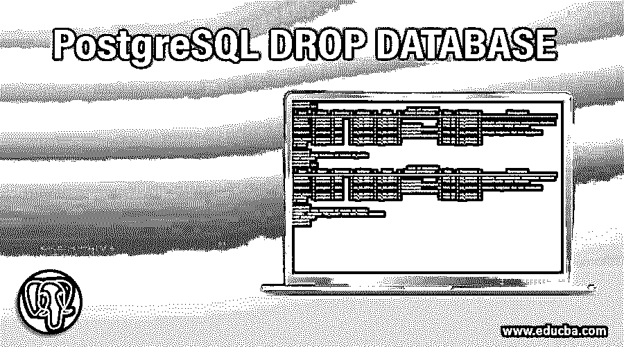
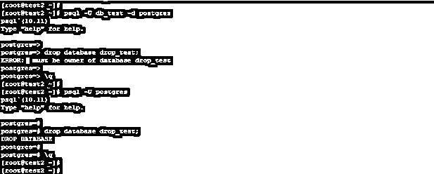
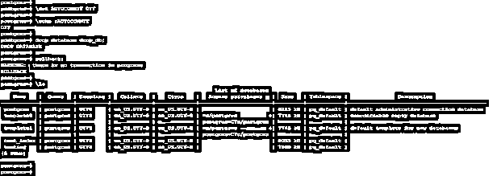
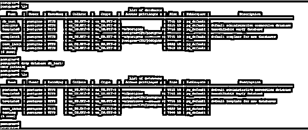
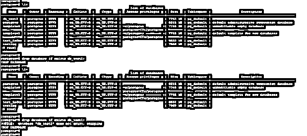

# PostgreSQL 删除数据库

> 原文：<https://www.educba.com/postgresql-drop-database/>

## PostgreSQL 删除数据库简介

PostgreSQL drop database 语句用于删除数据库；我们可以使用 PostgreSQL 中的 drop database 命令删除数据库中不需要的数据库。我们可以在 drop database 命令中使用数据库名称，这是我们想要从数据库服务器中删除的数据库名称；该语句将从服务器中删除目录条目和物理数据目录文件。我们不能撤消 drop database 语句，所以我们需要谨慎地使用这个命令。为了在 PostgreSQL 上执行这个命令，我们拥有超级用户或管理员用户的权限；另一个用户无法执行此命令。

### 语法和参数

下面是语法:

<small>Hadoop、数据科学、统计学&其他</small>

*   Drop database database_name(我们从数据库服务器中删除的数据库的名称)；

**或**

*   Drop database [如果存在] database_name(我们已从数据库服务器中删除的数据库的名称)；

**或**

*   Dropdb [options(我们在 PostgreSQL 中删除数据库时使用了多个选项)] database_name。

下面是 PostgreSQL 中 drop database 语句的参数描述语法。

*   **Drop:** Drop database 语句在 PostgreSQL 中基本上是用来从服务器中丢弃不用的数据库。
*   **数据库名称:**这被定义为数据库的名称，它是我们从数据库服务器中删除的。
*   **If exists:** 这被定义为使用 If exists 选项删除数据库；使用此选项后，如果数据库服务器上不存在该数据库，则不会显示错误。
*   **Dropdb:** 我们可以使用 Dropdb 命令从命令行删除数据库。我们可以在 PostgreSQL 中使用 dropdb 命令删除数据库。
*   **选项:**这被定义为我们在 dropdb 命令中使用了多个选项。在 PostgreSQL 中删除数据库时，我们使用了多个选项。

在使用 dropdb 命令删除数据库时，我们使用了以下选项。

*   **–V:**当我们必须打印 dropdb 的版本时，使用该选项。
*   **–I:**执行 dropdb 命令前会显示验证提示。
*   **–help:**会显示 dropdb 命令。
*   **–h:**定义为删除指定主机的数据库。
*   **–p:**定义为删除指定端口的数据库。
*   **–U:**这被定义为使用用户名删除数据库。
*   **–W:**这被定义为使用用户名密码删除指定的数据库。

### 在 PostgreSQL 中 DROP DATABASE 语句是如何工作的？

*   下面是 PostgreSQL 中 drop database 语句的工作方式。我们可以使用 PostgreSQL 中的 drop database 和 dropdb 命令删除数据库。
*   要在 PostgreSQL 中执行 drop database 命令，我们需要数据库所有者的特权或 admin 特权。
*   这将发出类似“错误:必须是数据库 drop_test 的所有者”的错误。删除 drop_test 数据库时。

**Code:** 下面的例子说明我们需要在 PostgreSQL 中拥有数据库所有者或管理员用户的特权。

`psql -U db_test -d postgres
drop database drop_test;
psql -U postgres
drop database drop_test;`

**输出:**

*   在上面的第一个示例中，我们尝试使用 db_test 用户删除数据库；它将发出我们无法删除数据库的错误，因为它将不是 drop_test 数据库名称的所有者。
*   在第二个例子中，我们使用 Postgres 用户删除了数据库；它不会显示错误，因为它是一个管理员用户。
*   我们不能在 PostgreSQL 中回滚 drop database 事务，因此我们需要谨慎使用该语句。

**代码:**下面的例子说明我们不能在 PostgreSQL 中回滚删除数据库的事务。

`\set AUTOCOMMIT OFF
\echo :AUTOCOMMIT
drop database drop_db;
rollback;
\l+`

**输出:**

*   在上面的示例中，我们已经删除了数据库，并试图回滚该数据库，但它不会回滚删除数据库的事务。
*   我们可以使用命令行和数据库 shell 提示符来删除数据库。
*   我们使用使用 shell 提示符的 drop database 语句和 dropdb 命令从 shell 提示符中删除数据库。
*   如果我们有删除数据库的权限，我们可以使用 pg_admin 这样的 GUI 工具删除数据库。

### 实现 PostgreSQL 删除数据库的示例

下面是提到的例子:

#### 1.不使用任何参数删除数据库

*   在下面的示例中，我们没有使用任何参数来删除数据库。我们必须从数据库提示符中删除数据库。
*   我们已经从用户 Postgres 中删除了数据库名 db_test。Postgres 用户拥有管理员权限。

**代码:**

`\l+
drop database db_test;
\l+`

**输出:**

#### 2.如果存在参数，则使用删除数据库

*   在下面的示例中，我们使用了 if exist 参数来删除数据库。我们必须在 PostgreSQL 的数据库提示符下删除数据库。
*   我们已经从用户 Postgres 中删除了数据库名 db_test1。

**代码:**

`\l+
drop database if exists db_test1;
\l+
drop database if exists db_test1;`

**输出:**

#### 3.从命令行提示符中删除数据库

*   在下面的例子中，我们从命令行提示符下删除了数据库。我们已经从 PostgreSQL 的命令行提示符中删除了数据库。
*   我们已经从用户 Postgres 中删除了数据库名 db_test2。

**代码:**

`psql -U postgres -c "drop database db_test2"
psql -U postgres
\l+`

**输出:**

#### 4.使用 dropdb 命令删除数据库

在下面的示例中，我们使用 dropdb 命令删除了数据库。我们已经使用 dropdb 命令从命令行提示符中删除了数据库。

**代码:**

`dropdb -U postgres db_test3
psql -U postgres
\l+`

**输出:**

### 结论

Drop database 语句主要用于从数据库服务器中删除现有的或未使用的数据库。我们可以使用 drop database 和 dropdb 命令来删除数据库。我们无法回滚删除数据库的语句。

### 推荐文章

这是一个 PostgreSQL DROP DATABASE 的指南。这里我们讨论一个 PostgreSQL DROP 数据库的介绍，它是如何工作的，并举例说明。您也可以浏览我们的其他相关文章，了解更多信息——

1.  [PostgreSQL 中的序列](https://www.educba.com/sequence-in-postgresql/?source=leftnav)
2.  [PostgreSQL 中的通配符](https://www.educba.com/wildcards-in-postgresql/?source=leftnav)
3.  [PostgreSQL 子查询](https://www.educba.com/postgresql-subquery/?source=leftnav)
4.  [PostgreSQL 别名](https://www.educba.com/postgresql-alias/?source=leftnav)