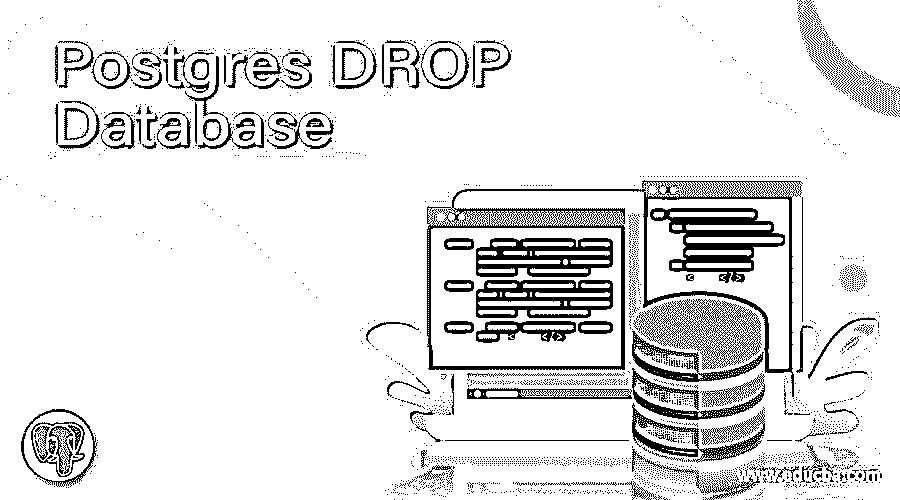
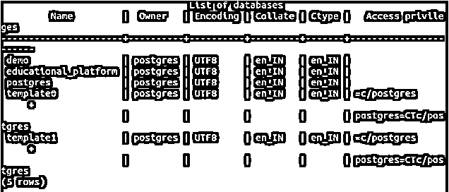
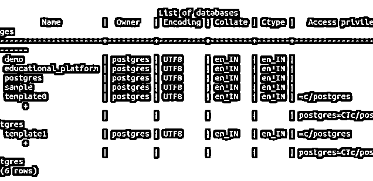
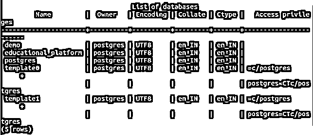
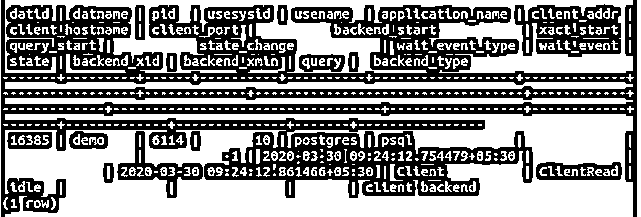
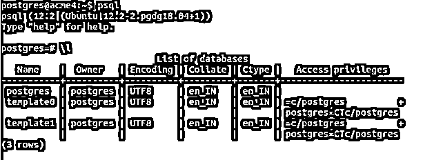

# Postgres 删除数据库

> 原文：<https://www.educba.com/postgres-drop-database/>

## Postgres DROP 数据库简介

只要数据库中的数据不重要，没有必要再存储，或者是一个您希望删除的空数据库，那么您可以使用 DROP Database 命令或一个用于该名为 dropdb 的可用实用程序来完全删除该数据库。每当我们删除时，这意味着在那时删除一个数据库，发生的情况是该数据库的整个目录被永久删除，并且存储在目录条目中的关于要删除的数据库的相关信息也被永久删除。没有办法回滚该查询，因此在使用这些命令时必须非常确定和小心。

在本文中，我们将逐一学习如何使用可用的两种方法 DROP Database 语句和 dropdb 实用程序来完全删除数据库。

<small>Hadoop、数据科学、统计学&其他</small>

**语法:**

`DROP DATABASE [IF EXISTS] nameOfTheDb;`

上面的语法包含了查询语句 DROP Database 和其他参数，可以用下面的方式来解释

*   **如果存在**–可选参数。当当前数据库服务器中不存在名为“nameOfTheDb”的数据库时，该关键字可用于防止使用上述命令导致的任何错误。如果在查询中使用了“IF EXISTS”关键字，并且当前服务器中没有名为“nameOfTheDb”的数据库，那么它将简单地通知您相同的情况，并且不会导致任何错误。
*   **nameOfTheDb**–它是您希望删除或丢弃的数据库的名称，位于当前数据库中。

**备注:**

在删除数据库并了解其行为时，需要考虑的事情很少。

*   如果要删除的数据库有任何关联的活动会话，则不能删除该数据库。
*   此外，数据库只能由数据库的所有者删除。
*   还有一点要记住，drop database 查询语句不能对您现在连接的同一个数据库执行。
*   一旦数据库被删除，这些操作将无法撤消。所以在这样做的时候要更加小心。

### 例子

我们可以使用查询来检查数据库服务器中存在的所有数据库，该查询会为我的服务器生成以下输出

`\l`

可以看到，在我们的数据库服务器中没有名为 sample 的数据库。

让我们借助一个例子来理解如何使用这个命令。我们需要做的第一件事是打开 psql 命令提示符，然后执行我们的语句。假设，我们想要删除名为“sample”的数据库。因此，我的查询语句如下

`DROP DATABASE sample;`

这将产生以下输出–

可以看到，它导致了一个错误，指出在我们当前的数据库服务器中没有名为“sample”的数据库。

现在，如果我们对相同的命令使用 IF EXISTS，将会输出什么

`DROP DATABASE IF EXISTS sample;`

这将产生以下输出–

我们可以看到，它抛出了一个通知，告诉我们不存在这样的数据库，而不是一个错误。

让我们创建一个名为“sample”的数据库，然后执行上面的查询。我们可以使用此命令为我们的目的创建一个新的数据库

`CREATE DATABASE sample;`

这将产生以下输出–

让我们在命令的帮助下检查它是否创建成功，结果如下-

所以，我们的数据库现在存在了。这意味着当我们运行上述任何 DROP 命令时，都不会导致错误或通知。让我们通过触发查询本身来检查输出。

`DROP DATABASE sample;`

现在的结果是

让我们通过检查所有数据库来核实。\l 给出以下输出–

这意味着我们的数据库被成功删除。

让我们试着删除一个有活动连接的数据库。在本例中，我们将删除已经存在的数据库演示。您甚至可以创建一个新的数据库并尝试删除它。对于具有活动连接的数据库 o，我们将使用 psql 提示符打开一个新的终端，然后使用\ c demo 连接到演示数据库；命令。

`\c demo;`

现在，回到我之前的终端，我们将尝试删除演示数据库。

`DROP DATABASE demo;`

可以看到，它显示了一个错误，说明一个会话已经在使用名为 demo 的数据库。因此，它不能被删除。在这种情况下，我们可以通过首先检查与数据库相关的所有活动并终止它们来删除数据库。我们可以从表 pg_stat_activity 中看到数据库的所有活动。

让我们启动以下查询——

`SELECT * FROM pg_stat_activity WHERE datname = 'demo';`

输出——

一个会话与演示数据库相关联。我们可以使用以下查询来终止它们

`SELECT pg_terminate_backend (pg_stat_activity.pid) FROM pg_stat_activity WHERE pg_stat_activity.datname = 'demo';`

现在让我们放下演示数据库。

`DROP DATABASE demo;`

和\l 命令现在导致–

因此，我们的数据库被成功删除。

`dropdb command -`

我们甚至可以使用 dropdb 命令删除数据库。它的工作方式类似于 DROP DATABASE 语句。优点是我们可以使用 dropdb 功能远程删除数据库，但必须是数据库的所有者，我们正在尝试删除。语法如下–

`Dropdb [option.] nameOfTheDb;`

*   **数据库名称–**这是要删除或删除的数据库名称，位于当前数据库中。

选项可以是以下任何一项

| [计]选项 | 描述 |
| -e | 回显命令。 |
| ［构成来自拉丁语、结尾为-us 的名词的复数］ | 是否显示验证提示 |
| -V | 用于打印 dropdb 版本 |
| 救命 | 寻求帮助 |
| -h 主机 | 指定当前系统的主机 |
| -p 端口 | 当前建立的连接使用的套接字。 |
| –如果存在 | 如果数据库不存在，是否显示通知而不是错误。 |
| -U 用户名 | 用于连接数据库的用户名。 |
| -w | 如果不需要询问密码提示。 |
| -W | 删除数据库前是否要求密码提示。 |
| 维护数据库-=数据库名 | 删除目标数据库时要连接到的 od 数据库的名称。 |

### Postgres DROP 数据库示例

`dropdb -p 5432 -i -e educational_platform;`

注意，dropdb 命令是 shell 命令，而不是 psql。您可以打开 psql 命令和 fire \l 命令来检查数据库是否被删除。

这样，我们的数据库 educational_platform 就成功删除了。

### 结论

我们可以通过使用 DROP Database 语句或 dropdb 实用程序来删除数据库。这样做时要小心，因为操作无法撤消。

### 推荐文章

这是一个 Postgres DROP 数据库的指南。这里我们讨论 Postgres DROP 数据库的介绍、语法、参数和代码实现的例子。您也可以看看以下文章，了解更多信息–

1.  [PostgreSQL 除了](https://www.educba.com/postgresql-except/)
2.  [Postgres 删除级联](https://www.educba.com/postgres-delete-cascade/)
3.  [PostgreSQL 角色](https://www.educba.com/postgresql-roles/)
4.  [PostgreSQL 命令](https://www.educba.com/postgresql-commands/)