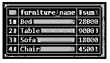
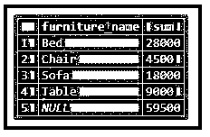
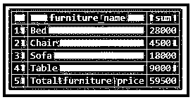
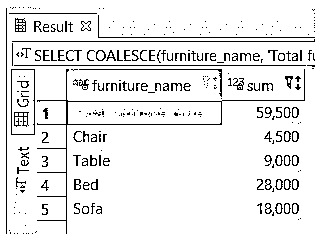
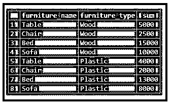
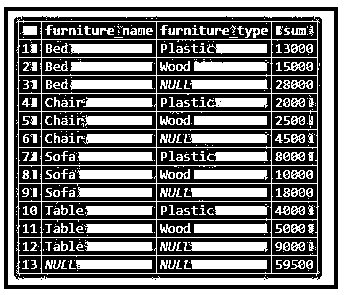
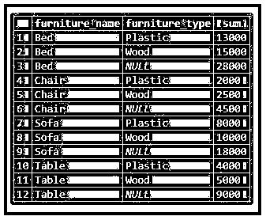

# PostgreSQL ROLLUP

> 原文：<https://www.educba.com/postgresql-rollup/>

## **PostgreSQL 汇总介绍**

PostgreSQL ROLLUP 是 GROUP BY 子句的扩展。通常，PostgreSQL GROUP BY ROLLUP 用于数据分析操作。对于执行数据分析相关操作，市场上有如此多的工具或软件可用。PostgreSQL 不是为数据分析目的而设计的；在 ROLLUP 等操作的帮助下，我们可以支持对实时数据的数据分析操作。

**语法:**

<small>Hadoop、数据科学、统计学&其他</small>

`SELECT
c1, c2, c3, aggregate_function(c4)
FROM
table
GROUP BY ROLLUP (c1, c2, c3);`

ROLLUP 选项中定义的列将被考虑用于生成层次结构。考虑上面的语法，其中输入列为(c1，c2，c3)。通过考虑层次 c1 > c2 > c3，ROLLUP 生成所有分组集。因此，对于小计和总计的报告，我们使用汇总。

在上面的语法中，ROLLUP(c1，c2，c3)生成以下三个分组集:

*   (c1、c2、c3)
*   (c1，c2)
*   (c1)
*   ()

我们还可以执行部分汇总，以减少创建的小计数量。

`SELECT
c1, c2, c3, aggregate(c4)
FROM
table_name
GROUP BY
c1, ROLLUP (c2, c3);`

### ROLLUP 在 PostgreSQL 中是如何工作的？

*   借助 PostgreSQL ROLLUP 选项，我们可以使用一条语句生成多个分组集。
*   PostgreSQL ROLLUP 选项在结果集中添加了额外的行，这允许我们获得总计行以及超级聚合行。
*   为了分析分层数据，如创建总计或小计，我们使用 PostgreSQL ROLLUP 选项。

### PostgreSQL 中的汇总示例

让我们创建一个名为 furniture 的表。

**代码:**

`CREATE table furniture
(
furniture_id SERIAL PRIMARY KEY,
furniture_name VARCHAR (256) NOT null,
furniture_type VARCHAR (256) NOT null,
furniture_price int NULL
);`

现在，在家具表中插入一些数据，以便执行 SQL 语句。

`INSERT INTO furniture (furniture_name,furniture_type,furniture_price)
VALUES
('Chair','Wood',2500),
('Chair','Plastic',2000),
('Table','Wood',5000),
('Table','Plastic',4000),
('Sofa','Wood',10000),
('Sofa','Plastic',8000),
('Bed','Wood',15000),
('Bed','Plastic',13000);`

借助下面的快照和 SELECT 语句说明上面语句的结果。

`SELECT * FROM furniture;`

#### 示例# 1–一列汇总

以下 SQL 语句使用 GROUP BY 子句和 SUM()函数从 furniture_name 中查找家具总价。

**代码:**

`SELECT
furniture_name, SUM(furniture_price)
FROM
furniture
GROUP BY furniture_name;`

**输出:**

借助下面的快照说明上述语句的结果。

为了获取所有家具的总价格，我们可以将 PostgreSQL ROLLUP 用于 GROUP BY 子句，如下所示:

`SELECT
furniture_name, SUM(furniture_price)
FROM
furniture
GROUP BY ROLLUP (furniture_name);`

**输出:**

借助下面的快照说明上述语句的结果。

您可以在 furniture_name 列中看到 NULL 值，它显示了总计超级聚合结果。

在上面的示例中，PostgreSQL ROLLUP 选项允许语句添加一个额外的行来显示所有家具的总价格。

正如我们所看到的，输出在新生成的行中显示了一个空值，我们可以通过使用 COALESCE()函数使其更具可读性。

这里，我们将用“总家具价格”代替空值，如下所示:

**代码:**

`SELECT
COALESCE(furniture_name, 'Total furniture price') AS furniture_name,
SUM(furniture_price)
FROM
furniture
GROUP BY ROLLUP (furniture_name);`

**输出:**

借助下面的快照说明上述语句的结果。

**

** 

#### 示例# 2–多列汇总

以下 SQL 语句按 furniture_name 和 furniture_type 生成 furniture 结果:

**代码:**

`SELECT
furniture_name, furniture_type, SUM(furniture_price)
FROM
furniture
GROUP BY furniture_name, furniture_type;`

**输出:**

借助下面的快照说明上述语句的结果。

现在将 ROLLUP 添加到 GROUP BY 子句中，如下所示:

**代码:**

`SELECT
furniture_name, furniture_type, SUM(furniture_price)
FROM
furniture
GROUP BY ROLLUP (furniture_name , furniture_type);`

**输出:**

借助下面的快照说明上述语句的结果。

**说明:**

*   furniture_type 行集对于指定的 furniture_name，附加的汇总行生成家具总价。在新添加的行中，furniture_type 列中的值设置为 NULL。
*   在所有行之后，另一个汇总行生成所有家具名称和家具类型的总家具价格。在新添加的行中，furniture_name 和 furniture_type 列中的值设置为 NULL。

#### 示例# 3–部分累计的累计

我们可以使用它进行部分汇总，从而减少生成的小计数量，如下例所示:

**代码:**

`SELECT
furniture_name, furniture_type, SUM(furniture_price)
FROM
furniture
GROUP BY furniture_name, ROLLUP (furniture_type);`

**输出:**

借助下面的快照说明上述语句的结果。

上面的示例为 furniture_type 列生成聚合摘要，而不是 furniture_name 列。

### 结论

从上面的文章中，你已经看到了如何使用它。此外，我们还添加了一些 PostgreSQL ROLLUP 的示例来深入理解它。

### 推荐文章

这是一个 PostgreSQL 汇总指南。在这里我们讨论介绍，ROLLUP 如何在 PostgreSQ 中使用适当的语法和相应的例子。您也可以看看以下文章，了解更多信息–

1.  [PostgreSQL UNION ALL](https://www.educba.com/postgresql-union-all/)
2.  [PostgreSQL 约束](https://www.educba.com/postgresql-constraints/)
3.  [PostgreSQL 排序依据](https://www.educba.com/postgresql-order-by/)
4.  [PostgreSQL 特性](https://www.educba.com/postgresql-features/)
5.  PostgreSQL LIMIT |如何工作？
6.  [学习 PostgreSQL 唯一约束](https://www.educba.com/postgresql-unique-constraint/)