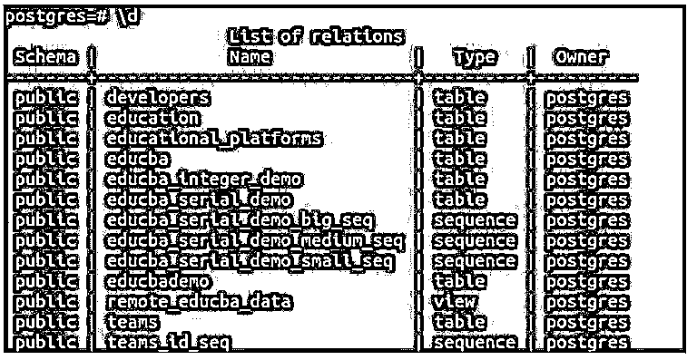
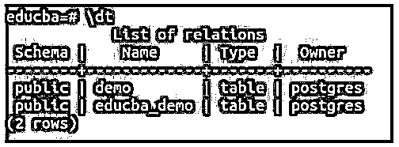
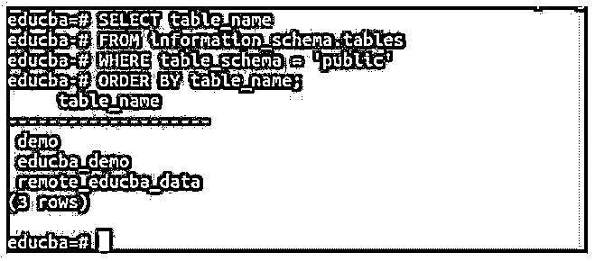

# PostgreSQL 显示表

> 原文：<https://www.educba.com/postgresql-show-tables/>

## PostgreSQL 显示表简介

我们经常需要研究和观察我们正在使用的数据库中存储的完整数据结构和对象。预先知道当前数据库中的表不仅有助于我们清楚地理解数据库，还能让我们在使用它们之前知道表的名称和属性。在 Postgres 中，我们可以通过使用 PostgreSQL 中可用的两种方法中的任何一种来显示特定数据库中存在的所有表。最有效和简单的方法之一是使用 Postgres names psql 实用程序中提供的工具，它提供了各种简短易用的元命令。

要获得数据库中的表，我们可以使用名为\dt 的 psql 元命令，该命令列出连接的数据库的所有表。另一种方法是使用 pg_catalog 模式中的 pg_tables 表，该模式存储数据库中所有表的详细信息。在本文中，我们将利用这两种方法，在一个示例的帮助下列出特定数据库中的表。

<small>Hadoop、数据科学、统计学&其他</small>

### Psql 元命令来检索表

元命令是 PostgreSQL 中提供的 psql 实用程序，它为我们提供了一组存储的命令，只需在表示某个命令的字母前加上\反斜杠，就可以访问这些命令，该命令由不同的操作符在可选的基础上跟随，从而增强了操作。要检索数据库中的表并以列表格式显示它们，我们可以使用 PostgreSQL 中提供的\dt 元命令。

我们首先需要使用以下命令通过终端登录到我们的 PostgreSQL 数据库服务器，其中 Postgres 是用户名，我将使用该用户名登录到我的 Postgres 数据库服务器，W 是指我将在执行以下命令后输入密码。

**代码:**

`psql -U postgres -W`

上述命令语句的执行给出了如下所示的输出，该输出要求在命令启动后立即输入密码，我们需要提及针对我们尝试登录所使用的用户设置的密码。例如，这里的用户是 Postgres，其密码是“a”。

**输出:**

此外，在连接到数据库服务器后，我们需要列出数据库服务器中所有可用的数据库。以便我们可以选择一个并连接到它，检索该数据库的表。要获得所有数据库名称的列表，我们可以使用名为\d 的元命令，如下所示。

**代码:**

`\d`

**输出:**

现在，我们将使用元命令\c 和数据库名称连接到 educba 数据库。我们可以使用名为\connect 的替代命令来帮助我们连接到数据库。

我们将使用如下所示的元命令\c 来连接 educba 数据库。

**代码:**

`\c educba`

**输出:**

现在，为了显示存储在 educba 数据库中的所有表，我们可以使用 meta-command \dt。

我们可以简单地执行下面的命令。

**代码:**

`\dt`

**输出:**

我们可以看到 Postgres 数据库中有两个表，即 demo 和 educba_demo，它们是公共的。为了获得关于检索到的表的更多细节，我们可以使用相同的元命令，并向它附加+ plus 操作符，如下所示。

**代码:**

`\dt+`

**输出:**

我们可以观察到，除了表的名称、所有者和模式类型之外，我们还可以获得表的大小和附加描述(如果针对表设置的话)。

### 使用 pg_tables 获取表的列表

我们还可以在 pg_catalog 数据库中的表 pg_tables 上使用备用 PostgreSQL 查询，该表存储了所有表的详细信息，包括 PostgreSQL 数据库中存在的所有用户定义的表和系统表。安装 PostgreSQL 后，名为 information_schema 和 pg_catalog 的系统表(也称为模式)已经存在于我们的 PostgreSQL 中。因此，我们需要检索 pg_tables 表中的记录，除了模式名为 information_schema 和 pg_catalog 的记录。最后，我们可以执行以下查询来显示 PostgreSQL 中的表。

**代码:**

`SELECT *
FROM pg_catalog.pg_tables
WHERE schemaname != 'information_schema'
AND schemaname != 'pg_catalog' ;`

**输出:**

从上面的查询中，我们可以观察到关于表是否有索引、规则、触发器和安全性的细节。

还有一种方法，使用这种方法我们可以检索特定数据库的表列表。我们可以使用下面的查询语句，因为 information_schema 中的 tables 表存储数据库表的详细信息。

**代码:**

`SELECT table_name
FROM information_schema.tables
WHERE table_schema = 'public'
ORDER BY table_name;`

**输出:**

我们可以观察到检索了三条记录，而不是两条，因为该查询检索了视图和表，remote_educba_data 是 educba 数据库中的视图。

### 结论–PostgreSQL 显示表格

我们可以使用三种方法中的任何一种来显示 PostgreSQL 中特定数据库的所有表，包括 psql 实用程序的元命令、pg_catalog 的 pg_tables 表和 information_schema 的 tables 表。

### 推荐文章

这是一个 PostgreSQL 显示表的指南。这里我们讨论入门，Psql 元命令来检索表，使用 pg_tables 来获取表的列表。您也可以看看以下文章，了解更多信息–

1.  [PostgreSQL 为空](https://www.educba.com/postgresql-is-null/)
2.  [PostgreSQL 恢复数据库](https://www.educba.com/postgresql-restore-database/)
3.  [PostgreSQL 随机排序](https://www.educba.com/postgresql-order-by-random/)
4.  [PostgreSQL TO_DATE()](https://www.educba.com/postgresql-to_date/)