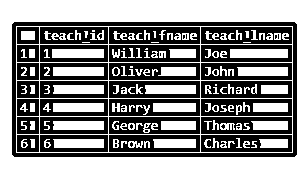
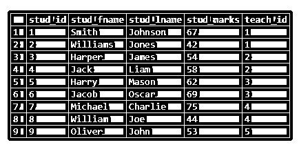
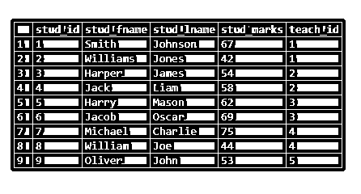
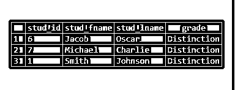
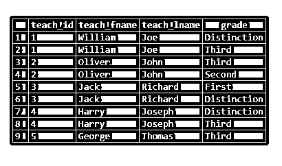

# PostgreSQL CTE

> 原文：<https://www.educba.com/postgresql-cte/>

## PostgreSQL CTE 的定义

PostgreSQL CTE 是通用表表达式的缩写，用于简化复杂的查询。常见的表表达式结果是临时的，我们可以在 SELECT、INSERT、UPDATE 和 DELETE 等中包含它。SQL 语句。公用表表达式结果是临时的，这意味着公用表表达式仅在执行 SQL 语句时存在。我们可以使用公共表表达式来增加复杂连接和 SQL 语句的可读性；此外，我们可以以人类可读和有组织的方式组织复杂的连接和 SQL 语句。

**语法:**

<small>Hadoop、数据科学、统计学&其他</small>

考虑以下 PostgreSQL CTE 的语法:

`WITH CTE_name (column_name_list) AS (
CTE_SQL_statement_definition
)
statement;`

**说明:**

*   ****【CTE _ 名称:**我们定义要赋予常用表表达式的名称。列名遵循公共表表达式。列名列表是一个可选列表。**
***   **CTE _ SQL _ 语句 _ 定义:**我们定义 SQL 语句，它返回 WITH 子句体内部的结果集。如果我们没有在公用表表达式的名称后定义列名，CTE_SQL_statement_definition 将成为公用表表达式的列列表的名称。*   **语句:**这可以用作视图或表中的语句，可以是 SELECT、INSERT、UPDATE 或 deletes SQL 语句。**

 **### CTE 如何在 PostgreSQL 中工作？

*   我们需要定义一个 WITH 子句，如上面的语法部分中所定义的那样，该子句后面是公共表表达式的名称，再后面是列的名称。
*   WITH 子句包含一个主体，如果我们没有定义列名，那么它将从在 WITH 子句主体中定义的 SQL 语句中获取所有列。
*   公用表表达式结果是临时的，这意味着公用表表达式仅在执行 SQL 语句时存在。

**例子:**

为了理解示例，我们将使用 PostgreSQL CREATE TABLE 语句创建两个名为“student”和“teacher”的表，如下所示:

`create table student
(
stud_id serial PRIMARY KEY,
stud_fname VARCHAR(80) NOT NULL,
stud_lname VARCHAR(80) NOT NULL,
stud_marks INT NOT NULL,
teach_id INT NOT NULL
);
create table teacher
(
teach_id serial PRIMARY KEY,
teach_fname VARCHAR(80) NOT NULL,
teach_lname VARCHAR(80) NOT NULL
);`

我们将使用 PostgreSQL INSERT INTO 语句向“教师”表中插入一些数据，如下所示:

`INSERT INTO teacher(teach_fname, teach_lname)
VALUES
('William','Joe'),
('Oliver','John'),
('Jack','Richard'),
('Harry','Joseph'),
('George','Thomas'),
('Brown','Charles');`

用下面的 SQL 语句和快照说明上面 INSERT INTO 语句的结果。

`select * from teacher;`

现在，我们将使用 PostgreSQL INSERT INTO 语句向学生的表中插入一些数据，如下所示:

`INSERT INTO student(stud_fname, stud_lname, stud_marks, teach_id)
VALUES
('Smith','Johnson',67,1),
('Williams','Jones',42,1),
('Harper','James',54,2),
('Jack','Liam',58,2),
('Harry','Mason',62,3),
('Jacob','Oscar',69,3),
('Michael','Charlie',75,4),
('William','Joe',44,4),
('Oliver','John',53,5);`

使用下面的 SQL 语句和快照来说明上面的 INSERT INTO 语句的结果。

`select * from student;`

1.考虑下面的基本示例，该示例将用于通过使用公用表表达式从 student 表中检索所有记录:

`With CTE_student AS
(
select
stud_id,
stud_fname,
stud_lname,
stud_marks,
teach_id
FROM
student
)
select * from CTE_student;`

使用下面的快照说明上面 SQL 语句的结果。

2.再考虑一个例子；在这里，我们将首先通过使用如下定义的 WITH 子句将 cte_student 定义为公用表表达式:

`WITH cte_student AS (
SELECT
stud_id,
stud_fname,
stud_lname,
(CASE
WHEN stud_marks <= 40
THEN 'Fail'
WHEN stud_marks > 40 AND stud_marks <= 55
THEN 'Third'
WHEN stud_marks > 55 AND stud_marks <= 60
THEN 'Second'
WHEN stud_marks > 60 AND stud_marks <= 65
THEN 'First'
WHEN stud_marks  > 65
THEN 'Distinction'
END) Grade
FROM
student
)
SELECT
stud_id,
stud_fname,
stud_lname,
Grade
FROM
cte_student
WHERE
Grade = 'Distinction'
ORDER BY
stud_fname;`

使用下面的快照说明上面 SQL 语句的结果。

3.再考虑一个例子；我们可以使用 JOIN 与 column table 表达式如下:

`WITH cte_student AS (
SELECT
stud_id,
stud_fname,
stud_lname,
teach_id,
(CASE
WHEN stud_marks <= 40
THEN 'Fail'
WHEN stud_marks > 40 AND stud_marks <= 55
THEN 'Third'
WHEN stud_marks > 55 AND stud_marks <= 60
THEN 'Second'
WHEN stud_marks > 60 AND stud_marks <= 65
THEN 'First'
WHEN stud_marks  > 65<
THEN 'Distinction'
END) Grade
FROM
student
)
SELECT t.teach_id,
teach_fname,
teach_lname,
Grade
FROM teacher t
INNER JOIN cte_student USING (teach_id);`***T4】***

 *使用下面的快照说明上面 SQL 语句的结果。

### **结论**

我们希望通过上面的文章，您已经理解了如何使用 PostgreSQL 公共表表达式以及 PostgreSQL 公共表表达式是如何工作的。另外，我们还添加了几个 PostgreSQL 公共表表达式的例子来详细理解它。

### 推荐文章

这是一个 PostgreSQL CTE 的指南。这里我们讨论 PostgreSQL CTE 的介绍、语法、工作原理和相应的例子。您也可以浏览我们的其他相关文章，了解更多信息——

1.  [PostgreSQL IF 语句](https://www.educba.com/postgresql-if-statement/)
2.  [PostgreSQL 临时表](https://www.educba.com/postgresql-temporary-table/)
3.  [PostgreSQL For 循环](https://www.educba.com/postgresql-for-loop/)
4.  [PostgreSQL 列表表](https://www.educba.com/postgresql-list-tables/)***