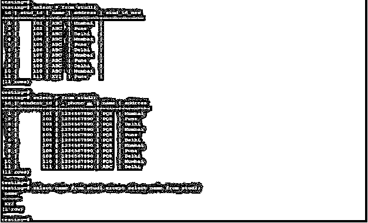

# PostgreSQL 排除

> 原文：<https://www.educba.com/postgresql-exclude/>

## PostgreSQL 排除简介

PostgreSQL 中的 PostgreSQL excludes 语句用于通过使用 PostgreSQL 中指定的运算符来比较指定列或表达式中的任意两行。在排除列时，比较运算符将返回 null 或 false 值作为输出。我们还可以从使用 PostgreSQL 中的 pg_dump 命令获得的备份中排除表数据和模式。我们在 PostgreSQL 中排除了指定的约束，也从表中排除了 gist 索引。

### 句法

下面是 PostgreSQL 中 exclud 的语法。

<small>Hadoop、数据科学、统计学&其他</small>

**1。创建表时排除约束:**

`create table name_of_table (name_of_column1 data_type, name_of_column2 data_type,name_of_column3 data_type, …., name_of_columnN data_type) EXCLUDE USING constraint_name (name_of_column with operator, name_of_column with operator));`

**2。从备份中排除表:**

`pg_dump –U name_of_user –W password –d name_of_database –exclude-table name_of_table > backup_file_name.sql`

**3。从备份中排除模式:**

`pg_dump –U name_of_user –W password –d name_of_database –exclude-schema name_of_schema> backup_file_name.sql`

**4。从备份中排除表数据:**

`pg_dump –U name_of_user –W password –d name_of_database –exclude-table-data= name_of_table > backup_file_name.sql`

#### 因素

下面是 PostgreSQL 中 exclud 的参数描述语法:

*   **Create table:** 该参数用于创建索引时的要点索引的 exclude 语句。
*   **表名:**表名定义为创建一个新的表，并将该表名定义到同一个表中，从同一个表中排除 gist 索引。
*   **列名:**列名定义为通过在指定列上创建 exclude 约束来创建一个具有指定列的表。
*   **数据类型:**定义列的数据类型，并对其使用排除约束。
*   **Exclude:** Exclude 用于从 PostgreSQL 的表中排除约束。在 PostgreSQL 中，我们从表列中排除了约束。
*   **约束名称:**这被定义为我们在 PostgreSQL 中创建表时已经排除了指定的约束。
*   **操作符:**我们在从表中排除约束条件时使用了操作符。
*   **Pg_dump:** 该命令用于通过排除 PostgreSQL 中的指定表来转储数据库。
*   **排除表:**该参数用于从整个数据库转储中排除指定的表。
*   **排除模式:**该参数用于从整个数据库转储中排除指定的模式。
*   **排除表数据:**该参数用于从整个数据库转储中排除表数据。

### PostgreSQL 中 EXCLUDE 语句的工作方式

下面是 Exclude 语句的工作原理:

我们已经通过使用 PostgreSQL 中的 exclude 关键字排除了 PostgreSQL 中的约束。我们还使用 except 运算符从 PostgreSQL 的另一个表中排除值。使用，只是我们需要在第二个表中定义特定的列名，这是我们在第一个表中定义的。要在 PostgreSQL 中执行 exclude 语句，我们需要在表上拥有 created table 特权，创建 backup 特权，或者我们需要拥有超级用户特权来执行语句。

下面是 exclude 语句的示例，需要在表上创建表权限、创建备份权限或超级用户权限才能在 PostgreSQL 中执行 Exclude 语句。

**代码:**

`pg_dump -U db_test -W -d testing --exclude-table stud1 > stud.sql
pg_dump -U postgres -W -d testing --exclude-table stud1 > stud.sql
echo $?`

**输出:**

**解释:**在上面的第一个例子中，我们使用用户作为 db_test，这个用户没有创建表的权限，也不是超级用户，所以在使用 pg_dump 执行 exclude 语句时，它会发出错误。在第二个示例中，我们使用用户名 Postgres 进行了数据库备份，在使用这个用户之后，我们进行了数据库备份。

### 实现 PostgreSQL 排除的示例

以下是 exclude 语句的示例:

#### 示例#1:在创建索引时排除约束

以下示例显示了在创建表时排除索引约束。我们创建了一个名为 test_exclude 的表来排除约束。

**代码:**

`CREATE TABLE test_exclude(ID INT PRIMARY KEY NOT NULL, STUD_NAME TEXT, STUD_AGE INT, STUD_ADDRESS CHAR(50), EXCLUDE USING gist (STUD_NAME WITH =, STUD_AGE WITH <>));
\d+ test_exclude;`

**输出:**

#### 示例 2:使用 except 运算符排除表数据

下面是在 PostgreSQL 中使用 except 运算符排除表数据的示例。

我们使用 stud1 和 stud2 表从表中排除数据。

#### 示例 3:从整个数据库备份中排除该表

以下示例显示从整个数据库备份中排除该表。我们已经从测试数据库备份中排除了 stud1 表。

**代码:**

`pg_dump -U postgres -W -d testing --exclude-table stud1 > stud.sql
echo $?`

**输出:**

#### 示例 4:从整个数据库备份中排除模式

以下示例显示从整个数据库备份中排除模式。我们已经从测试数据库备份中排除了测试模式。

**代码:**

`pg_dump -U postgres -W -d testing --exclude-schema test> stud.sql
echo $?`

**输出:**

### PostgreSQL EXCLUDE 的优点

以下是优点:

*   使用 pg_dump，我们可以从 PostgreSQL 的整个数据库转储中排除特定的表和模式。
*   使用 exclude 语句，我们还可以排除 PostgreSQL 中的约束。
*   使用 pg_dump，我们可以从 PostgreSQL 的整个数据库转储中排除表数据。
*   我们在 PostgreSQL 中使用 except 语句排除了两个表数据。

### 推荐文章

这是一个 PostgreSQL 排除指南。在这里，我们讨论 PostgreSQL EXCLUDE 的介绍、语法、工作原理、优点和查询示例。您也可以浏览我们的其他相关文章，了解更多信息——

1.  [安装 PostgreSQL](https://www.educba.com/install-postgresql/)
2.  PostgreSQL 中的[数组](https://www.educba.com/array-in-postgresql/)
3.  [hstore in PostgreSQL](https://www.educba.com/hstore-in-postgresql/)
4.  [PostgreSQL 重新索引](https://www.educba.com/postgresql-reindex/)