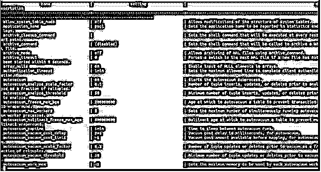

# Postgres 更改密码

> 原文：<https://www.educba.com/postgres-change-password/>

## Postgres 更改密码简介

在本文中，我们将了解如何更改用户的 Postgres Change 密码(如果存在的话),如果没有，我们将如何为用户分配一个密码，供他在 PostgreSQL 数据库服务器中进一步验证使用。有两种方法可以做到。第一种方法是使用 ALTER query 语句更改密码，第二种方法是使用 PostgreSQL 的 psql 实用程序中的 meta-command \password。

要继续更改密码，我们首先需要了解 PostgreSQL 中密码机制的工作方式，以及默认超级用户(通常是名为 Postgres 的用户)的密码策略。

<small>Hadoop、数据科学、统计学&其他</small>

在 PostgreSQL 的任何 Unix 分发系统中，有两种类型的认证方法，即 ident 和 peer。默认的身份验证方法取决于它使用的 PostgreSQL 版本以及 PostgreSQL 在您的计算机上的安装方式。

**Ident 认证方式:**在这种方式下，端口号为 113 的 TCP 端口在运行操作系统的身份认证服务器的地方对用户的凭证进行认证。

**对等认证方式:**在对等认证方式中，PostgreSQL 的当前用户的密码与操作系统用户的密码相匹配。

### 句法

格式 1:

`ALTER USER name [ [ WITH ] option [ ... ] ] where option can be:
CREATEDB | NOCREATEDB
| CREATEUSER | NOCREATEUSER
| [ ENCRYPTED | UNENCRYPTED ] PASSWORD 'newPassword'
| VALID UNTIL 'expirytime'`

**解释:**使用上述 alter 命令，用户的密码可以更改，同时其他选项也可以重新分配。

**名称:**是您要更改其属性或密码的用户或角色的名称。

**选项:**我们可以使用此格式更改与用户相关的多个参数和权限。

**CREATEDB:** 如果您想授予用户创建新数据库的权限，可以指定这个选项

**NOCREATEDB:** 如果您想限制用户创建任何新的数据库，这是可以提及的。

**CREATEUSER:** 可以指定该属性以允许用户创建新用户。

**NOCREATEUSER:** 当在上述格式的查询中提到该属性时，用户将无法创建新用户。

**ENCRYPTED:** 该属性确定存储在 pg_catalog 的 pg_shadow 表中的密码是否以 MD5 加密格式存储。

**未加密:**密码不以加密格式存储在 pg_catalog 中。如果既未指定加密属性也未指定未加密属性，并且在创建用户时也未指定，则默认密码存储机制将根据 password_encryption 配置变量决定。

**密码:**新密码是您要设置为用户密码的字符串。如果未指定此字段，并且用户之前没有为其设置任何密码，则不会对用户进行任何身份验证，用户可以登录系统而无需输入密码。但是如果你切换到密码认证系统，用户将无法登录。

有效期至到期时间:如果您想将设置的密码保留到某个特定的时间段，可以使用该字段。此字段是您希望允许分配的密码生效的时间戳。

### 实现 Postgres 更改密码的示例

下面是提到的例子:

#### 示例#1

我们将首先通过 Postgres 默认用户登录系统。这里我们已经为 Postgres 角色分配了一个密码。所以，我们要输入密码。

**代码:**

`sudo su - postgres`

**输出:**

#### 实施例 2

此外，让我们使用 psql promo 命令检查数据库服务器中的所有用户:

**代码:**

`select username from pg_catalog.pg_user;`

**输出:**

#### 实施例 3

让我们尝试使用一个用户登录:

**代码:**

`sudo su – a;`

**输出:**

#### 实施例 4

由于我们忘记了创建时分配给它的用户的密码，我们将通过使用格式 1 ALTER USER query 以如下方式重置它以进行支付:

**代码:**

`ALTER USER a WITH ENCRYPTED PASSWORD 'payal';`

**输出:**

因为输出是 ALTER ROLE。密码已成功重置。

格式 2:

将用户名重命名为 alteredName

这种格式仅用于将用户名更改为其他名称“alteredName”。

#### 实施例 5

**代码:**

`ALTER USER a RENAME TO payal;`

**输出:**

#### 实施例 6

现在让我们验证数据库服务器中的可用用户。

**代码:**

`SELECT usename FROM pg_catalog.pg_user;`

**输出:**

#### 实施例 7

**代码:**

`ALTER USER name SET parameter { TO | = } { targetValue | DEFAULT }`

该参数可以是 PostgreSQL 的任何配置属性。通过启动命令，您可以看到所有的配置属性

`SHOW ALL;`

**输出:**

#### 实施例 8

`ALTER USER name RESET parameter`

此命令用于重置与用户相关的任何字段的值。示例–

现在，如果我们想重设付费用户的密码。我们可以通过使用查询语句来做到这一点:

**代码:**

`ALTER USER payal RESET password;`

**输出:**

这给出了输出“ALTER ROLE ”,这意味着 payal 用户的密码已经成功重置。

#### 实施例 9

修改密码的元命令:在 PostgreSQL 中，我们有一个神奇的功能，叫做元命令，可以在 psql 实用程序的帮助下使用。元命令是简短的命令，提供这些命令是为了使

数据库管理员的简单高效。这些元命令在内部触发基本的 SQL 命令，如 ALTER、CREATE、SELECT 等。可以使用一个这样的元命令来更改用户的密码，命名为\password。它要求输入密码，然后再次输入密码进行确认，然后为该用户设置输入的密码。

`\password`

让我们借助一个例子来检查元命令的工作情况。假设我们想在登录到 Postgres 数据库后更改 Postgres 用户的密码。然后，我们将在以下步骤中查询相同的内容:

**代码:**

`psql -d postgres -U postgres
\password`

**输出:**

### 结论

我们可以通过使用 ALTER 命令或 PostgreSQL 中的 metacommand \password 来更改用户的密码。

### 推荐文章

这是一个 Postgres 更改密码的指南。在这里，我们讨论了 Postgres 更改密码的介绍，语法，代码和输出的例子。您也可以浏览我们的其他相关文章，了解更多信息——

1.  [PostgreSQL 数据库](https://www.educba.com/postgresql-database/)
2.  [PostgreSQL Trunc()](https://www.educba.com/postgresql-trunc/)
3.  [PostgreSQL 集群](https://www.educba.com/postgresql-cluster/)
4.  [PostgreSQL 函数](https://www.educba.com/postgresql-functions/)