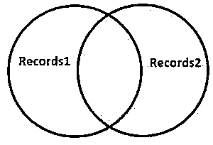
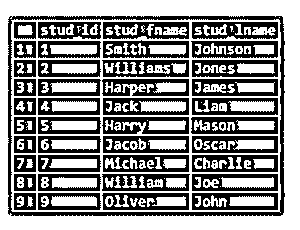
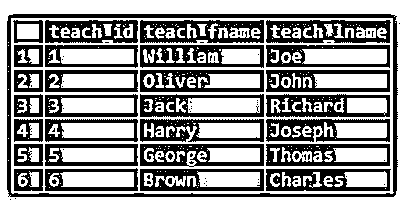
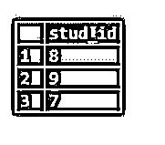
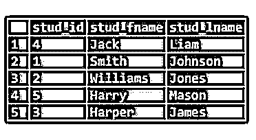
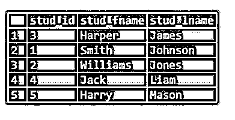

# PostgreSQL 除外

> 原文：<https://www.educba.com/postgresql-except/>

## PostgreSQL 简介，除了

PostgreSQL EXCEPT 运算符与两个 SELECT 语句一起使用。让我们考虑第一个 SELECT 语句和第二个 SELECT 语句，为了返回第一个 SELECT 语句中没有返回的所有记录，我们通常使用 PostgreSQL EXCEPT 运算符。用 PostgreSQL EXCEPT 运算符定义的 SELECT 语句定义了一个数据集。它从第一个 SELECT 语句数据集的结果中检索所有记录，然后从第一个 SELECT 语句数据集的结果中删除第二个 SELECT 语句数据集的所有记录。

**语法:**

<small>Hadoop、数据科学、统计学&其他</small>

`SELECT column_name_1, column_name_2, ... column_name_n
FROM table_1
[WHERE conditions_table1] EXCEPT
SELECT column_name_1, column_name_2, ... column_name_n
FROM table_2
[WHERE conditions_table2];`

**说明:**

*   **列名:**我们必须在第一个和第二个 SELECT 语句中定义要比较的列。不要求两个 SELECT 语句具有相同的字段，只需要确保它们具有相似的数据类型。
*   **table1 和 table2:** 我们已经定义了要从中检索记录的表的名称。必须在 FROM 子句中定义至少一个表。
*   **WHERE conditions:** 可选子句，用于根据满足的条件过滤表中的记录。

### PostgreSQL 中的 EXCEPT 运算符是如何工作的？

PostgreSQL EXCEPT 操作符的工作方式类似于从浅棕色区域返回所有记录。在上图中，我们可以看到存在于左侧区域(浅棕色区域)而不存在于右侧区域(记录 2)的记录。

为了在 PostgreSQL EXCEPT 运算符的帮助下组合 PostgreSQL SELECT 语句，我们需要考虑以下规则:

*   两个 SELECT 语句应该有相同的列数。
*   此外，两个 SELECT 语句的列顺序应该相同。
*   第一个和第二个 SELECT 语句中定义的列的数据类型应该相同。

### PostgreSQL 的示例，除了

下面是提到的例子:

我们将使用 PostgreSQL CREATE TABLE 语句创建两个名为“student”和“teacher”的表。

**代码:**

`create table student
(
stud_id serial PRIMARY KEY,
stud_fname VARCHAR(80) NOT NULL,
stud_lname VARCHAR(80) NOT NULL
);`

**代码:**

`create table teacher
(
teach_id serial PRIMARY KEY,
teach_fname VARCHAR(80) NOT NULL,
teach_lname VARCHAR(80) NOT NULL
);`

现在，我们将使用 PostgreSQL INSERT INTO 语句向“student”表中插入一些数据，如下所示:

**代码:**

`INSERT INTO student(stud_fname, stud_lname)
VALUES
('Smith','Johnson'),
('Williams','Jones'),
('Harper','James'),
('Jack','Liam'),
('Harry','Mason'),
('Jacob','Oscar'),
('Michael','Charlie'),
('William','Joe'),
('Oliver','John');`

`select * from student;`

**输出:**

现在，我们将使用 PostgreSQL INSERT INTO 语句向“教师”表中插入一些数据，如下所示:

**代码:**

`INSERT INTO teacher(teach_fname, teach_lname)
VALUES
('William','Joe'),
('Oliver','John'),
('Jack','Richard'),
('Harry','Joseph'),
('George','Thomas'),
('Brown','Charles');`

`select * from teacher;`

**输出:**

#### 示例#1

具有单列的 PostgreSQL EXCEPT 运算符。

只返回一个具有相同数据类型的列。

**代码:**

`SELECT stud_id
FROM student
EXCEPT
SELECT teach_id
FROM teacher;`

**输出:**

在上面的语句中，它将通过跳过与教师表中的 teach_id 相匹配的 stud _ id，返回学生表中的所有 stud _ id。这仅仅意味着如果 stud_id 与 teach_id 相同，那么它将不会在结果集中得到考虑。

#### 实施例 2

具有多列的 PostgreSQL EXCEPT 运算符。

返回具有相同数据类型的多列。

**代码:**

`SELECT stud_id, stud_fname, stud_lname
FROM student
WHERE stud_id <= 5
EXCEPT
SELECT teach_id, teach_fname, teach_lname
FROM teacher
WHERE teach_id < 3;`

**输出:**

在上面的语句中，operator 将通过跳过与教师表中的 teach_id、teach_fname、teach_lname 列匹配的 stud_id、stud_fname、stud_lname 列，返回学生表中的所有 stud_id、stud_fname、stud_lname 列。也就是说，如果 stud_id，stud_fname，stud_lname 与 teach_id，teach_fname，teach_lname 相同，则结果集中不会考虑它。

#### 实施例 3

使用 order by 的 PostgreSQL EXCEPT 运算符。

返回具有相同数据类型的多个列以及 order by 子句。

**代码:**

`SELECT stud_id, stud_fname, stud_lname
FROM student
WHERE stud_id <= 5
EXCEPT
SELECT teach_id, teach_fname, teach_lname
FROM teacher
WHERE teach_id < 3
ORDER BY 3;`

**输出:**

在上面的示例中，我们在 order by 子句中使用了数字 3，这意味着它将按 stud_lname | teach_lname 列对结果集进行排序。

### 推荐文章

这是一个 PostgreSQL 的指南，除了。这里我们讨论 PostgreSQL EXCEPT 的介绍以及 EXCEPT 操作符如何处理查询示例。您也可以看看以下文章，了解更多信息–

1.  [PostgreSQL IF 语句](https://www.educba.com/postgresql-if-statement/)
2.  [PostgreSQL 完全外部连接](https://www.educba.com/postgresql-full-outer-join/)
3.  [PostgreSQL 自然连接](https://www.educba.com/postgresql-natural-join/)
4.  [PostgreSQL 回合](https://www.educba.com/postgresql-round/)