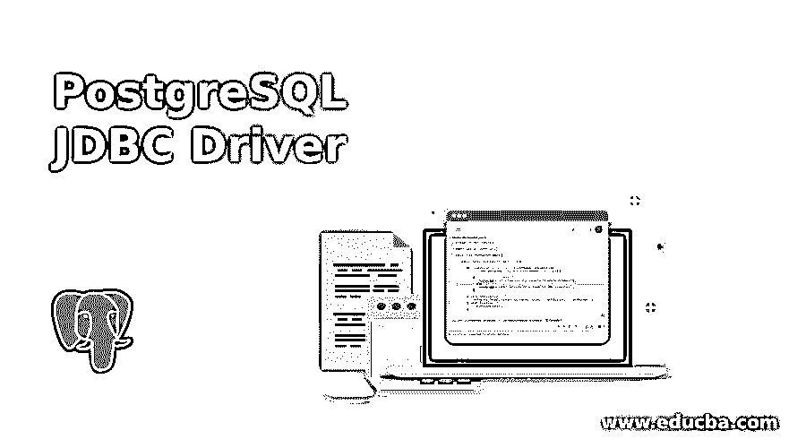
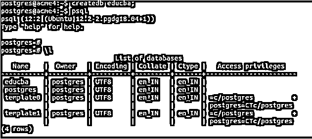
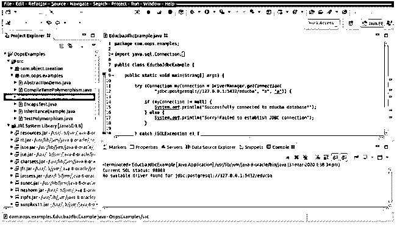
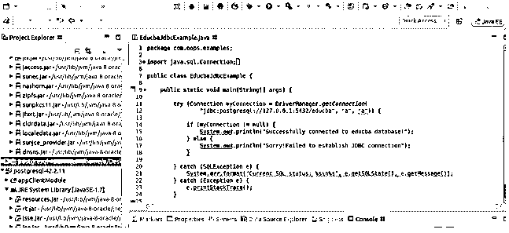
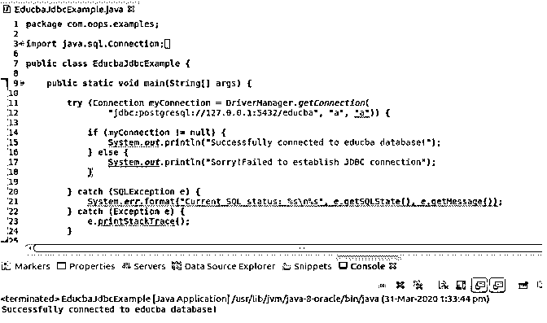

# PostgreSQL JDBC 驱动程序

> 原文：<https://www.educba.com/postgresql-jdbc-driver/>

## PostgreSQL JDBC 驱动程序简介

在创建基于数据库的应用程序和使用 java 应用程序中的任何数据库时，您需要遵循某些步骤来使用 JDBC (Java 数据库连接)，它是一个 API，即帮助我们在 Java 应用程序和数据库之间进行通信的应用程序编程接口。数据库可以是任何数据库，如 MySQL、PostgreSQL 等。本文将学习如何使用 DBC 驱动程序帮助程序将 java 应用程序与 PostgreSQL 数据库连接起来。

### 先决条件

创建基于数据库的 java 应用程序时，需要在系统中安装一些东西，如下所示

<small>Hadoop、数据科学、统计学&其他</small>

*   **Java JDK 工具包**

可以通过在命令中键入命令 java -version 来检查，这将为您提供指定系统中可用的 java 版本的输出，如下所示。

`java -version`

如果不存在，您应该首先安装 java。这里我们用的是 java 版本“1.8.0_201”。

*   PostgreSQL 和 psql 应该安装在您的计算机上，可以通过键入 psql -V 命令进行检查，该命令应该给出如下输出

`psql -V`

如果不可用，请在继续安装 JDBC 驱动程序之前安装它。我的是 psql(PostgreSQL)12.2(Ubuntu 12.2-2 . pgdg 18.04+1)。

*   最后一件事是 PostgreSQL jar 文件的 JDBC 驱动程序，可以从链接 https://jdbc.postgresql.org/download.html.下载，我们将在建立 JDBC 连接时进一步使用它。

### JDBC 初始化的步骤

*   我们首先需要使用 import 语句导入 JDBC

`import java.sql.*;`

这里你要小心；您不应该在应用程序中导入 org.postgresql 包，因为这样做会使 javac 在编译源文件时产生混乱。

*   第二步是你需要加载你的 JDBC 驱动的地方。这可以通过两种方式实现。一种是使用 Class.forName()方法，另一种是在初始化时将驱动程序作为参数传递给 JVM。第二步更可取，因为如果将来您的应用程序需要更改它的数据库服务器，那么不需要很容易地更改与连接相关的代码就可以完成。

在第一个方法中，我们将以下列方式使用 Class.forName()方法

`Class.forName("org.postgresql.Driver");`

其中 org.postgresql.Driver 指定您的 PostgreSQL JDBC 驱动程序的用法。如果没有找到我们的驱动程序，这个方法可以给出 ClassNotFoundException。这种方法最常用于 JDBC 应用。

第二种方法是使用-D 选项将 JDBC 驱动程序作为参数传递给初始化字符串，如下所示

`java -Djdbc.drivers=org.postgresql.Driver example.ImageViewer`

*   现在是连接数据库的时候了。在 JDBC 应用程序中，数据库由 URL(统一资源定位符)表示，在使用 PostgreSQL 数据库时，它可以是三种形式中的任何一种。

`jdbc:postgresql:databaseName`

`jdbc:postgresql://hostName/databaseName`

`jdbc:postgresql://hostName:portNumber/databaseName`

在哪里

默认情况下，主机名是 localhost，如果是 remote，则是机器的 Ipv6 地址。

端口号是套接字/端口地址，对于 PostgreSQL 默认为 5432。

DatabaseName 是 JDBC 应用程序要连接的数据库的名称。

最后，现在可以使用语句进行连接。

`Connection dbConnectionObject= DriverManager.getConnection(url, username, password);`

*   完成所有与数据库相关的操作后，最后一步是关闭 JDBC 连接，只需关闭连接对象即可，如下所示

`dbConnectionObject.close();`

### PostgreSQL JDBC 驱动程序示例

让我们考虑一个使用 PostgreSQL 的 JDBC 应用程序的例子。为此，我们首先需要在 PostgreSQL 数据库服务器中创建一个数据库。我们将创建一个名为 educba 的数据库，并使用 java 中的 JDBC 程序连接到它。

`createdb educba;
psql
\l`

创建一个名为 EducbaJdbcExample.java 的新文件，其中包含一个类似这样的程序——我们程序的前三条语句 sm 用于导入使用 JDBC 相关方法所需的包。接下来，我们尝试使用以下语句建立与 PostgreSQL 的连接

`Connection myConnection = DriverManager.getConnection(
"jdbc:postgresql://127.0.0.1:5432/educba", "postgres", "a")`

其中 127.0.0.1 代表 localhost，即相同的机器地址，5432 是 PostgreSQL 端口，我们希望连接到 educba 数据库名称，我们的用户名和密码分别是' a '和' a'。这里，我们在 try 中插入了这条语句，因为如果在建立连接时出现任何异常，它将立即给出异常并显示与异常相关的消息。如果建立了连接，则显示消息“成功连接到 educba 数据库！”将被显示；否则“对不起！无法建立 JDBC 连接”讯息。

保存、编译和运行应用程序后，如果它出现如下异常-

万一，如果你正在使用 Eclipse IDE 并且为你的程序创建一个 java 类文件，通过右击你的文件->运行方式-> Java 应用程序选项你可以运行你的程序。在这种情况下，它将给出以下输出。这是因为在我们当前的项目中没有下载 PostgreSQL 的 JDBC 驱动文件。

这是因为 JDBC 驱动程序没有加载。在这样的应用程序中，我们需要使用 cp 手动加载我们的 JDBC 驱动程序。为此，需要您的程序 EducbaJdbcExample。如果您正在通过命令行运行，或者如果您正在使用 Eclipse IDE，并且已经在当前项目中导入了 jar 文件，则 java 和下载的 PostgreSQL JDBC 驱动程序的 jar 文件存储在相同的路径中，如下所示

如果您使用 eclipse，那么您可以将您的应用程序作为 java 应用程序运行

可以看到，控制台上的消息现在是“成功连接到 educba 数据库！”.所以，我们现在连接到我们的数据库。

### 结论

我们可以从 java 应用程序中连接到 PostgreSQL 数据库，方法是以正确的方式执行上述所有步骤。

### 推荐文章

这是一个 PostgreSQL JDBC 驱动程序的指南。这里我们讨论 PostgreSQL JDBC 驱动程序的例子，以及 JDBC 初始化的步骤和先决条件。您也可以看看以下文章，了解更多信息–

1.  [PostgreSQL 授权](https://www.educba.com/postgresql-grant/)
2.  [PostgreSQL RANK()](https://www.educba.com/postgresql-rank/)
3.  [PostgreSQL 内部连接](https://www.educba.com/postgresql-inner-join/)
4.  [PostgreSQL 自然连接](https://www.educba.com/postgresql-natural-join/)