# 电源 BI 工具提示

> 原文：<https://www.educba.com/power-bi-tooltips/>

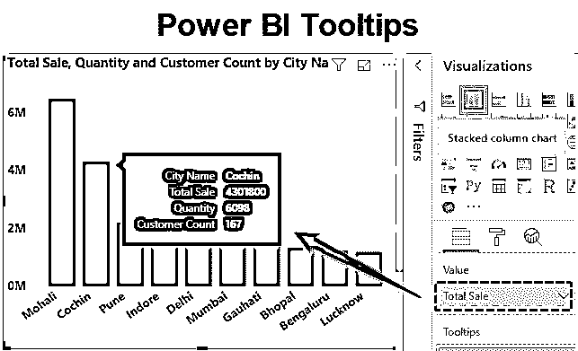

## Power BI 中的工具提示介绍

在本文中，我们将看到一个关于电源 BI 工具提示的概述。在 Power BI 中创建一个[图表是一件容易的事情。许多图表中的工具提示帮助我们获得除了已经在 visual 的字段中的值之外的附加数据标签。但是在图表中添加工具提示会使视图更加详细。在任何图表中添加工具提示，使图表看起来更有价值，而不会在图表上增加额外的列、条或线。添加工具提示后，我们只需将光标悬停在图表上，我们将能够在框中看到额外添加的字段值。](https://www.educba.com/power-bi-charts/)

### 如何使用 Power BI 工具提示？

我们不必去任何地方寻找工具提示，除非我们想在可视化部分添加一个新的图表类型。一旦我们创建了任何图表，我们将能够在可视化的**字段**部分找到**工具提示**。

<small>Hadoop、数据科学、统计学&其他</small>

要查看工具提示，首先，我们需要创建一个图表。这里我们从列表中选择了堆积柱形图。如果不选择数据字段，我们将能够在所选图表的字段下看到工具提示。

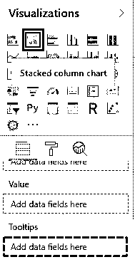

我们可以看到工具提示的描述，上面写着“**在此添加数据字段**”。我们可以在这里添加一个或多个数据字段。您也可以从下面的链接下载用于本例的 excel 工作簿。

You can download this Power BI Tooltips Excel Template here – [Power BI Tooltips Excel Template](#popmake-167767)

#### 示例#1

*   我们将使用电子产品的销售数据，我们将把这些数据转换成表格形式，这样我们就可以用图表显示出来。

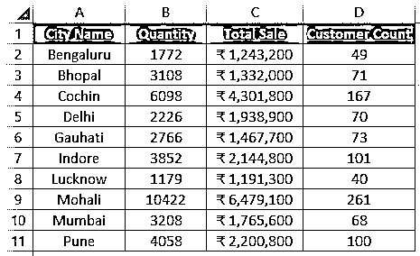

*   单击 Power BI 主页菜单功能区中的获取数据。选择源文件并上传。这里我们的数据在 Excel 中。

*   然后浏览文件位置并打开它。从导航窗口中，选择我们想要**加载**的板材。这里销售数据汇总在**表 2** 中。

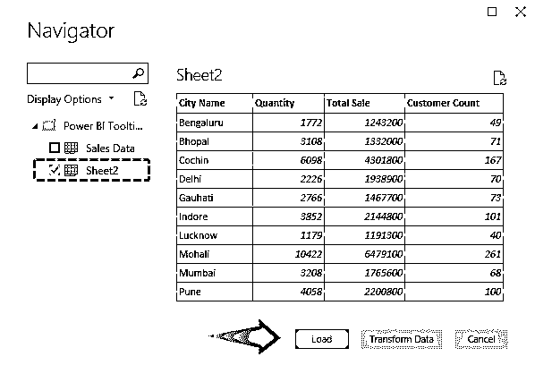

*   我们将看到我们的数据现在已上传到 Power BI 系统中。

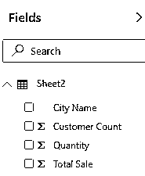

*   数据上传后，现在我们选择您想要创建的图表。这里我们选择一个最常用的基本**堆积柱形图**。

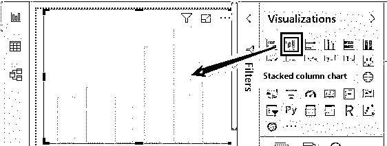

*   现在拖动我们想要查看的字段。这里我们在轴上使用城市名，在价值上使用总销售额。

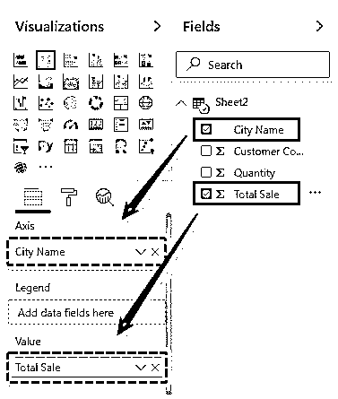

*   我们将得到如下所示的基本堆积柱形图。

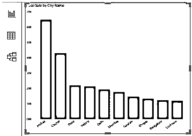

我们可以进行基本的格式化，例如边框、数据标签、列颜色等。根据需要。

*   但是，现在如果我们将光标移动到创建的图表中的任何列上，我们将只能看到我们在创建该图表时使用的城市名称和总销售额。

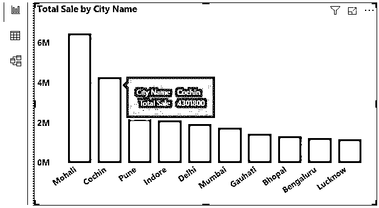

如果除了这两个值之外，我们还想看到其他值，该怎么办？这只能使用仅在 Power BI 中提供的**工具提示**功能。这种类型的函数在 Excel 中是不可用的，尽管它具有我们创建图表时使用的大多数功能。

*   让我们从字段部分拖动一个值，比如说**数量**到工具提示中。

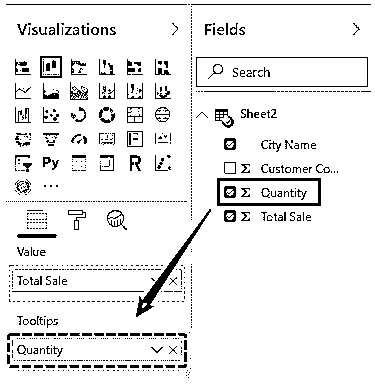

*   但是，现在如果我们将光标移动到城市名为 **Cochin** 的同一列上，我们将能够看到数量，其值反映为 **6098** 。

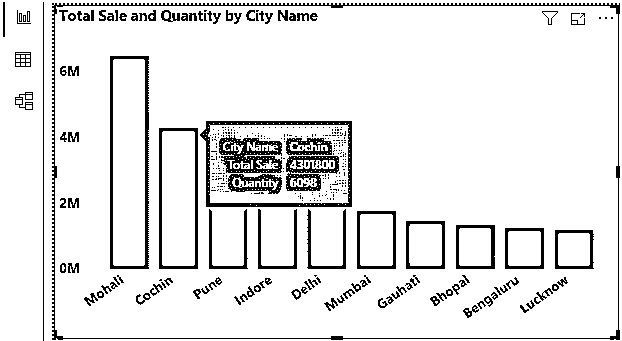

由此，我们可以总结出，科钦市的总销售额为 100 亿卢比。 **4301800** /-从工程量 **6098** 。

*   让我们尝试在工具提示中添加另一个字段。现在我们正在添加**客户数量**。

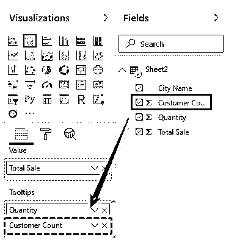

现在，如果我们将光标悬停在 Cochin 上，我们会看到客户计数也反映在客户计数 **167** 中。

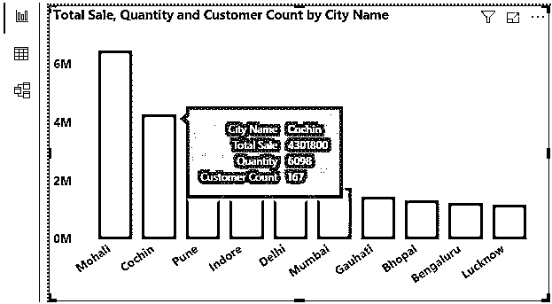

同样，如果我们总结一下科钦市的情况，总销售额为 100 亿卢比。 **4301800** /-数量 **6098** 来自 **167** 客户。这就是 Power BI 中工具提示的工作方式。

*   我们甚至可以进一步定制工具提示上的数据视图。为此，单击工具提示下每个字段上的向下箭头。

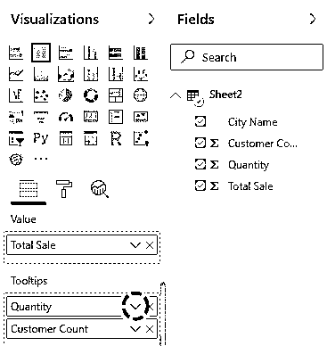

*   现在，从如下所示的列表中选择任何数学函数，以在视图中获得进一步的更改。

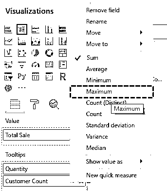

### 电源 BI 工具提示的优点

优点是:

*   无需对创建的图表做任何进一步的添加，工具提示就能给我们更多的细节。
*   在工具提示中添加字段没有限制。
*   工具提示用于显示更多信息的图表和数据。

**注意:**我已经对这些图表进行了大量的格式化，您可以从下面的链接下载 Power BI 工具提示文件，并应用每种适用的格式化技术。

You can download this Power BI Tooltips Template here – [Power BI Tooltips Template](#popmake-227875)

### 要记住的事情

使用 Powerbi 工具时要记住的事项:

*   我们可以通过选择数学运算的类型(如求和、平均、百分比、方差或中值)来定制工具提示，从而在不改变或修改数据的情况下修改工具提示的视图。
*   工具提示只能通过 Power BI 中的报告视图来访问。这是唯一可以更改图表中任何内容而无需对上传的数据做进一步更改的地方。
*   使用工具提示定制来知道我们想要看到或显示什么是很重要的。虽然使用默认属性的工具提示也会给出输出，但在选择自定义操作时，首先要确定我们想要看到的输出。
*   我们在数据视图选项卡中或使用查询编辑器对上传的数据进行更改。但是如果数据不是很大，那么最好在 Excel 中而不是在 Power BI 查询中更改数据。

### 推荐文章

这是一个电源 BI 工具提示指南。在这里，我们讨论如何使用 power bi 工具提示在图表中显示额外的数据标签，以及实际示例和可下载的 Power BI 模板。您也可以阅读以下文章，了解更多信息——

1.  [使用功率 BI IF 语句](https://www.educba.com/power-bi-if-statement/)
2.  [功率 BI 热图(示例)](https://www.educba.com/power-bi-heat-map/)
3.  [Power BI 中的定制视觉效果](https://www.educba.com/power-bi-bullet-chart/)
4.  [电源 BI 连接类型](https://www.educba.com/power-bi-connections/)
5.  [Power BI 主题|如何应用？](https://www.educba.com/power-bi-themes/)

