# 在 Power BI 中创建报告

> 原文：<https://www.educba.com/creating-reports-in-power-bi/>

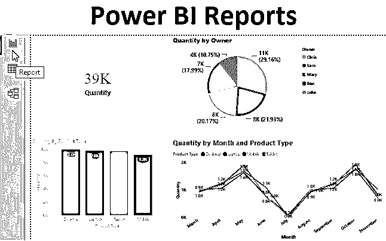

## Power BI 报告简介

第一次使用 Power BI 的人在使用 Power BI 创建报告和图表时可能不会遇到什么困难。在这里，我们将学习如何将数据导入 Power BI 系统，并对其进行处理。众所周知，要在 Excel 或 MS Office 的任何其他工具中创建报表，我们可以使用 MS Office 的任何文件中的现有数据，主要是 Excel 或 Word。但是在 Power BI 中，除了 MS Excel 和 SQL 数据库之外，我们有一个更长的数据源列表来链接和获取数据。我们将在下面的例子中看到这些细节。

### 在 Power BI 中创建报告的示例

我们将使用过滤器、可视化和字段来创建不同类型的报告。这些选项位于窗口右侧的 Power BI windows Report 选项卡中，如下所示。

<small>Hadoop、数据科学、统计学&其他</small>

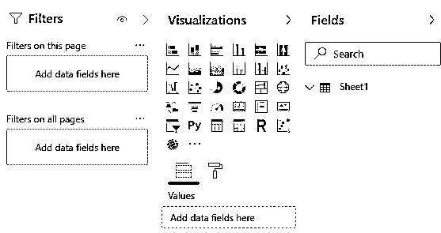

一旦我们使用任何来源将数据上传到 Power BI 中，我们就可以使用上面显示的工具来创建不同类型的报告。要在 Power BI 中创建报告，我们需要数据。因此，您可以从下面的链接下载 excel 工作簿，它用于本例。

You can download this Power BI Reports Excel Template here – [Power BI Reports Excel Template](#popmake-167767)

这里我们有一个样本销售数据的一些数据的电子产品约 1000 线如下所示。

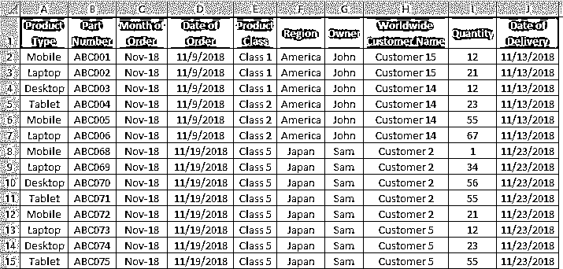

*   进入 Power BI，点击**获取数据**选项，如下所示。

*   选择要连接到 Power BI 的数据库文件的类型。这里我们的数据在一个 Excel 文件中。然后点击**连接**继续。

*   Power BI 会要求我们浏览文件位置。这样做，然后打开它。

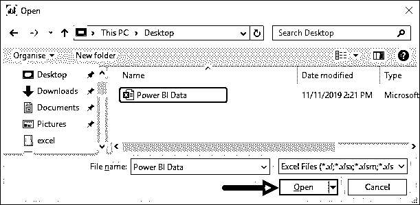

*   我们将看到一个导航窗口。勾选我们要加载的纸张的复选框，然后点击加载。

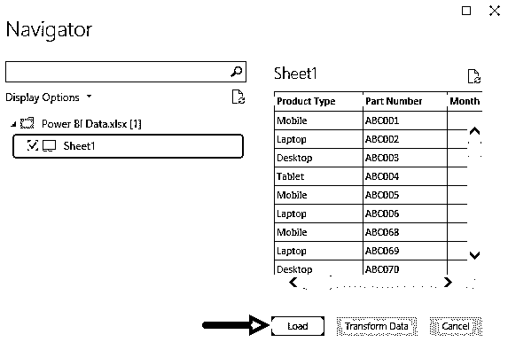

*   稍后，我们将能够在 data 选项卡下看到我们上传到 Power BI 中的数据。

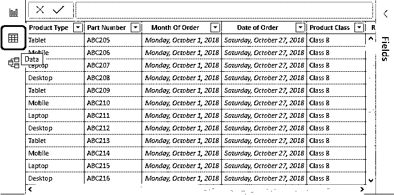

*   现在，要在 Power BI 中生成报告，请转到**报告**选项卡。

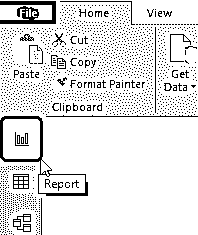

*   在 Power BI 中创建报告的过程类似于在 Exce l 中[创建仪表板。我们使用不同类型的](https://www.educba.com/dashboard-in-excel/)[图形和图表](https://www.educba.com/excel-charts-graphs/)，让我们创建报告的第一个图表。首先，我们将从可视化中选择一张**卡片**，如下图所示。

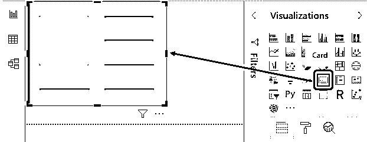

*   在这里，我们将看到销售的产品的总体质量。为此，从如下所示的**字段**部分选择数量。

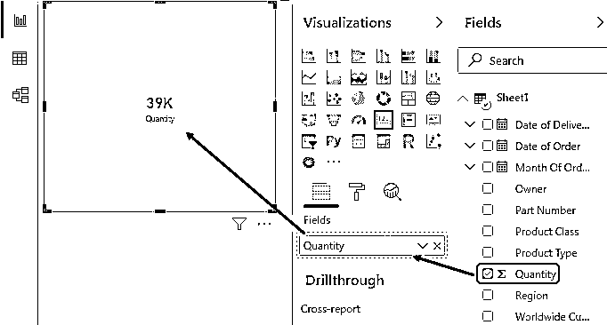

*   为了让这张卡片更有吸引力，我们还可以从**可视化**下面的格式部分更改字体和背景颜色。

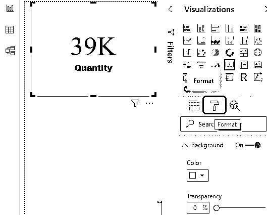

*   让我们在同一个页面上创建另一个可视化。现在我们将选择**堆积柱形图**。

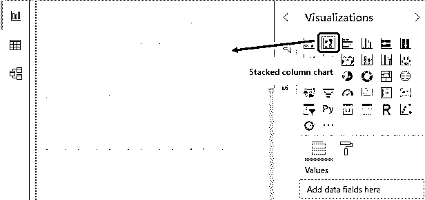

*   现在，我们将把产品类型放在**轴**中，把数量放在**值**字段中，以查看哪种产品卖得最多。

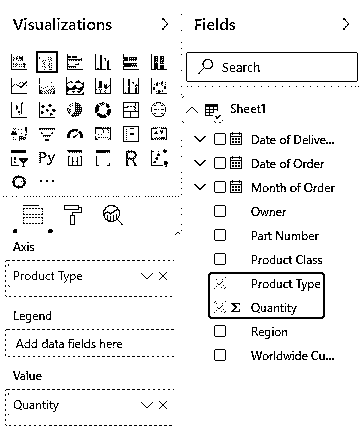

*   这将给出可视化，如下所示。

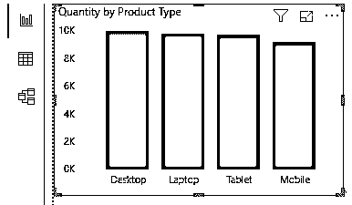

*   为了使它更有吸引力，我们改变了格式选项中的颜色列，并包含了数据标签。

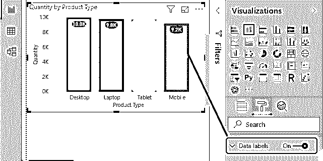

*   让我们创建另一个图表。这一次，在同一个表中，我们将创建一个饼图，其中我们将绘制销售所有者 wise 图，并查看产品的哪个所有者销售了多少数量的产品。为此，从可视化中选择**饼图**，如下所示。

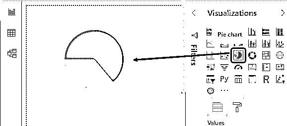

*   现在，我们将在**图例**中输入所有者，在**值**字段中输入数量。

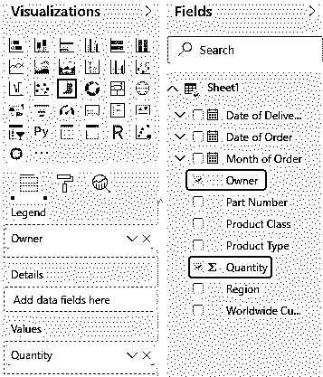

*   我们将看到我们的饼图是如何轻松地创建的。

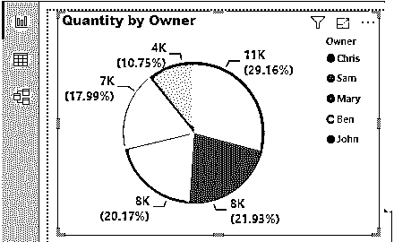

*   现在我们将根据我们的要求格式化图表。我们现在将从格式部分更改数据颜色。

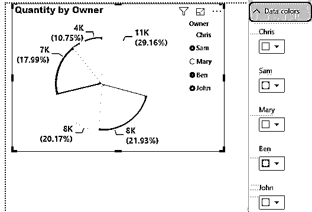

*   现在我们将绘制一个折线图。当我们想要显示趋势时，这条线更有效，当我们有这样的月销售日期时，我们可以很容易地显示这种趋势。为了绘制该图，我们将选择如下所示的**线图**。

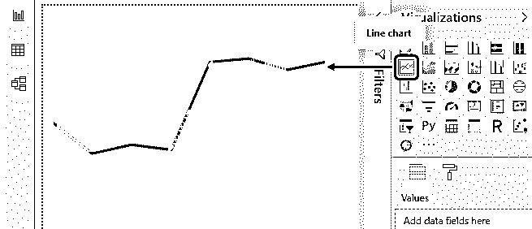

*   现在选择产品类型、数量和月份以及销售发生的时间，因为我们将显示每个产品每月的趋势。

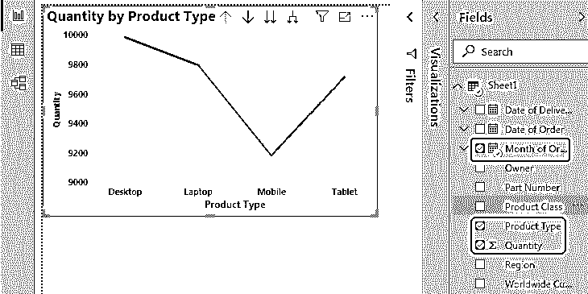

*   我们将在**轴**中输入月份，在**图例**中输入产品类型，在字段的**值中输入数量。**

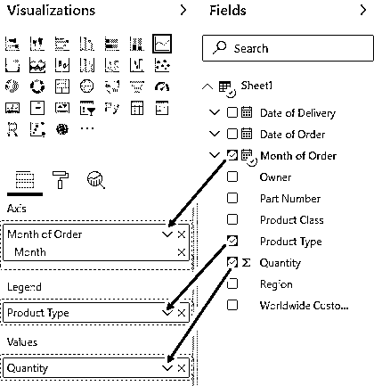

*   通过这样做，我们将修改已创建的折线图，以显示产品销售趋势，如下所示。

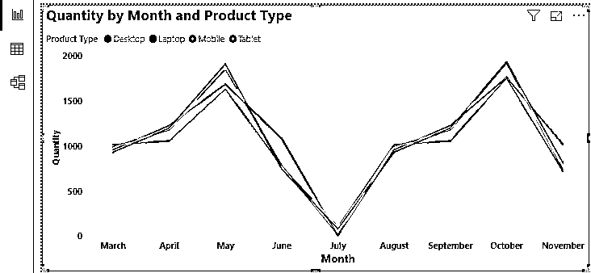

*   线条的颜色采用默认主题。我们将根据我们在堆积柱形图中给出的颜色改变每条趋势线的颜色。此外，我们还添加了数据标签，如下所示。

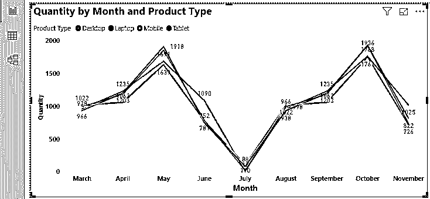

*   这就完成了我们上传的销售数据的 Power BI 报告。

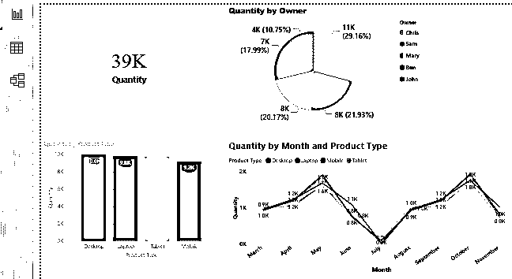

*   现在，让我们测试创建的报告是否工作，并过滤选择的部分。让我们为所有者 **Mary** 筛选饼图。为此，只需单击饼图中的 Mary。
*   我们将看到，完整的报告被与 Mary 相关的数据过滤掉了。我们可以看到，玛丽售出的总数量是 **7802** 产品月份 7802 也在堆积柱形图和折线图中进行了筛选。

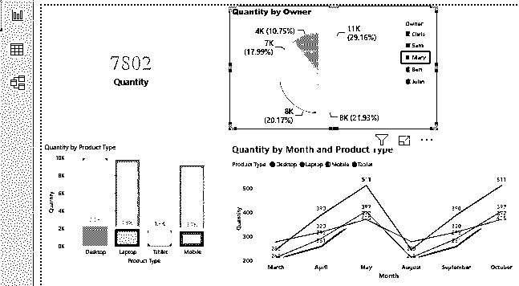

**NOTE: **Power BI Reports file can also be downloaded from the link below, and the final output can be viewed.You can download this Power BI Reports Template here – [Power BI Reports Template](#popmake-227875)

### Power BI 报告的优点

*   我们不必为了下沉而将每个表格、选项卡和图表相互链接。它会自动完成。
*   除了 MS Office 中可用的图形和图表之外，还有各种类型的图形和图表。
*   在 Power BI 中使用和创建图表非常简单。我们只需要将字段拖到相关的部分。
*   我们可以修改 Power BI 本身的数据。

### 要记住的事情

*   我们可以使用相同的数据，我们在 Power BI 上传不同的页面。
*   建议在将数据上传到报告后，在 Power BI 中自行修改数据。这样，我们就可以使用内置函数、公式来改变数值格式，使数据完全标准化。
*   达到里程碑后继续保存数据，因为这比保存 excel 数据花费的时间多一点。

### 推荐文章

这是在 Power Bi 中创建报告的指南。在这里，我们讨论如何使用图表和卡片在 Power BI 中创建报告，以及一个实际的例子。您也可以阅读以下文章，了解更多信息——

1.  [Power BI 仪表板与报告| 8 大差异](https://www.educba.com/power-bi-dashboard-vs-report/)
2.  [Power BI 初学者教程](https://www.educba.com/power-bi-tutorial/)
3.  【Power BI 与 Excel 的比较
4.  [什么是微软 Power BI？](https://www.educba.com/what-is-power-bi/)
5.  [如何在 Power BI 中使用日历 DAX 功能？](https://www.educba.com/power-bi-calendar/)
6.  [功率 BI IF 语句](https://www.educba.com/power-bi-if-statement/)
7.  [在 Power BI 中创建示例仪表板](https://www.educba.com/power-bi-dashboard-samples/)
8.  [创建功率 BI 图表的步骤](https://www.educba.com/power-bi-charts/)
9.  [电源 BI 连接类型指南](https://www.educba.com/power-bi-connections/)

