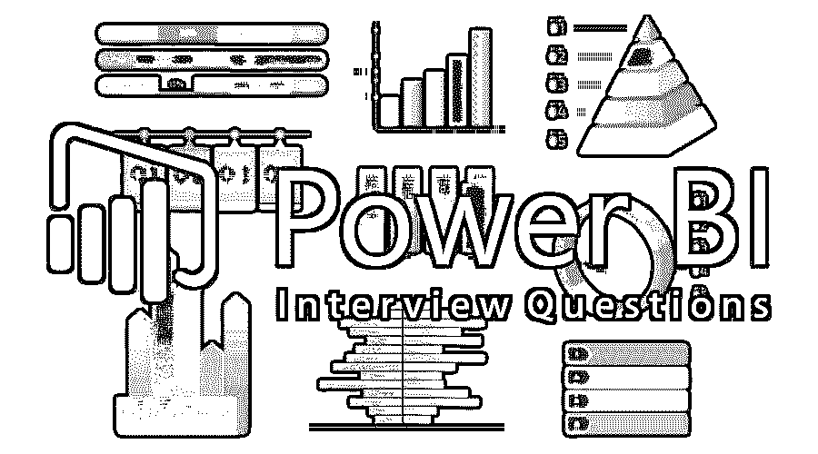

# Power Bi 面试问题

> 原文：<https://www.educba.com/power-bi-interview-questions/>

## Power Bi 面试问答介绍

以下文章提供了 Power Bi 面试问题的概要。Power BI 是一个[商业智能工具](https://www.educba.com/business-intelligence-tool/)，我们可以向它上传数据，并在整个组织中传递数据。商业智能可以快速回答任何问题并改进决策。为企业增加价值，实现更好的数据可视化。它有助于识别重要区域、隐藏模式并做出正确预测。

目标是将来自不同来源的数据应用到一个通用的平台中，从而简化组织的数据报告。它为连接数据集和建立报告提供了一个基于云的平台。它以一种可理解的方式向最终用户提供工作的图形表示，从而创建个性化的仪表板。Power BI 有一个服务叫自然查询处理。

<small>Hadoop、数据科学、统计学&其他</small>

Power BI 架构包括以下组件:

*   **Power BI Desktop:** 桌面收集了数百个数据源，生成报告和可视化。
*   **在线服务:**桌面商务智能的所有报告都在这里发布。Power BI 采用[软件即服务](https://www.educba.com/what-is-software-as-a-service-saas/) (SaaS)。
*   **Power BI Gateway:** 它使用内部信息。它向数据源发送查询，并将结果返回给网关云服务。Power BI 数据网关保持数据新鲜，并以最少的工作量进行更新。
*   **手机 App:** 我们可以用数据连接到任何地方。

Power BI 应用程序可在以下平台上运行:

Power BI 的另一个特性是快速洞察，我们可以在数据集内搜索令人兴奋的模式，并提供图表列表以更好地理解数据。它可能会使用人工智能来分析数据。工作区有四个选项卡:仪表板、报告、工作簿、数据集。我们可以使用本地应用在移动设备上显示仪表盘和报告。

要使用数据刷新，我们需要从数据源获取数据，并将其推入 SAAS 模型。例如，如果数据从 SQL Server 移动到 Excel 中。Excel 文件上传到 Power BI 读取的一个驱动器中。在审查之后，Power BI 生成一个 SQL Server 分析，该分析生成仪表板和报告。

对电源 BI 的基本需求:

*   我们需要一个超级商务智能账户
*   不允许公开电子邮件
*   带域的工作电子邮件地址。org 和。Edu 得到了支持

现在，如果你正在寻找与 Power BI 相关的工作，那么你需要准备 2022 Power BI 面试问题。的确，每个面试都因不同的职位而不同。在这里，我们准备了重要的 BI 面试问题和答案，将帮助你在面试中取得成功。

在这篇 2022 Power BI 面试问题文章中，我们将介绍 10 个最重要和最常被问到的 Power BI 面试问题。这些顶级面试问题分为两部分。

### 第 1 部分 Power BI 面试问题(基础)

第一部分包括基本的商务智能面试问题和答案。

#### Q1。我们为什么需要 BI？

**答案:**

我们可以通过点击按钮来获取数据并创建报告。帮助吸引新客户来服务和监督现有客户。我们可以跟踪信息，并据此设定目标。一般来说，完全构建一个 ETL 解决方案。(提取、转换、加载)最终帮助管理层做出更好的决策。这里的投资效率(ROI)非常高。将不需要的数据变成渐进的信息。

#### Q2。如何导入 Power BI desktop 中的数据？

**答案:**

这是面试中问 BI 面试问题的基本权力。转到获取数据源(我们从不同的域中找到数据源)并选择数据源(Excel、CSV、SQL ),然后加载它。要查看数据，请单击数据视图。要选择表格，单击字段，您可以选择一个可视化来生成报告。

#### Q3。解释一下 Power BI 和 Tableau 的区别？

**答案:**

| **功能** | **功率 BI** | 表 |
| **数据可视化** | 仅关注建模和报告。 | 最好的工具。 |
| **数据处理** | 当处理大量数据时，它会变慢。 | 处理批量数据。 |
| **用户界面** | 简单易用。 | 使用自定义仪表板。 |
| **成本** | 更便宜。 | 非常昂贵，因为它使用数据仓库。 |
| **机器学习** | 它与微软 Azure 相关联。 | 它有 python 机器学习。 |

#### Q4。Power BI 的构建模块是什么？

**答案:**

Power BI 的构建模块如下:

*   形象化
*   数据集
*   报告
*   仪表盘
*   瓷砖

#### Q5。什么是 Power Pivot，Power BI 中的过滤器写的是什么？

**答案:**

Power Pivot 是一个内存组件，支持高度压缩的数据存储。它用于构建数据模型、关系、创建公式、从各种资源计算列。

过滤器适用于:

*   可视化水平
*   页面级别
*   报告级别

### 第 2 部分 Power BI 面试问题(高级)

现在让我们来看看高级 Power BI 面试问题。

#### Q6。给出电力 BI 网关和数据管理网关的区别？

**答案:**

*   **Power BI Gateway:** 它是一个工作在本地网络上的软件(不存储在云中的数据)。它可以用于单个数据或多个数据源(SQL Server、SQL SERVER ANALYSIS SERVICES、其他数据源、文件、共享点)。数据被加密存储在网关云服务中。
*   **数据管理网关**:该组件获取连续数据，公开表格和视图。

#### Q7。报告 Power BI desktop 中新选择窗格的需求是什么？

**答案:**

它用于控制页面上不同视觉效果之间的 tab 键顺序。我们可以将两个或更多可视页面组合成一个可视组。它用于在可视化中选择数据，以便突出显示和深入查看。

#### Q8。哪些数据集可用于创建带有流数据切片的仪表板？

**答案:**

*   流式数据集(在使用流式数据集之前，我们需要将数据缓存在内存中)
*   混合数据集

#### Q9。什么是 DAX 以及编写引用计算列和度量值的 DAX 表达式的标准？

**答案:**

这是高级电源 BI 面试中问的面试问题。DAX 是 Power BI 使用的语言，缩写为数据分析表达式。它是一种函数式语言，执行流程是函数调用。它们被构造成与表格一起工作。

**DAX 公式示例:**

**=** SUM( FILTER( Values(‘Date[Year]’),)))

DAX 中的执行从内部函数开始，在外部工作。它包括多种时间智能功能。

有两种类型的上下文:

*   **行上下文–**它适用于度量。
*   **过滤器上下文–**将过滤器应用于计算。

当引用计算列时，我们必须包括表名，并且 DAX 代码自动具有定义计算列的表的行上下文。

当引用一个度量时，我们可以选择包含一个表名。

#### Q10。Power BI 中的动态滤波是如何执行的？

**答案:**

Power BI 中的动态滤波通过以下步骤完成:

*   所有数据设置完成后，向 Power BI 发布详细报告。
*   将其发布到组工作空间。
*   创建过滤器链接(例如:在 url 选项卡(？过滤器=销售人员//员工))
*   创建 DAX 计算列。
*   公共概览报告。

### 推荐文章

这是一份关于商务智能面试问答列表的指南。这里我们列出了最有用的 10 组面试问题，这样求职者就能轻松应对面试。您也可以阅读以下文章，了解更多信息——

1.  [Appium 面试问题](https://www.educba.com/appium-interview-questions/)
2.  [Power BI vs QlikView](https://www.educba.com/power-bi-vs-qlikview/)
3.  [QlikView 面试问题](https://www.educba.com/qlikview-interview-questions/)
4.  [电子商务面试问题](https://www.educba.com/e-commerce-interview-questions/)

