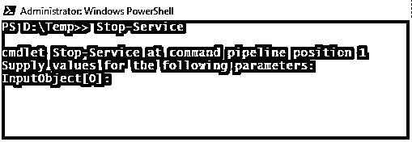

# PowerShell 停止服务

> 原文：<https://www.educba.com/powershell-stop-service/>

## PowerShell 停止服务简介

PowerShell 中的 Stop-Service cmdlet 用于停止本地计算机或远程计算机上正在运行的服务。您可以一起停止一个或多个服务。例如，可以通过名称、显示名称或输入对象来停止服务。

**语法:**

<small>Hadoop、数据科学、统计学&其他</small>

Stop-Service 命令使用以下语法。

`Stop-Service
[-Force] [-NoWait] [-Name] <String[]>
[-InputObject] <ServiceController[]>
[-DisplayName] <String[]>
[-PassThru] [-Include <String[]>] [-Exclude <String[]>] [-WhatIf] [-Confirm] [<CommonParameters>]`

### 因素

以下是 PowerShell 停止服务的参数

#### 1.-名字

此参数用于服务名或别名。您可以使用通配符(*)。要停止多个服务，可以用逗号(，)分隔它们。例如，打印后台处理程序服务的别名为 Spooler，就像所有其他服务都有自己的别名一样。

#### 2.–显示名称

使用此参数时，需要提供服务的显示名称。它是字符串数据类型。您可以提供多个显示名称，用逗号(，)分隔。允许使用通配符(*)。例如，“Windows 管理工具”是 winmgmt 服务别名的显示名称。

#### 3.–输入对象

您可以提供多个服务作为输入对象参数的变量，以停止本地和远程计算机上的服务。

#### 4.–包括

此参数指定停止任何服务时要包含的服务名称。此参数的值限定了 Name 参数。您可以使用通配符(*)。例如，当您指定 S*时，它将停止所有以 S 开头的服务。

#### 5.–排除

此参数指定停止任何服务时要排除的服务名称。此参数的值限定了 Name 参数。您可以使用通配符(*)。例如，当您指定 S*时，它将停止剩余的服务，不包括以 S 开头的服务。

#### 6.-帕斯尚

默认情况下，Stop-Service 不在 PowerShell 控制台中显示输出。使用此参数时，输出将显示在 PowerShell 控制台中。

#### 7\. –WhatIf

使用此参数时，它显示停止服务运行时将要执行的操作，而不运行实际的命令。

#### 8.–确认

此参数将在停止服务前提示用户同意。以下选项可与–Confirm 参数一起使用。

是对所有人都是不对所有人都是暂停？]帮助(默认为“Y”):

**Y(Yes)**–将停止单个服务，如果有多个服务，将为下一个服务再次运行检查。

**A(全是)**–将停止停止服务命令中提供的所有服务。

**N(否):**不会停止单个服务，如果有多个服务，将为下一个服务再次运行检查。

**L(全否):**不会停止停止服务命令中提供的所有服务。

**S (Suspend):** 它将跳过服务停止，这意味着它将使服务保持当前状态。

#### 9.–力

使用 Force 参数将停止服务，即使该服务有依赖的服务正在运行。因此，它首先停止相关服务，然后停止服务本身。

#### 10.–NoWait

当您指定**–**nowait parameter 时，PowerShell 控制台不会等待服务停止，而是执行下一个代码。

#### 11.–公共参数

停止服务支持以下常用参数。

-Verbose，-Debug，-ErrorAction，-ErrorVariable，-WarningVariable，-WarningAction，-OutBuffer，-OutVariable。

### PowerShell 停止服务的示例

下面提到了不同的例子:

#### 1.停止服务 cmdlet

当你只写停止服务时，它会等待输入对象，如下所示。输入对象可以是服务别名、显示名或类似变量的输入对象。

`Stop-Service`

**输出:**

#### 2.使用–Name 参数停止服务

您可以在–Name 参数后提供服务名(别名)。Stop-Service cmdlet 将–Name 作为默认参数。当您停止服务时，您将不会在控制台中获得任何输出。您需要使用 Get-Service 命令来检索服务的状态。您还可以使用–PassThru 参数，这将在后面的示例中解释。

`Stop-Service -Name Spooler
Get-Service Spooler`

**输出:**

您可以通过用逗号(，)分隔来停止多个服务。举个例子，

`Stop-Service -Name Spooler, Winmgmt, PlugPlay
Get-Service Spooler, Winmgmt, PlugPlay`

**输出:**

您也可以使用通配符(*)。

举个例子，

`Stop-Service -Name Spooler, "Winmg*", "*Plug*" -PassThru`

**输出:**

#### 3.使用–Passthru 参数停止服务

在上面的例子中，我们看到我们需要使用 Get-Service cmdlet 来获取服务状态。您还可以使用–Passthru 参数，该参数在控制台本身中显示输出。

`Stop-Service -Name Spooler, Winmgmt, PlugPlay -PassThru`

**输出:**

#### 4.使用–display name 参数停止服务

您可以提供显示名称作为停止服务的输入来停止服务。

举个例子，

`Stop-Service -DisplayName "Plug*","Print Spooler" -PassThru`

**输出:**

#### 5.使用–input object 参数停止服务

这里，我们将在变量中存储一些服务别名，并将其传递给 InputObject 参数。

`$services = "Spooler","Plugplay","Winmgmt"
Stop-Service -InputObject $services -PassThru`

**输出:**

#### 6.使用–Include 参数停止服务

在下面给定的变量中，我们只需要停止“后台打印程序”服务。因此，当我们使用–Include 参数时，它将只包括后台打印程序服务。

`$services = "Spooler","Plugplay","Winmgmt"
Stop-Service $services -Include "Spoo*" -PassThru`

**输出:**

#### 7.使用–Exclude 参数停止服务

下面给出的变量将排除后台打印程序服务，因此其他两个服务将自动重新启动。

`$services = "Spooler","Plugplay","Winmgmt"
Stop-Service $services -Exclude "Spoo*" -PassThru`

**输出:**

#### 8.使用–what if 参数停止服务

Whatif 参数将预测命令的执行，而不实际执行命令。下面是一个例子。

`Stop-Service -Name Spooler -WhatIf`

**输出:**

#### 9.使用–Confirm 参数停止服务

您可以将–Confirm 参数与布尔值($true 或$false)一起使用。当您指定$true 时，服务将不会停止，但会提示用户同意，而使用$false 时，服务将会停止。

`Stop-Service -Name Spooler -Confirm:$false -PassThru`

**输出:**

`Stop-Service -Name Spooler -Confirm:$true -PassThru`

**输出:**

#### 10.使用–Force 参数停止服务

很少有服务有依赖服务，不停止依赖服务就不能直接停止。so–Force 参数停止服务及其依赖的服务。例如，Winmgmt 服务。

`Stop-Service Winmgmt -Force -PassThru`

**输出:**

#### 11.使用–NoWait 参数停止服务

一些服务需要时间来停止，直到那时执行才会停止。例如,–NoWait 参数在后台停止，执行移到下一个代码。

举个例子，

`Stop-Service Winmgmt -NoWait -PassThru`

**输出:**

### 推荐文章

这是 PowerShell 停止服务的指南。这里我们讨论 PowerShell 停止服务的例子以及语法和参数。您也可以看看以下文章，了解更多信息–

1.  [PowerShell 获取项目](https://www.educba.com/powershell-get-item/)
2.  [PowerShell 拆分字符串](https://www.educba.com/powershell-split-string/)
3.  [PowerShell 获取进程](https://www.educba.com/powershell-get-process/)
4.  PowerShell 中的[字符串](https://www.educba.com/string-in-powershell/)

