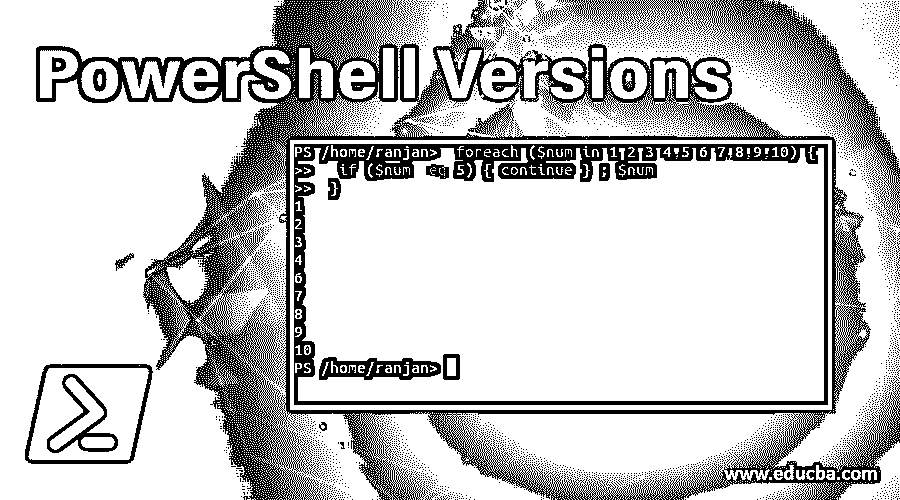
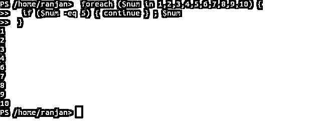
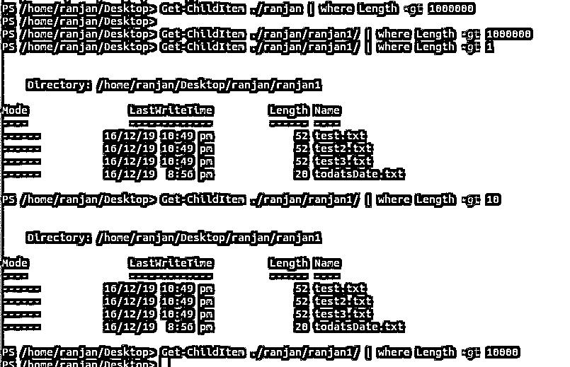
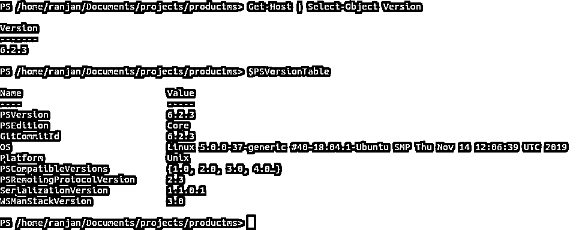

# PowerShell 版本

> 原文：<https://www.educba.com/powershell-versions/>

## PowerShell 版本简介

PowerShell 提供了一个命令行功能强大的界面来执行各种自动化工作。如果你知道 Linux 和 mac 的命令行，PowerShell 命令行是一样的。PowerShell 的第一个版本是在 2006 年发布的 1.0 版本。此版本支持 Windows XP SP2、Windows Server 2003 SPI 和 Windows Vista。每个版本都有更多的支持和命令。因此，目前 PowerShell 版本 6 是稳定版本，7 即将到来。PowerShell 版本 6 支持 Windows、Mac 和 Linux 操作系统。所以很简单来说，其版本最大的变化就是支持另一个平台，也就是支持 Windows 以外的操作系统。在另一个版本中，增加了一些命令和语法。

### 不同版本的 PowerShell

以下是 9 个不同版本的 PowerShell:

<small>Hadoop、数据科学、统计学&其他</small>

#### 1) PowerShell 1.0

PowerShell 版本 1.0 是非常基础的版本，它支持 Windows XP SP2、Windows Server 2003 SPI 和 Windows Vista。

#### 2) PowerShell 2.0

在 PowerShell 1 之前，我们只能为本地机器编写命令，也就是说，我们只能控制本地机器，但是在 PowerShell 2 中，借助 WS-management，我们可以为远程机器编写命令(远程机器意味着从您的计算机访问其他计算机)。

PowerShell 2.0 中的新变化如下:

*   **后台作业:**这里，为了调用异步 any 作业，它使用后台作业，并等待用户输入，例如，您正在运行任何脚本，并且您希望该脚本应该询问输入值，而不是只执行它应该执行的值。
*   **事务简介:**在这个 PowerShell 中提供了编写命令的能力，开发人员可以在这里回滚他们的更改。
*   **模块:**这赋予了 PowerShell 自我管理的能力，非常简单，我们可以编写一个脚本，这个脚本可以是另一个脚本的命令，并定义我们自己的功能以在其他脚本中使用。
*   **数据语言:**它允许本地化，这意味着我们可以在一个域上编写脚本，当相同的脚本将在其他域上运行时，本地字符串将在脚本运行时导入。
*   **脚本调试:**允许我们在脚本中设置任意断点进行调试。
*   **网络文件传输:**随着 PowerShell 中后台智能传输服务的引入，使得两台机器之间的异步文件传输成为可能。

#### 3) PowerShell 3.0

PowerShell 3.0 于 2011 年 12 月 2 日发布，支持 Windows 7,8，包括 Windows Server 2012。新的改进如下:

*   **作业调度:**我们可以设置作业运行的任何时间，例如，如果您有作业 A、B、C，那么可以为所有这些作业的执行安排时间。
*   **会话连接:**控制远程会话，当脚本需要时，它可以连接和断开会话。
*   **支持委托:**可以将管理任务委托给权限较小的用户。
*   **检测自动模块:**当脚本需要时，它给 [PowerShell 脚本](https://www.educba.com/useful-powershell-scripts/)以隐式加载模块的权力。

**新命令和特性:**这个版本中还添加了许多新命令，如 get-wmio object、dwin32_logicaldisk、volumes、firewalls，它还包括网络连接，并允许我们处理打印机。

#### 4) PowerShell 4.0

在这个版本中，它开始支持 Windows 8.1 和 Windows Server 2012 R2。PowerShell 4.0 引入了一些新特性。

*   **保存帮助:**PowerShell 4.0 的一个重要改进是它允许您保存远程模块的帮助。
*   **改进的调试:**调试已经存在，但在 PowerShell 4.0 中，它提供了更多的调试功能，如工作流支持，能够执行远程调试远程机器。
*   **Switch 选项 in -PipelineVariable:** 为了公开当前管道，我们使用 PipelineVariable。
*   **期望状态配置:**简单来说，这个版本的 PowerShell 允许我们配置一个系统，在这个系统中它可以识别机器。
*   **Where 和 ForEach:** Where 和 ForEach 方法语法提供了另一种过滤和迭代对象的方法。

**举例:**

以下屏幕中的 foreach 示例显示了除数字 5 之外的所有数字，这对过滤数据**很有用。**

`foreach ($num in 1,2,3,4,5,6,7,8,9,10) {
if ($num -eq 5) { continue } ; $num
}`

**输出:**

**举例:**

以下是 where 的示例:

`Get-ChildItem ./ranjan/ranjan1/ | where Length -gt 10`

**输出:**

#### 5) PowerShell 5.0

PowerShell 5.0 中包含的主要功能是 OneGet 命令，它支持 Chocolatey。

**举例:**

它引入了两个名为 Get-TimeZone 和 Set-TimeZone 的新命令。

`Get-TimeZone`

**输出:**

#### 6) PowerShell 6.0

这个版本是测试版本之一，因为在这个版本中 PowerShell 是跨平台的。跨平台意味着独立于任何操作系统(例如，支持 macOS、Linux 和 Windows)。它变得免费和完全开源。该版本于 2018 年 1 月 10 日发布，适用于 Windows、macOS 和 Linux。

#### 7) PowerShell Core 6.1

6.1 中添加的一些重要功能如下:

*   能够支持对 Windows 10 和 Windows Server 2019 的 1900 个命令。
*   它建立在。网芯 2.1。
*   支持 Windows、macOS 和 Linux 的所有新版本。
*   性能也有所提高。

#### 8) PowerShell Core 6.2

在这个版本中，大部分错误修复和一些性能增强工作已经完成。

**举例:**

在这个例子中，我使用 PowerShell 6.2 并检查我的操作系统详细信息。

`Get-Host | Select-Object Version
$PSVersionTable`

**输出:**

上面的例子展示了我如何在 Linux 上用 PowerShell 6.2 版运行 PowerShell。如果我要用比它更老的版本，那就不行了。

#### 9) PowerShell 7

PowerShell 7 中的新功能包括:

*   它基于。网芯 3.1。
*   ForEach 对象并行。
*   Windows 兼容性包装。
*   新版本的通知。
*   Get-Error cmdlet 用于处理 powerShell 错误。
*   管道链运算符的选项是&&和||。
*   它包括像(x？y: z)，所以如果您使用的是 PowerShell 版本 7，那么只有一个三元运算符可以工作。
*   Out-GridView，-ShowWindow 是一些新命令。

**Note:** The ternary operation will not work if you are using lower than 7 versions. See the example below:

### 结论

从版本 1 到 7，每个版本都有一些新的命令和特性，但是它们通过支持除 Windows 之外的操作系统，如 macOS 和 Linux，做了很大的架构改变。

### 推荐文章

这是 PowerShell 版本的指南。在这里，我们将讨论基本概念和 9 个不同的 PowerShell 版本以及示例。您也可以阅读以下文章，了解更多信息——

1.  [Linux 中的 NFS](https://www.educba.com/nfs-in-linux/)
2.  [PowerShell 环境变量](https://www.educba.com/powershell-environment-variables/)
3.  [PowerShell 中的 Regex](https://www.educba.com/regex-in-powershell/)
4.  [PowerShell 重命名-项目](https://www.educba.com/powershell-rename-item/)

