# 如何安装 PowerShell

> 原文：<https://www.educba.com/install-powershell/>

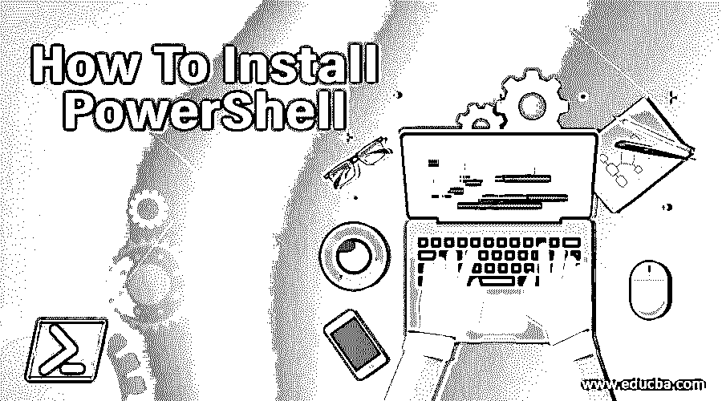

## 如何安装 PowerShell

以下文章概述了如何安装 PowerShell。PowerShell 是来自微软的任务自动化引擎，具有命令行外壳和相关的脚本语言。Windows PowerShell 是一个开源软件，其基础源代码可以在 GitHub 上获得。它构建于. NET 框架之上，而 PowerShell 核心构建于。网芯。它帮助管理员和 It 专业人员自动执行系统任务，配置和管理 Windows、 [Linux 和 macOS](https://www.educba.com/linux-vs-mac/) 等操作系统及其应用程序和流程。它在 Linux 中的对等物被称为 Bash 脚本。它是一个面向对象的引擎，即它是基于对象的。Windows PowerShell 的命令称为 cmdlets。NET 类。它们执行一个动作，并作为输出返回一个对象，该对象可以作为另一个命令的输入。

PowerShell 功能被分组在一起，用于管理称为 [PowerShell 模块](https://www.educba.com/powershell-modules/)的特定任务。这些模块允许管理员重用脚本或代码来实现任务的自动化。Windows PowerShell 的宿主应用程序是集成脚本环境(ISE)。它可以访问命令行工具。NET 类库和 COM 对象。迄今为止，PowerShell 已经发布了许多版本。它在 2003 年 9 月的专业开发人员会议上首次公开，命名为 Monad。所有版本的 Windows PowerShell 都与以前的版本兼容。

<small>Hadoop、数据科学、统计学&其他</small>

### 不同版本的 PowerShell

PowerShell 的不同版本如下:

#### 1.PowerShell 1.0

这是 2006 年 11 月发布的，受 Windows Server 2003 SP1、Windows XP SP2 和 Windows Vista 支持。

#### 2.PowerShell 2.0

这些在 2009 年 10 月发布的产品与 Windows Server 2008 R2 和 Windows 7 集成。支持它的其他可用 Windows 版本有 Windows XP Service Pack 3、Windows Vista with Service Pack 1 和 Windows Server 2003 Service Pack 2。还包括其他功能，如事务、PowerShell 远程处理、可步进管道、模块、脚本调试、事件、Windows Powershell 集成脚本环境、块注释、新 cmdlets 和运算符。

#### 3.PowerShell 3.0

它于 2012 年 9 月发布，集成了 Windows 8 和 Windows Server 2012。它适用于 Windows Server 2008 Service Pack 2、Windows 7 Service Pack 1 和 Windows Server 2008 R2 Service Pack 1。它是 Windows 管理框架 3.0 的一部分，该框架已于 2012 年 12 月向公众发布。添加了会话连接、计划作业和自动模块检测等新功能。

#### 4.PowerShell 4.0

它于 2013 年 10 月发布，集成了 Windows 8.1 和 Windows Server 2012 R2。它也受 Windows 7 Service Pack 1、Windows Server 2012 和 Windows Server 2008 R2 Service Pack 1 的支持。默认的执行策略是远程签名的，调试也得到了增强。

#### 5.PowerShell 5.0

它于 2016 年 2 月发布，与 Windows 10 集成，可用于 Windows 8.1、Windows 7 Service Pack 1、Windows Server 2012 R2 和 Windows Server 2012。PowerShell 等附加功能。NET 枚举、PowerShell 后台作业的调试、类定义、DSC 部分配置等等。

#### 6.PowerShell 5.1

这是在 2017 年 1 月 Windows 10 周年更新和 Windows Server 2016 中发布的。这是第一个带有桌面和核心两个版本的版本。

#### 7.PowerShell Core 6.0

它于 2018 年 1 月 10 日向公众发布，而它是在 2016 年 8 月 18 日宣布的。它在许多 Windows 版本中受支持，如 Windows 10、Windows 8.1、带 Service Pack 1 的 Windows 7、Windows Server 2012 R2、Windows Server 2012 和 Windows Server 2016。

### 安装 PowerShell 的步骤

现在让我们看看如何在 Windows 7 上安装 Windows PowerShell 3.0:

如果您使用的是 Windows 8、8.1、Windows Server 2012 或 Windows Server 2012 R2 等版本，则 Windows PowerShell 3.0 会预装在您的系统中，但如果您使用的是 Windows 7 或 Windows Server 208 R2，则 Windows PowerShell 3.0 可能会预装，也可能不会预装。您可能正在使用 2.0 版，该版本已预装在这些版本的 Windows 中。

您可以将版本从 2.0 更新到 3.0。但是首先，您必须确保您使用的是哪个版本的 Windows Powershell。所以要检查版本。

**步骤 1:** 点击开始，在搜索栏输入 PowerShell，选择 PowerShell 控制台。

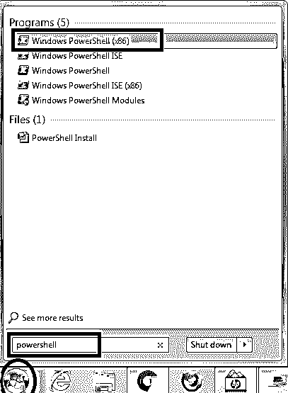

**步骤 2:**PowerShell 控制台将会打开。然后键入命令:

**获取主机|选择对象版本**

该命令的输出将告诉您版本。

如果版本是 3.0，那么你可以开始工作，但是如果版本是 2.0，那么你需要更新它。为此，您必须安装 Windows PowerShell 3.0。

**第三步:**你要下载 Windows 管理框架 3.0，微软下载中心已经包含了 Windows PowerShell 3.0。(【https://www.microsoft.com/en-us/download/details.aspx? T2】id=34595

当您打开此 URL 时，将出现以下窗口；单击下载下载 Windows 管理框架 3.0。

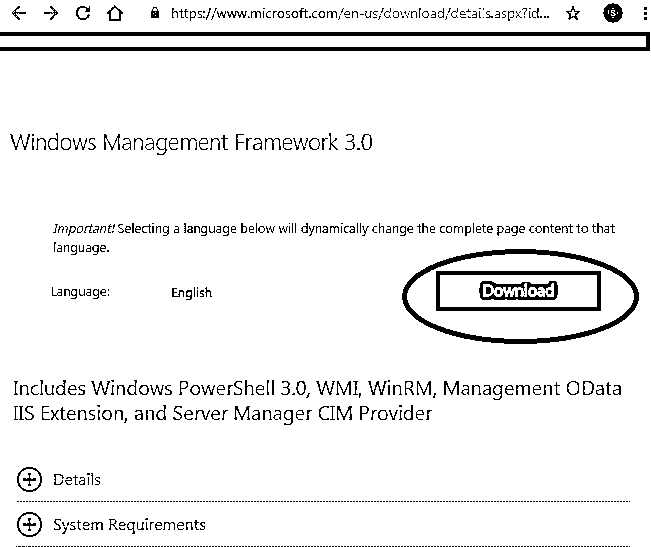

**第 4 步:**选择所需文件，点击下一步。

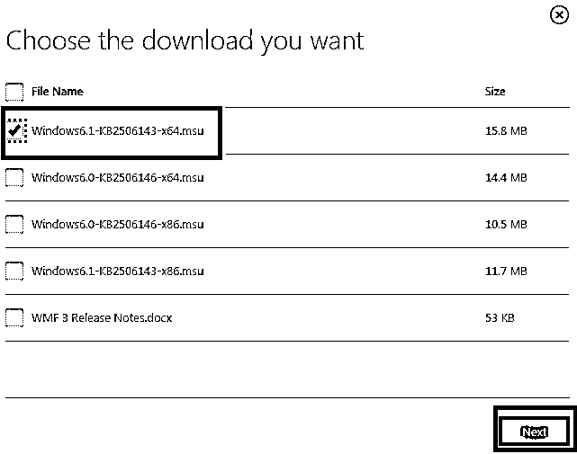

**步骤 5:** 文件将被下载到您的系统上。打开它。

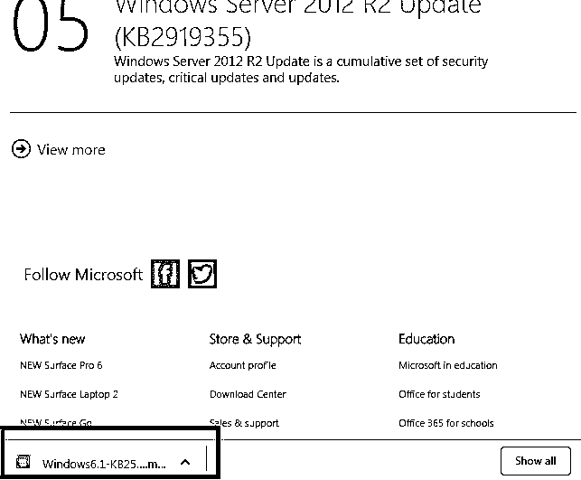

**第六步:**它会问你要不要安装。点击是。

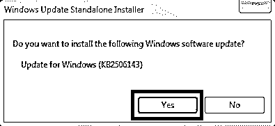

**第 7 步:**将出现许可条款文档。选择“我接受”。

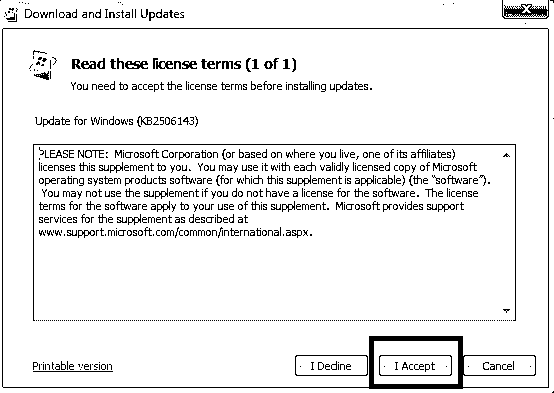

安装将开始。

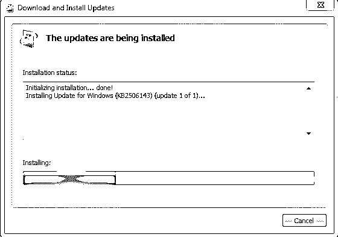

**第八步:**它会要求重启系统。点击立即重启。

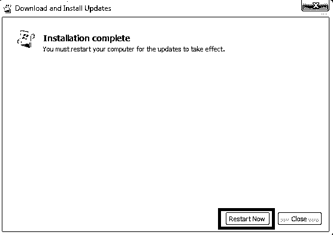

正确安装后，您必须确保它已经配置为运行远程脚本；为此，请以管理员身份运行它。

**第九步:**点击开始- >所有程序- >附件- > Windows PowerShell - >右键 Windows PowerShell - >以管理员身份运行。

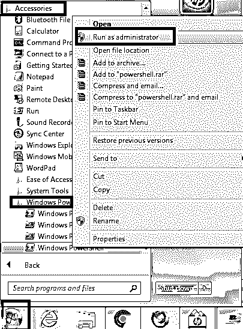

**步骤 10:** 之后，更改执行策略，允许运行远程脚本。

*   **类型**:Set-execution policy remote signed-Force。

然后按回车键。

以验证执行策略。

*   **类型** : Get-ExecutionPolicy。

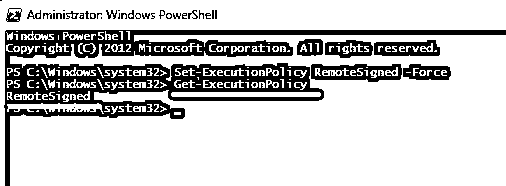

如果输出是远程签名的，那么一切都配置好了，您可以开始工作了。

### 推荐文章

这是如何安装 PowerShell 的指南。这里我们讨论了在我们的系统上安装 PowerShell 的基本概念、不同版本和步骤。您也可以阅读以下文章，了解更多信息——

1.  [Powershell 的主要用途](https://www.educba.com/uses-of-powershell/)
2.  [PowerShell 和 Python 的比较](https://www.educba.com/powershell-vs-python/)
3.  [PowerShell 和 Bash 的区别](https://www.educba.com/powershell-vs-bash/)
4.  [使用 PowerShell 字符串函数](https://www.educba.com/powershell-string-functions/)

