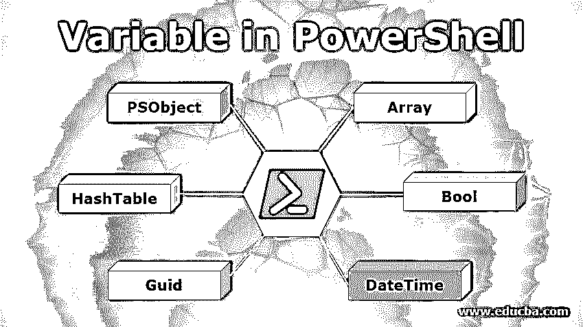
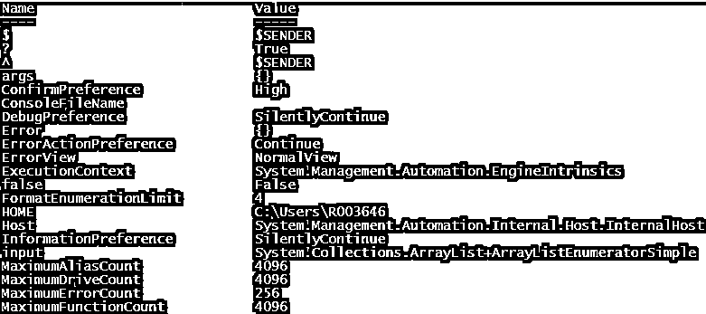
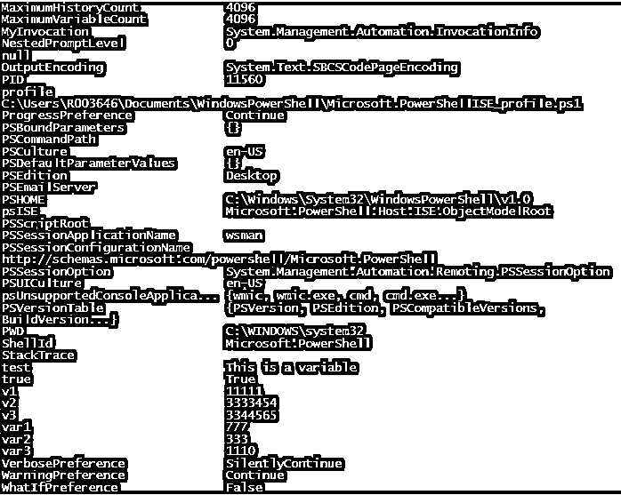
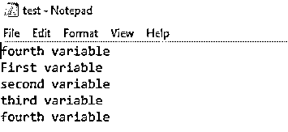

# PowerShell 中的变量

> 原文：<https://www.educba.com/variable-in-powershell/>

## PowerShell 中变量的介绍

PowerShell 中的变量是一个内存块，可用于存储值。PowerShell 变量使用“$”符号表示。变量名可以是数字、字母甚至下划线。PowerShell 变量不区分大小写。PowerShell 变量不仅仅是基于文本的，相反，它们是像 Microsoft.Net 对象那样的对象。

### 使用语法创建变量

以下示例显示了变量的创建

<small>Hadoop、数据科学、统计学&其他</small>

`$test`

$test 是一个变量，可以使用=或赋值运算符为它赋值

`$test=” This is a variable”`

要获得变量的值，我们只需要简单地输入变量

#### 示例#1

下面的例子是用来说明变量的介绍

**代码:**

`Write-Host "Introduction to the variable"
$test="This is a variable"
Write-Host "The value of the variable is below"
$test`

**输出:**

变量简介

变量的值如下

这是一个变量

#### 实施例 2

以下示例用于显示对变量的算术运算

**代码:**

`Write-Host "Example of arithmetic operation"
$v1 = 11111
$v2 = 3333454
$v3 = $v1 + $v2
$v3`

**输出:**

算术运算的例子

Three million three hundred and forty-four thousand five hundred and sixty-five

### PowerShell 中的变量类型

在 PowerShell 中，如果未指定变量的数据类型，PowerShell 会在初始化变量时自动检测变量类型。

以下是数组变量的类型

**1。数组:**数组变量是第一种类型的变量。数组变量可以声明如下

`[int32[]]$inttest = 1,2,3,4`

或者

`$test=1..99`

**2。Bool:** 布尔变量可以定义如下。

`[bool] $test = 1`
或

`[bool] $test= $true`

**3。DateTime:**DateTime 变量可以声明如下

`$a = [DateTime] "07/06/2015 05:00 AM"`

**4。guid:**guid 值可以分配给变量，如下所示

`$a=New-Guid`

**5。HashTable:**HashTable 变量存储一个键值对。哈希表可以定义如下

`$test = @{ key1= 1; key2= 2; key3= 3}`

或者

`$test = @{}`

**6。PS object:**PS object 变量类似于哈希表，使用键值对结构。它可以定义如下。

`$test = [PSCustomObject]@{
Key1 = 'Value1'
Key2 = 'Value2'
}`

### PowerShell 中的自动变量

这些变量是由 PowerShell 自己创建的。它们用于维护 PowerShell 的状态。用户不会更改这些变量的值，PowerShell 会更改它们以保持准确性。以下是一些自动变量。

| **变量** | **描述** |
| **$首页** | 包含用户主目录的路径 |
| **$主机** | 代表 PowerShell 的应用程序 |
| **$NULL** | 空值 |
| **$个人资料** | 表示当前用户配置文件的完整路径 |
| **$STACKTRACE** | 包含最近错误的堆栈跟踪 |
| **$PSCOMMANDPATH** | 包含运行脚本的路径 |
| **$PID** | 包含当前会话的处理器 id |
| **$ErrorActionPreference** | 表示传递错误消息时采取的操作 |
| **$PSCulture** | 表示 Powershell 会话的当前区域性 |

PowerShell 中的所有自动变量都可以通过运行下面的命令找到。

**代码:**

`Get-Variable`

**输出:**

### 不同类型的变量范围

作用域不过是变量的生命外壳。变量只在指定的范围内有效。

*   **$Global:** 在当前会话中，变量在整个脚本中都可用。
*   **$Script:** 该变量只能在脚本内部访问，并在脚本执行完毕后被丢弃。
*   **$Private:** 变量只在函数内有效。
*   **$local:** 变量仅在会话的当前范围内有效。
*   **与变量相关联的 cmdlet:**
*   **清除变量:**删除变量的值
*   **Get-Variable:** 获取当前会话中的变量列表。
*   **新变量:**用于创建一个新变量
*   **删除变量:**删除变量
*   **Set-Variable:** 用于改变变量的值

#### 示例#1

检查上次运行的 cmdlet 是否成功。

**代码:**

`$? is used for the above-said purpose`

**上一个 cmdlet 运行了**

`get-mynae`

**对应的输出**

从上面可以明显看出，cmdlet 执行不成功。之后，cmdlet 被执行。

**代码**

`$?`

**输出:**

False 表示最后一个 cmdlet 不成功，true 表示执行成功。

#### 实施例 2

将变量值存储到 word 或 csv 文件中

**代码:**

`Write-Host "variable example"
$test = "First variable"
$test1 = "second variable"
$test2 = "third variable"
$test3 = "fourth variable"
$test | Out-File C:\test.txt -Append
$test1 | Out-File C:\test.txt -Append
$test2 | Out-File C:\test.txt -Append
$test3 | Out-File C:\test.txt -Append`

**输出:**

#### 实施例 3

设置并获取一个变量

**代码:**

`Set-Variable -Name "test" -Value "test"
Get-Variable -Name "test"
Set-Variable -Name "test1" -Value "testone"
Get-Variable -Name "test1"
Set-Variable -Name "test2" -Value "testtwo"
Get-Variable -Name "test2"
Write-Host "Get all the user defined variables in the current session"
Get-Variable test* -ValueOnly`

**输出:**

### 结论

因此，本文详细介绍了 PowerShell 中的变量。它还解释了与变量相关的数据类型、变量范围以及 PowerShell 中可用的变量类型。要更深入地理解变量，建议创建示例程序，并享受围绕它们工作的乐趣。

### 推荐文章

这是 PowerShell 中的变量指南。在这里，我们将讨论如何在 PowerShell 中创建变量、不同类型的变量范围和自动变量，并给出示例。您也可以浏览我们推荐的其他文章，了解更多信息——

1.  [PowerShell 移动项目](https://www.educba.com/powershell-move-item/)
2.  [PowerShell 中的 Get-Command](https://www.educba.com/get-command-in-powershell/)
3.  [PowerShell 中的比较运算符](https://www.educba.com/comparison-operators-in-powershell/)
4.  [PowerShell 中的循环](https://www.educba.com/loops-in-powershell/)
5.  [PowerShell Out-File |示例和参数](https://www.educba.com/powershell-out-file/)

