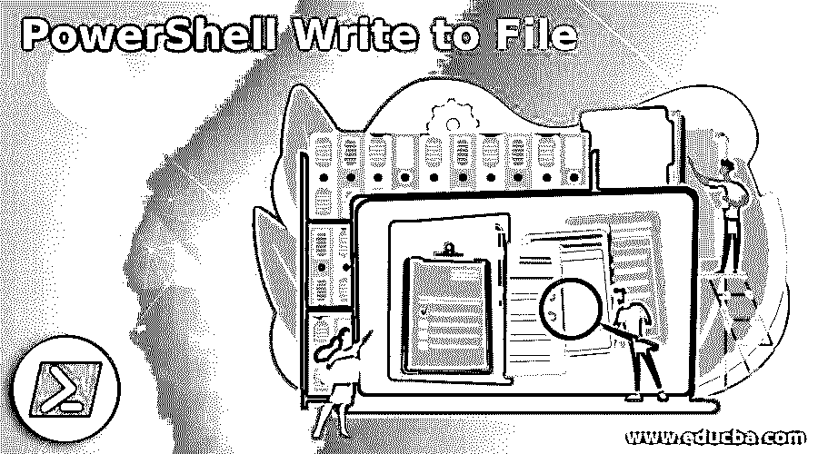
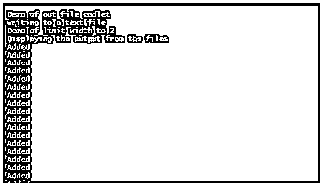

# PowerShell 写入文件

> 原文：<https://www.educba.com/powershell-write-to-file/>

## PowerShell 写入文件简介

以下文章提供了 PowerShell 写入文件的概述。有多种场景需要将生成的输出写入文件。例如，它可以用于文档、错误记录或调试目的。在 PowerShell 中，有多种方法可以将输出写入文件，并且有 cmdlets 可以生成各种类型的文件，如文本、csv、xml 或 html 文件。

### 不同的 Cmdlet

下面给出了不同的 cmdlets、它们的参数和详细用法，以及适当的示例。

<small>Hadoop、数据科学、统计学&其他</small>

#### 1.文件外

这是一个基本的 cmdlet，它将输出发送到用户选择的文件中。默认情况下，它使用内置的格式化机制来生成输出文件。输出的格式与它在控制台中的显示格式相同。

**语法:**

`Out-File [-FilePath] <string> [[-Encoding] <Encoding>] [-Append] [-Force] [-NoClobber] [-Width <int>] [-NoNewline] [-InputObject <psobject>] [-WhatIf] [-Confirm] [<CommonParameters>]`

**参数:**

*   **-Append:** 将输出添加到现有文件中。此参数的数据类型是开关。无是默认值。此参数不识别管道输入；此外，不允许使用通配符。
*   **-Confirm:** 这确保在运行 cmdlet 之前收到用户确认。参数的数据类型是开关。Cf 是该参数的别名。默认值为 False。此参数不识别管道输入；此外，不允许使用通配符。
*   **-Encoding:** 这表示 PowerShell 在生成输出文件时应该使用的编码机制。各种类型的编码如下:ascii、utf32、utf8BOM、utf8NoBOM、utf7、utf8、oem 和 Unicode。默认值是 utf8NoBOM。此参数的数据类型是编码。此参数不识别管道输入；此外，不允许使用通配符。
*   **-FilePath:** 表示输出文件的位置。此参数的数据类型是字符串。它的别名是路径。无是默认值。此参数不识别管道输入；此外，不允许使用通配符。
*   **-Force:** 该参数用于覆盖已有的只读文件。开关是该参数的数据类型。无是默认值。此参数不识别管道输入；此外，不允许使用通配符。
*   **-InputObject:** 表示需要发送到输出文件的对象。它可以是保存对象的变量，也可以是结果是对象集合的表达式。此参数的数据类型是 PSObject。无是默认值。此参数识别管道输入，但不允许使用通配符。
*   **-LiteralPath:** 这也代表输出文件的位置。字符串是这个参数的数据类型，它的别名是 PSPath 和 LP。无是默认值。此参数识别管道输入，但不允许使用通配符。
*   **-NoClobber:** 用于防止文件被覆盖。如果输出文件存在，将显示一条消息。如果不使用，那么文件将被覆盖。此参数的数据类型是开关。默认值为无。此参数不识别管道输入；此外，不允许使用通配符。
*   **-NoNewLine:** 用于防止新行插入输出。不添加新行。此参数的数据类型是开关。无是默认值。此参数不识别管道输入；此外，不允许使用通配符。
*   **-Width:** 这表示每行输出应该有多少个字符。如果长度超过此限制，这些字符将被截断。默认限制是 80。因此，该参数的数据类型为 80。无是默认值。此参数不识别管道输入；此外，不允许使用通配符。

**举例:**

**代码:**

`Write-Host "Demo of out file cmdlet" -ForegroundColor Green
Write-Host "writing to a text file" -ForegroundColor Green
for($i=0;$i -le 10; $i++)
{
$out="Added" | Out-File -FilePath C:\vignesh\demo.txt -Append
}
Write-Host "Demo of limit width to 2"
for($i=10000;$i -le 10010; $i++)
{
$out="Added" | Out-File -FilePath C:\vignesh\demo1.txt -Append -Width 2
}
Write-Host "Displaying the output from the files" -ForegroundColor Green
Get-Content -Path "C:\vignesh\demo.txt"
Get-Content -Path "C:\vignesh\demo1.txt"`

**输出:**

#### 2.设置内容

这个 cmdlet 也类似于 add-content，只是它会覆盖文件的现有内容，而不会追加内容。

**语法:**

`Set-Content [-Path] <string[]> [-Value] <Object[]> [-PassThru] [-Filter <string>] [-Include <string[]>] [-Exclude <string[]>] [-Force] [-Credential <pscredential>] [-WhatIf] [-Confirm] [-NoNewline] [-Encoding <Encoding>] [-AsByteStream] [-Stream <string>] [<CommonParameters>]`

**参数:**

*   **-Confirm:** 这确保在运行 cmdlet 之前收到用户确认。参数的数据类型是开关。Cf 是该参数的别名。默认值为 False。此参数不识别管道输入；此外，不允许使用通配符。
*   **-Encoding:** 这表示 PowerShell 在生成输出文件时应该使用的编码机制。各种类型的编码如下:ascii、utf32、utf8BOM、utf8NoBOM、utf7、utf8、oem 和 Unicode。默认值是 utf8NoBOM。此参数的数据类型是编码。此参数不识别管道输入，也不允许使用通配符。
*   **-FilePath:** 表示输出文件的位置。此参数的数据类型是字符串。它的别名是路径。无是默认值。此参数不识别管道输入；此外，不允许使用通配符。
*   **-Force:** 该参数用于覆盖已有的只读文件。开关是该参数的数据类型。无是默认值。此参数不识别管道输入；此外，不允许使用通配符。

**举例:**

**代码:**

`Write-Host "Demo of set content cmdlet" -ForegroundColor Green
Write-Host "writing to a text file" -ForegroundColor Green
for($i=0;$i -le 10; $i++)
{
$out="Added" | Set-Content -Path C:\vignesh\demo.txt
}
Write-Host "Displaying the output from the files" -ForegroundColor Green
Get-Content -Path "C:\vignesh\demo.txt"
Write-Host "Rewriting the contents of the file"
$out="newly added" | Set-Content -Path C:\vignesh\demo.txt
Get-Content -Path "C:\vignesh\demo.txt"`

**输出:**

### 结论–PowerShell 写入文件

因此，本文详细解释了如何在 PowerShell 中写入文件。它解释了各种方法、它们的参数和语法，以及适当的例子。这可以通过编写和练习示例脚本来详细了解。

### 推荐文章

这是 PowerShell 写入文件的指南。为了更好地理解，我们在这里讨论简介和不同的 cmdlet。您也可以看看以下文章，了解更多信息–

1.  [PowerShell 睡眠](https://www.educba.com/powershell-sleep/)
2.  [PowerShell 子串](https://www.educba.com/powershell-substring/)
3.  [PowerShell 不像](https://www.educba.com/powershell-not-like/)
4.  [否则如果在 PowerShell 中](https://www.educba.com/else-if-in-powershell/)

