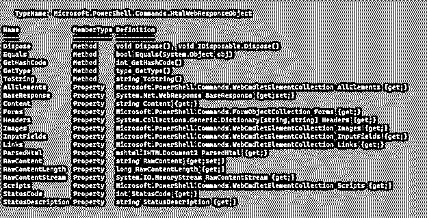
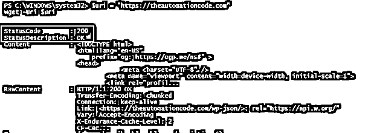

# PowerShell wget

> 原文：<https://www.educba.com/powershell-wget/>

## PowerShell wget 简介

PowerShell Wget 是 PowerShell 中 Invoke-WebRequest 的别名，它是一个非交互式实用程序，将请求发送到 HTTP 或 HTTPS 网页或 web 服务，解析响应并返回链接、图像和 HTML 元素的集合，它还帮助从网页下载文件，用表单发布或删除或修改网站上的数据，检查网站的状态等。

**语法**

<small>Hadoop、数据科学、统计学&其他</small>

`Invoke-WebRequest
[-UseBasicParsing] [-Uri] <Uri>
[-WebSession <WebRequestSession>] [-SessionVariable <String>] [-AllowUnencryptedAuthentication] [-Authentication <WebAuthenticationType>] [-Credential <PSCredential>] [-UseDefaultCredentials] [-CertificateThumbprint <String>] [-Certificate <X509Certificate>] [-SkipCertificateCheck] [-SslProtocol <WebSslProtocol>] [-Token <SecureString>] [-UserAgent <String>] [-DisableKeepAlive] [-TimeoutSec <Int32>] [-Headers <IDictionary>] [-MaximumRedirection <Int32>] [-MaximumRetryCount <Int32>] [-RetryIntervalSec <Int32>] [-Method <WebRequestMethod>] [-Proxy <Uri>] [-ProxyCredential <PSCredential>] [-ProxyUseDefaultCredentials] [-Body <Object>] [-Form <IDictionary>] [-ContentType <String>] [-TransferEncoding <String>] [-InFile <String>] [-OutFile <String>] [-PassThru] [-Resume] [-SkipHttpErrorCheck] [-PreserveAuthorizationOnRedirect] [-SkipHeaderValidation] [<CommonParameters>]`

如果我们检查 Invoke-Webrequest 语法，PowerShell 7.1 版本支持该命令的 4 个集合。

其他 3 组包括以下额外参数。

**-NoProxy**

**-自定义方法**

这意味着您不能将上述 2 个参数与第一组特定参数组合在一起。例如，您不能同时使用-Proxy 和-NoProxy 参数，而是同时设置支持-NoProxy 和-CustomMethod。

### PowerShell **wget** 是如何工作的？

Wget 实用程序是基于 Unix 的实用程序，一般来说，人们使用它从网页下载文件。PowerShell 以 cmdlet Invoke-WebRequest 的形式引入了一个类似的实用程序，它的别名是 wget，以便来自 Unix 后台的人可以理解这个命令在 PowerShell 中具有类似或更高级的功能。

Invoke-WebRequest 是从 PowerShell 3.0 开始引入的，在与网页交互方面已经变得非常流行。

Wget 是 PowerShell 中 Invoke-WebRequest 命令的别名。Net 框架版本(1.0 到 5.1)。

`Get-Alias -Name wget`

**输出:**

而在 Powershell 核心版本(6.0 及更高版本)中，wget 别名被替换为 iwr 命令。

`Get-Alias -Definition Invoke-Webrequest`

**输出:**

Wget 和 iwr 也有相同的支持实用程序 curl，它是一个 Unix 命令，但作为 Invoke-Webequest 命令的别名引入。

`Get-Alias -Definition Invoke-WebRequest`

**输出:**

当您使用 Wget 命令解析网页时，有一些属性和方法与该命令相关联。让我们看看那些成员是什么。

`$uri = "https://theautomationcode.com"
$response = wget -Uri $uri
$response | gm`

**输出:**

有各种各样的属性，如标题、图像、链接，您可以通过 wget 命令直接检索它们。

在下面的例子中，我们将看到 wget 命令是如何支持各种参数的。

### PowerShell wget 的示例

以下是 PowerShell wget 的示例:

#### 示例#1

使用 wget 命令检查网站状态

我们可以使用 wget (Invoke-WebRequest)命令来检查网页的状态。

`$uri = "https://theautomationcode.com"
wget -Uri $uri`

**输出:**

StatusCode 200 表示站点正常。您可以在下面的 wiki 页面链接上查看各种状态代码。

https://en.wikipedia.org/wiki/List_of_HTTP_status_codes

#### 实施例 2

Wget 命令中的异常处理。

编程语言使用 try/catch 方法进行异常处理。在本例中，我们将使用 PowerShell 中相同的方法处理不存在的网站异常。

`Try {
$uri = "https://theautomationcode222.com"
wget -Uri $uri -EA Stop
}
Catch {
Write-Host $($_.Exception.Message) -BackgroundColor DarkRed
}`

**输出:**

捕获消息的状态代码。

`try{
$uri = "www.microsoft.com/unkownhost"
wget -Uri $uri -EA Stop
}
catch{
Write-Output "Status Code:  $($_.Exception.Response.StatusCode.value__)"
}`

**输出:**

#### 实施例 3

使用 Wget 命令下载文件。

我们可以使用 wget 命令直接从互联网下载文件，如下所示。在本例中，我们从 MS 网站下载了一个基于 Web 的. net framework，如下所示。

`$uri = https://go.microsoft.com/fwlink/?LinkId=2085155
wget -Uri $uri -OutFile "C:\temp\netframework.exe" -Verbose`

**输出:**

上述命令将下载文件保存在 C:\temp 文件夹中，文件名为 NetFramework.exe。

#### 实施例 4

从网页下载图片和链接。

使用 wget 小部件，我们可以从网站直接访问本地系统的图像或链接，如下所示。

`$uri = "https://theautomationcode.com"
$response = wget -Uri $uri`

使用上面的命令，来自网页的响应将被存储在$Response 变量中。因此，我们可以直接访问这些属性。但是，首先，让我们检查网站上存储的图像。

`$response.Images.src`

**输出:**

上面的命令显示了网站上图片的来源。

通过对上面的命令进行一些操作，您可以将这些图像下载到特定的文件夹中，如下所示。它会将链接中的所有图片下载到 C:\temp\WebImages 文件夹中。

`foreach($img in $response.Images.src){
$imgurl = ($img.Split('?'))[0] $imgname = ($imgurl -split '/')[-1] wget -Uri $imgurl -OutFile "C:\temp\WebImages\$imgname" -Verbose
}`

**输出:**

同样，您可以从网站访问链接。

`$response.Links.Href`

#### 实施例 5

使用 wget 将 Rest API 内容转换为 JSON 数据。

当我们使用 rest API 获取网站数据时，这些数据通常是 JavaScript Object Notation (JSON)格式的。因此，当我们使用 Invoke-RestMethod 命令时，它会直接将输出转换为 JSON 格式，如下所示。

`Invoke-RestMethod -Uri "https://jsonplaceholder.typicode.com/posts"`

**输出:**

但是使用 wget 命令，我们需要使用一些 cmdlets 来过滤内容，然后我们可以转换为上面的输出显示格式。

`$uri = 'https://jsonplaceholder.typicode.com/posts'
$response = Invoke-WebRequest -Uri $uri
$response.Content | ConvertFrom-Json`

您将获得与第一个相同的输出。

#### 实施例 6

使用 wget post 方法登录网站。

在下面的例子中，我们将使用如下所示的 wget 表单登录 LinkedIn 网站。

`$linloginpage = 'https://www.linkedin.com/login?fromSignIn=true&trk=guest_homepage-basic_nav-header-signin'
$response = wget -Uri $linloginpage -SessionVariable LIN
$form = $response.Forms[1] $form.Fields["Username"] = "user@emailid"
$form.Fields["Password"] = "Your password"
$uri = "https://www.linkedin.com" + $form.Action
$r = wget -Uri $uri -WebSession $Lin -Method Post -Body $form.Fields
Write-Output "`n`nWebsite Status: $($r.StatusDescription)"`

**输出:**

### 结论

Wget 或 Invoke-WebRequest (Curl，iwr)是用于网页清理的最佳命令行工具之一，被各种开发人员和脚本编写人员用来调用 API、传递、删除、修改、向 API 或网页添加信息，而不使用 GUI，并且还有助于处理各种类型的网页错误和报告目的。

### 推荐文章

这是 PowerShell wget 的使用指南。在这里，我们讨论 PowerShell wget 是如何工作的，以及示例和输出。您也可以看看以下文章，了解更多信息–

1.  [PowerShell ZIP](https://www.educba.com/powershell-zip/)
2.  [PowerShell do while](https://www.educba.com/powershell-do-while/)
3.  [PowerShell 字典](https://www.educba.com/powershell-dictionary/)
4.  [PowerShell 多行字符串](https://www.educba.com/powershell-multiline-string/)

