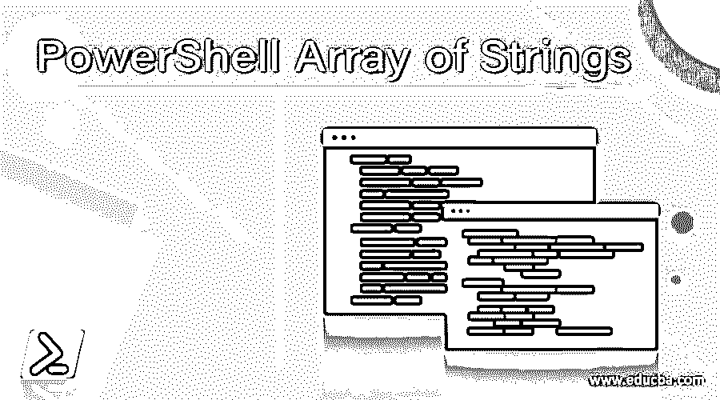
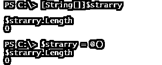
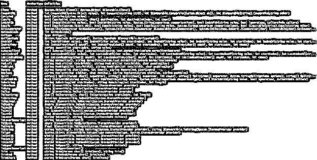
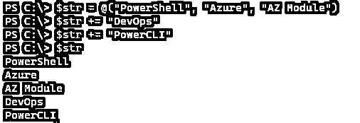
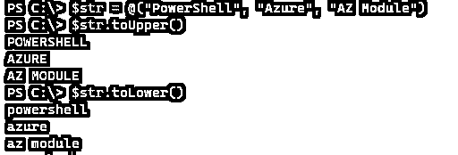
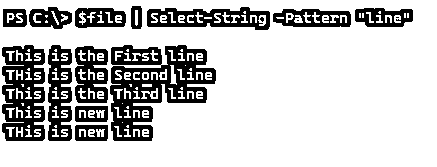

# PowerShell 字符串数组

> 原文：<https://www.educba.com/powershell-array-of-strings/>

## PowerShell 字符串数组的定义

PowerShell 字符串数组是字符串对象的集合，即多个字符串驻留在同一个集合中，可以使用 String[]、@()或 ArrayList 进行声明，并且可以以各种方式使用，如函数、在文件内容中作为变量，并且可以对字符串数组执行多种操作，如拆分、连接、修剪、ToUpper、ToLower 等。

**语法:**

<small>Hadoop、数据科学、统计学&其他</small>

很少使用方法来声明 PowerShell 字符串数组。

**使用变量声明作为数据类型。**

`[String[]]`

**使用空数组声明**

`$str = @()`

**使用数组列表。**

`[System.Collections.Arraylist]@()`

### 如何在 PowerShell 中创建字符串数组？

如上面的语法所示，我们可以利用这些方法来创建字符串数组。
要创建一个字符串数组，我们可以声明变量名。

`[String[]]$var = "PowerShell", "String", "Array"`

另一种方法是使用@()创建。

`$strarry = @("PowerShell", "String", "Array")`

另一种方法是创建 system.collections.arraylist 类方法，如下所示。

`New-Object -TypeName System.Collections.ArrayList
$arrlist = [System.Collections.ArrayList]@("PowerShell", "String", "Array")
$arrlist`

### PowerShell 中的字符串数组是如何工作的？

当我们只声明单个字符串时，它可以表示如下。

`$str = "This is a PowerShell String"
$str`

**输出:**

当我们检查它的数据类型时，它是字符串类型。

`$str.GetType()`

可以检查 typeName 是字符串，BaseType 是系统。对象。

当我们添加多个字符串时

`$str = "This is a PowerShell String", "This is a second string"
$str`

**输出:**

此变量的数据类型。

`$str.GetType()`

您可以看到类型被转换为 Object[]，基类型被转换为 system . array。Object[]array 意味着它可以接受多个字符串。

**字符串数组索引**

为了检查我们输入的字符串的长度，

`$str.Length`

当您声明字符串数组时，它的长度为 0。

`[String[]]$strarry
$strarry.Length`

或者

`$strarry = @()
$strarry.Length`

**输出:**

一旦我们添加了条目，它们的长度就会增加，实际上，它在索引部分起作用。每次我们将条目添加到字符串数组中，它的索引就增加 1，并从 0 开始。

`[String[]]$str = "First String", "Second String", "Third String"
Write-Output "0th Index: $($str[0])"
Write-Output "2nd Index: $($str[1])"`

**输出:**

显然，不存在的索引不会得到任何输出，或者会抛出一个异常，比如 index 4 不存在，所以$Str[4]不会给出任何输出。

**这里——字符串方法——没用**

该字符串也可以用 Hare-String 方法声明。这个方法是一个自由文本格式，我们可以在 Here-String 方法中输入任意数量的字符串，但是让我们看看它是只有一个字符串还是字符串数组。

`$hashstr = @'
First String
Second String
Third String
'@`

上面的$hashstr 给出了三个字符串作为输出。

当我们检查它的长度时，

`$hashstr.Length`

**输出:**

它没有给出长度 3，但是它计算了这个词的意思，这里的字符串不能被认为是一个字符串数组，而是一个字符串。见下面的证明。

`$hashstr.Count`

**输出:**

总计数为 1 意味着它被视为单个字符串。

### 字符串数组支持的方法

当我们需要对字符串数组执行各种操作时，我们总是需要检查操作支持哪些方法。

一旦我们创建了一个字符串数组，我们可以使用下面的命令来查找方法。

`$str | Get-Member -MemberType Method`

**获取内容方法**

当您使用 Get-Content 命令检索任何文件内容时，它会自动转换为系统数组。例如，我们在 C:\temp 位置存储了一个名为 Test.txt 的文本文件。我们将检查它的数据类型，

`$file = Get-Content C:\Temp\test.txt
$file.GetType()`

**输出:**

### 例子

让我们讨论 PowerShell 字符串数组的例子。

#### 示例#1:向数组字符串添加值。

我们可以使用

`$str = @("PowerShell", "Azure", "AZ Module")`

我们有了上面的字符串数组，要将值添加到字符串数组中，

`$str += "DevOps"
$str += "PowerCLI"
$str`

**输出:**

#### 示例 2:使用 PowerShell 更改字符串数组的大小写。

您可以将字符串数组改为大写或小写，为此，您需要使用 ToUpper()或 ToLower()

`$str = @("PowerShell", "Azure", "AZ Module")
$str.toUpper()
$str.toLower()`

**输出:**

#### 示例 3:使用 String ArrayList 方法向数组中添加值。

当我们声明一个简单的字符串数组时，我们不能使用 add()或 remove()来添加或删除数组中的值，因为它是用固定大小创建的。请参见下面的示例。

`$str = @("PowerShell", "Azure", "AZ Module")
$str.Add("PowerCLI")`

**输出:**

要检查字符串数组是否是固定大小的，

`$str.IsFixedSize`

**输出:**

为了解决上述问题，我们可以使用字符串的 ArrayList，而不是创建一个固定大小的数组。

`New-Object -TypeName System.Collections.ArrayList
$arrlist = [System.Collections.Arraylist]@("PowerShell", "Azure")
$arrlist.Add("PowerCLI")
$arrlist.Add("DevOps")`

**输出:**

要从数组列表中移除该值，

`$arrlist.Remove("Azure")
$arrlist`

**输出:**

#### 例 4:检查字符串数组是否包含特定的字符串。

我们需要使用 Contains()方法来检查字符串数组是否包含任何特定的字符串。

`$str = @("PowerShell", "Azure", "AZ Module", "DevOps", "AzCLI")
$str.Contains("Azure")
$str.Contains("Dev")`

**输出:**

通配符不支持这种方法。

`$str.Contains("*Module*")
False`

#### 示例 5:使用 Select-String 命令从字符串数组中进行搜索。

当我们处理字符串数组格式的文件时，如果我们需要从该文件中检索特定的行或匹配的行，我们可以使用如下所示的 Select-String 方法。

`$file = Get-Content C:\Temp\test.txt
$file
$file | Select-String -Pattern "new"
$file | Select-String -Pattern "line"`

**输出:**

### 结论

PowerShell 字符串数组在自动化工程师的日常生活中非常有用，我们需要在脚本中使用它来操作项目、从字符串中检索特定数据、替换数据以及以文本格式存储命令输出。

### 推荐文章

这是一个 PowerShell 字符串数组的指南。这里我们讨论定义、语法和参数，字符串数组在 PowerShell 中是如何工作的？代码实现示例。您也可以看看以下文章，了解更多信息–

1.  [PowerShell 多行字符串](https://www.educba.com/powershell-multiline-string/)
2.  [PowerShell 批处理文件](https://www.educba.com/powershell-batch-file/)
3.  [PowerShell do while](https://www.educba.com/powershell-do-while/)
4.  [PowerShell 字典](https://www.educba.com/powershell-dictionary/)

