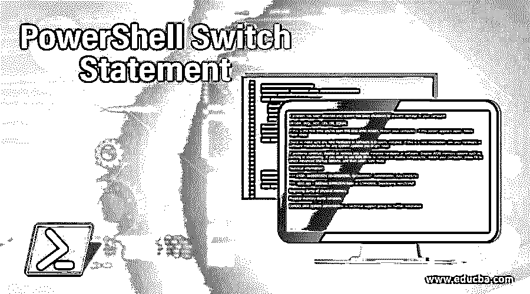
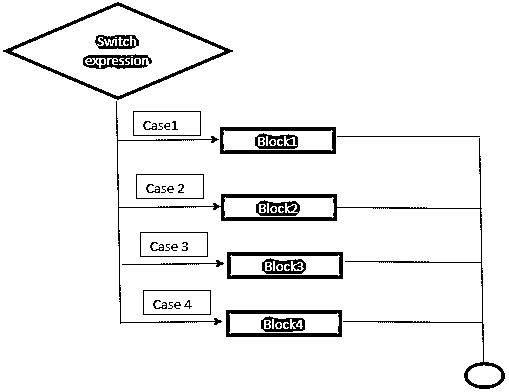
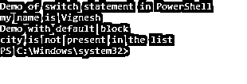

# PowerShell 开关语句

> 原文：<https://www.educba.com/powershell-switch-statement/>

## PowerShell 开关语句简介

PowerShell 中的 switch 语句与其他编程语言中的 switch 语句相同。switch 语句用于评估预定义的条件列表，换句话说，它相当于多个 if 语句。switch 语句有一个条件序列，每个条件都有自己要执行的操作。只要条件匹配，就会执行相应的操作。switch 语句中的每个条件都被视为一个案例，并且针对每个案例检查执行 switch 语句的值。本文将详细介绍 switch case 语句。有一个默认块来处理与任何情况都不匹配的值。

### 句法

switch 语句的基本语法/结构如下

<small>Hadoop、数据科学、统计学&其他</small>

`switch(<valueToBeChecked>) {
<condition> {<actionToBePerformed>}
break;
<condition> {< actionToBePerformed >}
break;
<condition> {< actionToBePerformed >}
break;
Default {< actionToBePerformed >}
}`

**代码:**

`switch (Jan)
{
Jan  {"It is Jan."}
Feb  {"It is Feb."}
Mar  {"It is Mar."}
Apr  {"It is Apr."}
}`

上面的代码将产生“It is Jan”的输出。

**语法#1**

switch 语句的其他详细语法如下

`switch [-regex|-wildcard|-exact][-casesensitive] (<value>)
{
"string"|number|variable|{ expression } { statementlist }
default { statementlist }
}`

**语法#2**

`switch [-regex|-wildcard|-exact][-casesensitive] -file filename
{
"string"|number|variable|{ expression } { statementlist }
default { statementlist }
}`

### PowerShell 开关语句流程图

下面是流程图:

**Switch 语句的要点:**

*   对象或对象数组都可以用作开关变量。
*   在一个开关中可以有任意数量的 case 语句。默认块和动作块是可选的。
*   开关变量和 case 变量必须是相同的数据类型。它应该是常量或文字。
*   只要匹配了一个大小写，就执行后面的语句，直到遇到 break 语句。
*   当遇到 break 语句时，switch 语句终止。控制转移到 break 之后的下一条语句。
*   没有必要让每个事例都有一个断点。如果没有断点，则执行后续语句，直到遇到断点。

### 因素

以下是开关的参数。

*   **通配符:**这表示被检查的条件是通配符字符串。如果匹配子句不是字符串类型，则不考虑相应的参数。这是不区分大小写的比较。
*   **精确:**它表示必须存在精确匹配。如果匹配子句不是字符串类型，则不考虑相应的参数。它不区分大小写。
*   **区分大小写:**表示匹配区分大小写。如果匹配子句不是字符串类型，则不考虑相应的参数。
*   **文件:**输入取自一个文件。在指定多个文件的情况下，只有最后一个文件用于比较。每一行都由 switch 语句计算。它不区分大小写。
*   **Regex:** 表示匹配时必须考虑正则表达式。如果匹配子句不是字符串类型，则不考虑相应的参数。

### 实现 PowerShell Switch 语句的示例

下面是提到的例子:

#### 示例#1

**代码:**

`Write-Host "Demo of switch statement in PowerShell"
$name="vignesh"
switch($name)
{
"ram" {"my name is ram";break}
"raman" {"my name is raman";break}
"ramu" {"my name is ramu";break}
"Vignesh" {"my name is Vignesh";break}
"ram123" {"my name is ram123";break}
"ram45" {"my name is ram454";break}
"ramfdgdf" {"my name is ramdfgfdg";break}
"ramfgdf" {"my name is ramdgfdg";break}
"ramfgdfg" {"my name is ramdgg";break}
}
Write-Host "Demo with default block"
$city="NewYork"
switch($city)
{
"Tn" {"city name is TN";break}
"as" {"city name is as";break}
"sd" {"city name is sd";break}
"gf" {"city name is gf";break}
"gujarat" {"city name is gujarat";break}
"wqe" {"city name is wqe";break}
"ewrewr" {"city name is ewrewr";break}
"wer" {"city name is wer";break}
"ewr" {"city name is ewr";break}
default {"city is not present in the list";break}
}`

**输出:**

#### 示例#2

**代码:**

`Write-Host "Demo of switch statement with array as input in PowerShell"
$name="vignesh"
$name1="Krishnakumar"
$name2="Nandhini"
$name3="Vyapini"
switch($name,$name1,$name2,$name3)
{
"Krishnakumar" {"my name is Krishnakumar";break}
"Nandhini" {"my name is Nandhini";break}
"ramu" {"my name is ramu";break}
"Vignesh" {"my name is Vignesh";break}
"ram123" {"my name is ram123";break}
"ram45" {"my name is ram454";break}
"ramfdgdf" {"my name is ramdfgfdg";break}
"ramfgdf" {"my name is ramdgfdg";break}
"Vyapini" {"my name is Vyapini";break}
}
Write-Host "Demo with default block"
$city="NewYork"
$city1="Tn"
$city2="gujarat"
$city3="Texas"
$city4="albama"
switch($city,$city1,$city2,$city3,$city4)
{
"Tn" {"city name is TN"}
"as" {"city name is as"}
"sd" {"city name is sd"}
"gf" {"city name is gf"}
"gujarat" {"city name is gujarat"}
"Texas" {"city name is texas"}
"ewrewr" {"city name is ewrewr";}
"wer" {"city name is wer"}
"NewYork" {"city name is NewYork"}
default {"city is not present in the list";break}
}`

**输出:**

**解释:**在上面的例子中，如果仔细观察，在第一个 switch 语句中，只打印了第一个匹配项。这是因为一旦找到匹配，就会执行相应的 break 语句，并退出 switch case。在第二个 switch 案例中，找到了所有匹配的值，因为没有为每个案例编写 break 语句。

#### 示例#3

**代码:**

`write-host "Demo of execution with and without break statement"
Write-Host "Demo of execution without break statement" -ForegroundColor Yellow
$Pm="Modi"
switch($pm)
{
"Modi" {"PM is Modi"}
"Indira gandhi" {"PM was Indira gandhi"}
"vallu" {"PM was Indira gandhi"}
"test" {"PM was Indira test"}
default {"none"}
"Modi" {"execution is done even after first match"}
}
Write-Host "Execution of switch with break statement" -ForegroundColor Yellow
switch($pm)
{
"Modi" {"PM is Modi";break}
"Indira gandhi" {"PM was Indira gandhi;break"}
"vallu" {"PM was Indira gandhi;break"}
"test" {"PM was Indira test;break"}
default {"none;break"}
"Modi" {"execution is done even after first match;break"}
}`

**输出:**

**解释:**在上面的输出中，除了第一个开关用例没有 break 语句之外，相同的开关用例使用了相同的输入参数。正如您从上面看到的，如果没有使用 break，那么即使在成功匹配之后执行也会继续，而使用 break 时不会发生这种情况。

### 结论

因此，本文详细介绍了 PowerShell 中的 switch case 语句。它还用适当的例子解释了 switch case 语句及其语法的执行。了解这方面更多信息的最佳方式是尝试其他各种方法，并在示例脚本中实践它们。

### 推荐文章

这是 PowerShell Switch 语句指南。在这里，我们讨论语法、切换语句的流程图以及用适当的代码和输出实现的示例。您也可以浏览我们的其他相关文章，了解更多信息——

1.  [PowerShell 将字符串转换为日期](https://www.educba.com/powershell-convert-string-to-date/)
2.  [PowerShell 获取进程](https://www.educba.com/powershell-get-process/)
3.  [PowerShell 通配符的类型](https://www.educba.com/powershell-wildcards/)
4.  [PowerShell If-Not |示例](https://www.educba.com/powershell-if-not/)
5.  [PowerShell 重命名文件夹示例指南](https://www.educba.com/powershell-rename-folder/)
6.  [PowerShell 发送邮件|示例](https://www.educba.com/powershell-send-mail/)

