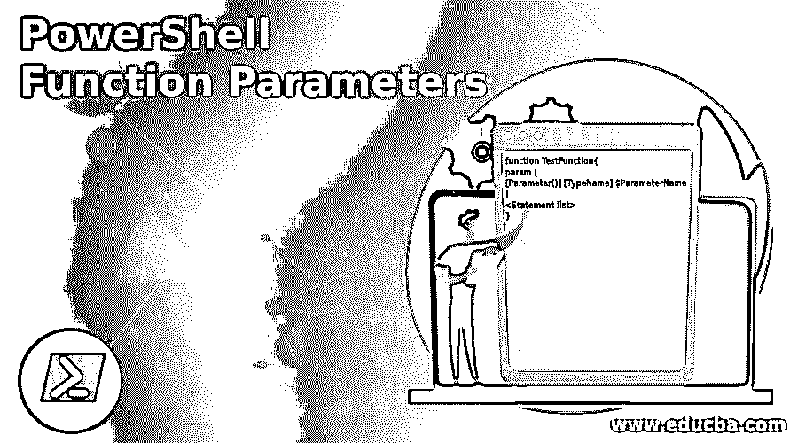
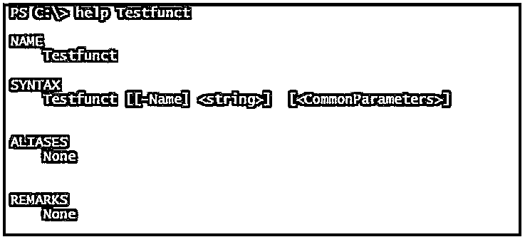
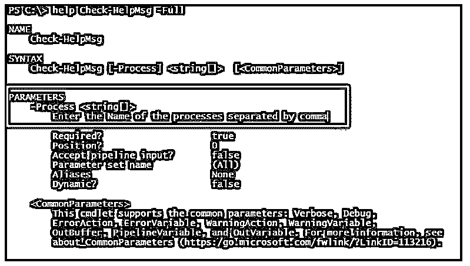
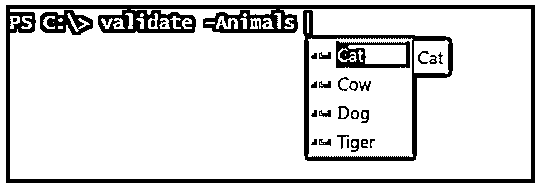

# PowerShell 函数参数

> 原文：<https://www.educba.com/powershell-function-parameters/>

## PowerShell 函数参数简介

PowerShell 函数参数通过使用属性和参数来限制用户输入某些值，从而使函数更加丰富。它添加了一些检查和验证来避免为它们编写冗长的代码，并且它们易于使用。一旦声明了函数参数，也可以用命令行传递参数。函数参数包括命名参数、位置参数、开关参数和动态参数。函数参数也有助于将简单函数转换为高级函数。

### PowerShell 函数参数的语法

函数中的参数通常在 Param()块中描述。

<small>Hadoop、数据科学、统计学&其他</small>

**1。单参数命名参数语法。**

`function TestFunction{
param (
[Parameter()] [TypeName] $ParameterName
)
<Statement list>
}`

在上面的例子中，我们可以添加多个参数值。有不同的命名参数属性，如 Mandatory、ValueFromPipeline、Position、ParameterSetName 等。Typename 是 ParameterName 的数据类型，如字符串、整数、字符。

**2。高级函数的命名参数语法。**

当我们添加 Cmdletbinding 属性时，它会将一个函数转换为高级函数。创建高级函数时，该函数使用其他通用参数。

`function TestFunction{
[CmdletBinding()] param (
[Parameter()] [TypeName] $ParameterName
)
<Statement list>
}`

**3。带属性的参数。**

形容词（adjective 的缩写）只有一个参数的参数。

`function testparam{
param(
[Parameter(Argument=Value)] [ParameterType] $ParameterName)
}`

b.具有多个参数的参数。

`function testparam{
param(
[Parameter(Argument1=Value1,
Argument2=Value2)] [ParameterType] $ParameterName)
}`

4.参数集语法。

`function testparam{
Param(
[Parameter(AttributeValue1)] [ParameterType] [$ParameterName],
[Parameter(AttributeValue2)] [ParameterType] [$ParameterName] )
}`

### PowerShell 中的函数参数是如何工作的？

当我们使用函数参数时，以及当 PowerShell 调用函数时，它首先检查函数中声明的参数，比如该参数是否声明为强制参数或指定了来自管道的值或任何其他指定的参数。

您也可以使用命令行传递这些参数。

**举例:**

**代码:**

`function Testfunct{
param(
[Parameter (Mandatory = $false)] [String]$Name
)
Write-Output "Name : $name"
}`

您可以如下所示传递参数。

**代码:**

`Testfunct -Name "PowerShell"`

您也可以使用该功能的帮助来获得可用的参数。

**输出:**

### PowerShell 函数参数的示例

以下是 PowerShell 函数参数的示例:

#### 示例#1

没有参数块的简单函数。

在下面的示例中，只定义了参数块，而没有定义参数块。我们简单地用 String 数据类型声明了 Name 变量。

**代码:**

`Function PrintName{
param(
[String]$Name
)
Write-Output "Hello : $name !!! "
}
PrintName -Name PowerShell`

**输出:**

#### 实施例 2

带有强制参数的函数。

用$true value 指定强制参数时，调用函数时必须传递变量值；否则，会产生错误。

第一个例子相当于强制参数为 false。

**代码:**

`Function PrintName{
Param(
[Parameter(Mandatory=$false)] [String]$Name
)
Write-Output "Hello : $name !!! "
}
PrintName`

如果你直接调用一个函数而没有指定任何值，那么它不会给出任何错误。

**输出:**

如果将强制参数指定为 true，并在不传递任何值的情况下调用函数，那么它将要求值，如果不指定时间，那么它将生成函数错误。

提供价值。

而不提供强制值。

上面的输出生成了参数绑定异常。

#### 实施例 3

带位置参数的函数。

当我们用位置参数指定一个函数时，关键字(Position)，你不需要指定参数的名字。对于位置参数，这不是必需的，也不是强制性的。

**代码:**

`Function Get-ServersInfo{
Param(
[Parameter(Mandatory=$true,Position=0)] [String[]]$ComputerName
)
Write-Output "Computers :"
$ComputerName
}
Get-ServersInfo Computer1,Computer2`

**输出:**

在上面的例子中，函数 Get-ServersInfo 使用默认的位置参数 Position=0，所以我们直接传递了计算机名。如果我们有多个位置参数，那么我们将用每个参数名来增加位置。

**代码:**

`Function Get-ServersInfo{
Param(
[Parameter(Mandatory=$true,Position=1)] [Int]$port,
[Parameter(Mandatory=$true,Position=0)] [String[]]$ComputerName
)
Write-Output "Computers :"
$ComputerName
}
Get-ServersInfo Computer1,Computer2 8080`

**输出:**

在上面的例子中，即使我们首先声明了 port 变量，但是它的位置值是 1，而 ComputerName 变量的位置值是 0，所以它首先取计算机名。

#### 实施例 4

具有 ValueFromPipeline 属性的函数参数。

当 ValueFromPipeline 值设置为 true 时，我们可以使用管道传递变量。

**代码:**

`Function Get-ProcessInfo{
Param(
[Parameter(Mandatory=$true,
ValueFromPipeline=$true)] [String[]]$Process
)
Get-Process -Process $Process
}
“Notepad” | Get-ProcessInfo`

**输出:**

当我们使用 Pipeline 传递多个进程时，它可能不工作，但是通过直接传递值，同样可以工作。

使用管道传递值。

在这种情况下，我们可以使用 Begin、Process 和 End 块。

**代码:**

`Function Get-ProcessInfo{
Param(
[Parameter(Mandatory=$true,
ValueFromPipeline=$true)] [String[]]$Process
)
Begin{}
Process{Get-Process $Process}
end{}
}
“Notepad”,”Winword” | Get-ProcessInfo`

**输出:**

#### 实施例 5

具有开关属性的函数参数。

像开关函数一样，我们可以在函数中使用开关参数。在下面的例子中，如果我们将 reboot 开关值设置为 true，那么将执行 true 块；否则，将执行假块。

**代码:**

`Function Check-Switch{
param(
[Parameter(Mandatory=$false,Position=0)] [Switch]$Reboot
)
if($Reboot){"Server Reboot requested"}
else{"Server will not reboot"}
}
Check-Switch $true
Check-Switch $false`

**输出:**

#### 实施例 6

带有帮助消息的函数参数。

当您需要显示参数的描述或需要放置与该参数相关的任何帮助命令时，您可以使用 HelpMessage 功能。要显示消息，您需要使用 Get-Help 命令。

**代码:**

`Function Check-HelpMsg{
param(
[Parameter(Mandatory=$true,HelpMessage="Enter the Name of the processes separated by comma")] [String[]]$Process
)
Begin{}
Process{Get-Process $Process}
End{}
}
help Check-HelpMsg -Full`

**输出:**

#### 实施例 7

具有验证集属性的函数参数。

不用在脚本中编写长时间的验证，我们可以直接在参数块中用验证集提供验证。

**代码:**

`Function Validate{
param(
[Parameter(Mandatory=$true)] [ValidateSet("Cat","Dog","Cow","Tiger")] [String[]]$Animals,
[Parameter(Mandatory=$true)] [ValidateRange(10,20)] [Int]$Age
)
Write-Output "Animals:"
$Animals
Write-Output "Age: $Age"
}
validate -Animals
validate -Animals Dog,Cow -Age 15`

**输出:**

当您键入验证集中定义的参数名称时，它会弹出值。这适用于 ISE，但可能不会出现在不同的控制台中。在这种情况下，我们可以使用。

验证范围内的值。

验证范围之外的值会引发异常。

### 结论

PowerShell 函数参数非常有用，正如我们在上面的例子中看到的。它通过在函数的开头指定它们来降低代码的复杂性，并且我们不需要编写额外的代码来验证数据。我们可以使用异常处理机制来处理异常。

### 推荐文章

这是 PowerShell 函数参数的指南。这里我们讨论一下入门，PowerShell 中的函数参数是如何工作的？还有例子。您也可以看看以下文章，了解更多信息–

1.  [PowerShell 执行策略](https://www.educba.com/powershell-execution-policy/)
2.  [PowerShell 睡眠](https://www.educba.com/powershell-sleep/)
3.  [PowerShell 子串](https://www.educba.com/powershell-substring/)
4.  [PowerShell 启动进程](https://www.educba.com/powershell-start-process/)

