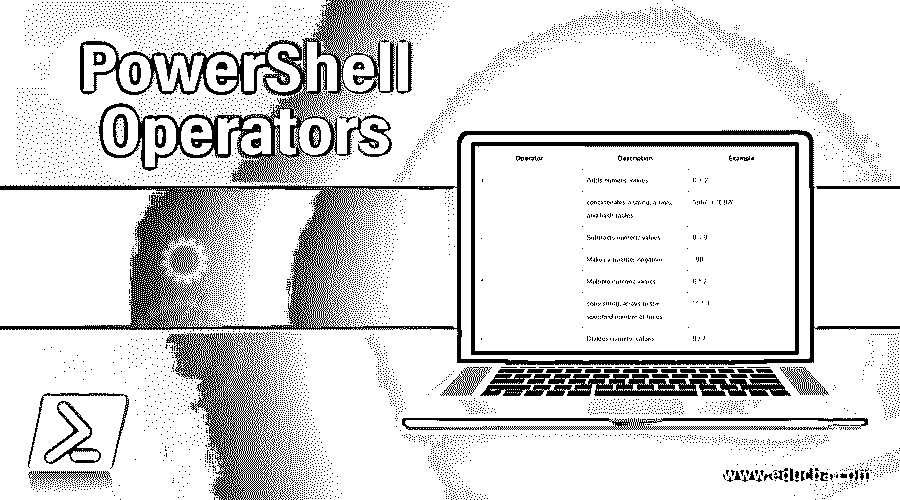

# PowerShell 操作员

> 原文：<https://www.educba.com/powershell-operators/>

## 什么是 PowerShell 操作员？

我们大多使用 PowerShell 操作符来执行命令。如果你想做些什么，你可以在网上搜索命令，复制命令并粘贴到命令提示符或 PowerShell 中。但是真正的 PowerShell 是一个面向对象的自动化工具，而不是 DOS 命令行界面。

### PowerShell 操作员

在这一节中，我将解释 PowerShell 支持的常用操作符。但是它有很多运营商。我在下面列出的，

<small>Hadoop、数据科学、统计学&其他</small>

1.  算术运算符(+、-、*、/、%)
2.  赋值运算符(=、+=、-=、*=、/=、%=)
3.  比较运算符
    *   相等运算符(-eq，-ne，-gt，-lt，-le，-ge)
    *   匹配运算符(-match，-notmatch，-replace)
    *   包含比较运算符(-in，-notin，-contains，-notcontains)
4.  逻辑运算符(-and，-or，-xor，-not，！)
5.  重定向运算符(>、>>和> &1)
6.  拆分和连接运算符(-split，-join)
7.  类型运算符(-is，-isnot，-as)
8.  一元运算符(++，–)
9.  特殊操作员

### 不同类型的 PowerShell 操作员

PowerShell 操作器很容易使用。这里我们将借助例子讨论[如何使用 PowerShell](https://www.educba.com/how-to-use-powershell/) 操作符。

#### 1.算术运算符

算术运算符计算数值。你可以做加、减、乘、除、余数运算。此外,+和*对字符串、数组和哈希表进行操作。

| **操作员** | **描述** | **例子** |
| + | 添加数值 | 6 + 2 |
|  | 串联字符串、数组和哈希表 | “edu”+“CBA” |
| – | 减去数值 | 8 – 9 |
|  | 使数字为负数 | -98 |
| * | 多个数值 | 6 * 2 |
|  | 将字符串、数组复制到指定的次数 | “!” * 3 |
| / | 将数值相除 | 9 / 7 |
| % | 除法运算后给出余数 | 9 % 3 |

#### 2.赋值运算符

PowerShell 赋值运算符为变量赋值、更改或追加值。

| **操作员** | **描述** | **例子** |
| = | 给变量赋值 | $a = 3 |
| += | 向变量添加值并赋值 | $a += 4 |
|  | 在末尾连接字符串 | $b = "Hello，"
$b += "World " |
|  | 向数组中添加数字 | $a = 1，2，3
$a += 2 |
| -= | 减去并赋值给变量 | $a -= 9 |
| *= | 将变量相乘并赋值 | $a *= 2 |
|  | 将字符串追加指定的次数 | $e = "String "
$e * 5 |
| /= | 除以并给变量赋值 | $a /= 7 |
| %= | 将变量除以一个余数值 | $a %= 3 |

#### 3.比较运算符

*   **相等运算符**

检查值是否相等。这包括数字、字符串、数组。它将返回 True 或 False 结果。

| **操作员** | **描述** | **例子** |
| -情商 | 检查等值 | 1-等式 1 |
|  | 检查相等的数组 | 1，2，3-等式 2 |
|  | 检查相等的字符串 | “你好”——情商“世界” |
| -是吗 | 检查不相等的值 | 1 -ne 2 |
|  | 检查不相等的数组 | 一二三二 |
|  | 检查不相等的字符串 | “你好”——ne“世界” |
| -gt | 检查更大的价值 | 8 -gt 6 |
|  | 检查数组中所有较大的值，并逐一打印 | 7，8，9 -gt 8 |
| -葛 | 检查更大或相等的值 | 8-锗 8 |
|  | 检查数组中所有较大的值或相等的值，并逐一打印 | 7，8，9-第八季 |
| -中尉 | 检查较小的值 | 8 -lt 6 |
|  | 检查数组中所有较小的值，并逐一打印 | 7，8，9 -lt 8 |
| 表示器具名称:bridle ｜ thimble | 检查较小或相等的值 | 6-乐 8 |
|  | 检查数组中所有较小的值或相等的值，并逐一打印 | 七，八，九-乐八 |

*   **匹配运算符**

这些 PowerShell 操作符能够使用通配符表达式找到具有特定模式的元素。

| **操作员** | **描述** | **例子** |
| -匹配 | 用指定的正则表达式匹配字符串 | “星期天”、“星期一”、“星期二”——匹配“太阳” |
| -不匹配 | 不匹配具有指定正则表达式的字符串 | “星期天”、“星期一”、“星期二”——不匹配“太阳” |
| -更换 | 检查给定的字符串并替换为指定的字符串 | "书"-替换" B "，" C " |

*   **安全壳比较运算符**

这些 PowerShell 操作符用于检查数组中是否存在指定的元素或数组。

| **操作员** | **描述** | **例子** |
| -包含 | 检查数组中是否存在指定的元素 | “红色”、“黄色”——包含“红色” |
| -不包含 | 检查指定元素在数组中是否不存在 | “红色”、“黄色”——不包含“绿色” |
| 构成有机化合物、药品、蛋白质等的名称 | 检查数组中是否存在指定的元素 | “红色”——在“红色”、“黄色”中 |
| -notin | 检查指定元素在数组中是否不存在 | “绿色”——不是“红色”、“黄色” |

**注**:contains 和 in 做同一个运算，操作数顺序不同，在“contains”中我们取右边的值来对照左边的值进行检查。但是在“in”中，我们用左边的值来检查右边的值。

#### 4.逻辑运算符

它还允许我们使用逻辑运算，如 AND、OR、NOT、XOR。

| **操作员** | **描述** | **例子** |
| 表示“对象”:　analysand | 这两种说法都是真的。 | 1-和 1 |
| 表示“…人” | 任何一个陈述都是真实的。 | 1 或 0 |
| -异或 | 当陈述中只有一个为真时，为真。 | 1-异或 0 |
| -不是 | 否定该语句。 | -不是 1 |
| ! | 否定该声明 | ! Zero |

#### 5.重定向运算符

它们用于将一个命令的输出重定向为另一个命令的输入。

| **操作员** | **描述** | **例子** |
| > | 将所有成功流数据发送到输出 | .\script.ps1 > script.log |
| >> | 将所有成功流数据追加到输出中 | .\script.ps1 >> script.log |
| n>&1 | 将指定流(n)重定向到输出 | .\script.ps1 3>&1 script.log |

**注**:

*   3 > & 1–用于警告重定向
*   2 > & 1–用于错误重定向

#### 6.拆分和连接运算符

这个 PowerShell 操作符用于将一个命令的输出重定向为另一个命令的输入。'

| **操作员** | **描述** | **例子** |
| -分裂 | 根据分隔符将字符串拆分为子字符串 | ——拆分“一二三四” |
|  | 用指定的分隔符拆分字符串 | "姓氏:名字:地址"-拆分":" |
| -加入 | 将给定的字符串连接到单个字符串 | -加入“a”，“b”，“c” |

#### 7.类型运算符

类型运算符判断给定对象是否是指定。网络类型。

| **操作员** | **描述** | **例子** |
| -是 | 比较指定的实例。NET 类型，如果相等则返回 True。 | 32-是“整数” |
| -不是吗 | 比较指定的实例。如果不相等，则返回 False。 | 32 -isNot “int” |
| -作为 | 将给定值转换为指定的类型 | “12/31/07” -as [DateTime] |

#### 8.一元运算符

这些是 PowerShell 中的快速递增和递减运算符。主要用于迭代。

| **操作员** | **描述** | **例子** |
| ++ | 将值递增 1 并赋值回 | $a = 9$a++ |
| — | 将值减 1 并赋值回 | $a = 9$ a– |

#### 9.特殊操作员

PowerShell 特殊操作员有不适合任何其他组的特定用例。

| **操作员** | **描述** | **例子** |
| @( ) | 将一个或多个语句的结果显示为列表。 | @(Get-wmio object win32 _ logical disk) |
| “&”号 | 运行命令、脚本或块。 | $c = “get-executionpolicy”& $c |
| [ ] | 将对象转换为指定类型 | [int64]$a = 34 |
| , | 逗号创建一个数组。 | $myArray = 1,2,3 |
| -f | 格式运算符，通过格式方法格式化字符串 | “{0} {1，-10 } { 2:N }”-f1，“你好”，[数学]::pi |
| .. | 生成一个范围 | 一个..f ' |

### 推荐文章

这是 PowerShell 操作人员的指南。这里我们已经详细讨论了基本概念以及各种类型的 PowerShell 操作符。您也可以浏览我们推荐的其他文章，了解更多信息——

1.  [Powershell 的用途](https://www.educba.com/uses-of-powershell/)
2.  [Windows 操作人员](https://www.educba.com/windows-operators/)
3.  [C 运算符](https://www.educba.com/c-operators/)
4.  [MySQL 操作符](https://www.educba.com/mysql-operators/)

