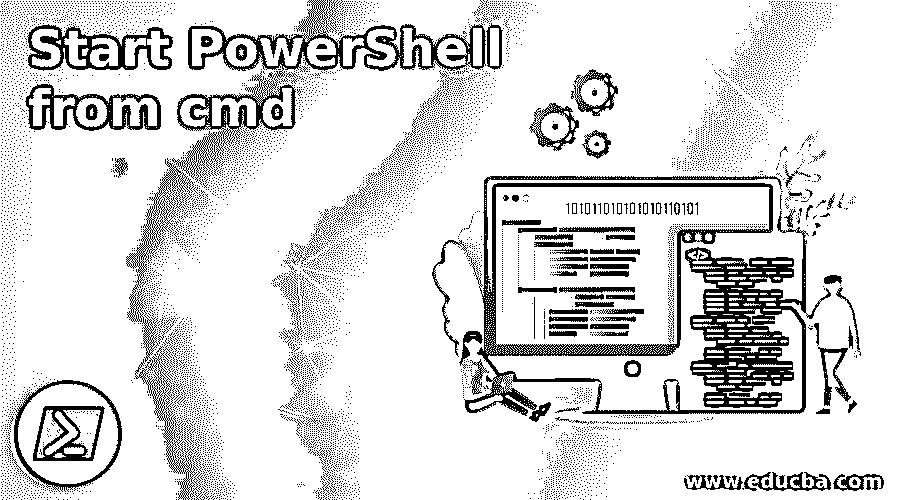
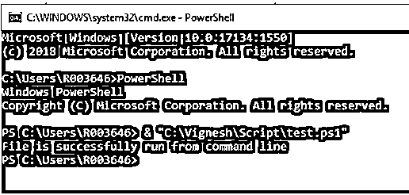
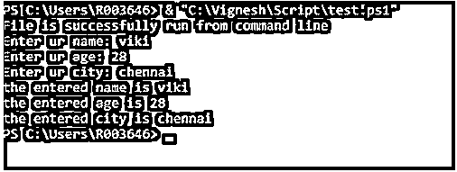

# 从 cmd 启动 PowerShell

> 原文：<https://www.educba.com/start-powershell-from-cmd/>

## 从 cmd 启动 PowerShell 简介

通过命令提示符启动 Powershell 或 Powershell 脚本是管理员的基本活动之一。命令提示符是一种用于执行命令的解释器应用程序。它通常被称为 cmd。它是通过按 winkey plus R 打开的。有不同的方式可以用来启动 powershell 和 powershell 脚本，包括作为管理员运行 PowerShell。由于命令提示符与命令一起工作，因此很容易使用和执行各种命令。本文将详细介绍使用 cmd 执行 Powershell 脚本的不同方法。

### 从 cmd 启动 PowerShell 的语法

下面是在以下操作系统中从命令提示符启动 Powershell 的语法。这适用于 Windows 7、Windows Server 2008 R2 版和 Windows Server 2008。

<small>Hadoop、数据科学、统计学&其他</small>

*   通过按 winkey + R 打开命令提示符，键入 Cmd
*   打开命令提示符后，键入 PowerShell

在以下操作系统中启动 PowerShell ISE Windows 7、Windows Server 2008 R2 和 Windows Server 2008。

`Open the command prompt by pressing winkey + R. Type Cmd`

`Once the command prompt is open, type PowerShell_ISE`

可以不用 PowerShell_ISE，单独用 ISE。

要打开 32 位版本的 PowerShell，可以从命令提示符运行以下命令

在 windows server 2012 中打开 32 位 PowerShell

`Open the command prompt`

`Type,%SystemRoot%\SysWOW64\WindowsPowerShell\v1.0\powershell.exe`

在 windows 8.1 和 windows 8 中打开 32 位 PowerShell

`Open the command prompt`

`Type,%SystemRoot%\SysWOW64\WindowsPowerShell\v1.0\powershell.exe`

以管理员模式运行来启动 PowerShell

`Open the command prompt`

`Start-Process PowerShell -Verb RunAs`

要从命令提示符运行 PowerShell 文件，请键入以下内容

powershell.exe " & ' c:\ Data \ test . PS1 ' "

在某些情况下，它可能会抛出一个错误，在这种情况下，应该将执行策略设置为远程签名。

set-execution policy remote signed

如果脚本在命令提示符下的当前目录中，那么。/test.ps1 将运行该脚本。如果文件路径中包含空格，则整个路径必须用双引号括起来，并且前面有一个&符号。

### 从 cmd 启动 PowerShell 的示例

下面是一些例子:

#### 示例#1

**在 windows 10 中从 cmd 执行 PowerShell 脚本:**在执行脚本之前，需要先开发脚本。让我们考虑一个将显示以下输出的脚本，“文件从命令行成功运行”。打开记事本，键入下面一行。

`Write-Host “File is successfully run from command line”.
Save this file with .ps1 extension.`

还有另一种创建脚本文件的方法。打开 Windows PowerShell ISE。单击文件选项并选择一个新文件。键入 Write-Host“文件从命令行成功运行”。保存文件。

**输入:**

以上是输入文件。要从命令提示符执行上述文件，请按照以下步骤操作。

*   按 winkey+ R
*   cmd 标牌
*   将会打开命令提示符。
*   键入 PowerShell，然后按 enter 键。

然后键入&“C:\ Vignesh \ Script \ test . PS1”，然后按 enter 键。该脚本将被执行，输出如下所示。

#### 实施例 2

在接收到来自用户的输入之后执行脚本

**输入:**

`Write-Host "File is successfully run from command line"
$uname=Read-Host "Enter ur name"
$age=Read-Host "Enter ur age"
$city=Read-Host "Enter ur city"
Write-Host "the entered name is" $uname
Write-Host "the entered age is" $age
Write-Host "the entered city is" $city`

**输出:**

要运行上述脚本，请在命令提示符下键入 PowerShell。然后&后跟双引号中的脚本路径，并按 enter 键。它会要求一个名字，然后是年龄和钦奈。一旦参数被传递，给定的输入将被打印出来，如上所示。如果由于执行策略而引发错误，则需要使用 set-execution policy cmdlet 修改执行策略。

#### 实施例 3

**使用输入参数执行脚本:**在许多情况下，脚本可能需要用户的输入来执行一些计算或执行。此时，用户需要的输入被配置为脚本中的参数。这是在 args 关键字的帮助下实现的。在声明参数时，甚至可以将它们的数据类型定义为 string、int 等。如果数据类型未知，我们可以忽略这一部分。这意味着参数可以接受字母和数字。如果一个脚本有一个参数，而在没有参数的情况下执行，它要么不会运行，要么可能不会产生预期的结果。下面的例子将展示如何从命令行向脚本传递参数。

**输入:**

`$username=$args[0] $age=$args[1] $city=$args[2] $wname=$args[3] $wage=$args[4] $wcity=$args[5] Write-Host "The user name is" $username
Write-Host "Age of the user is" $age
Write-Host "city of the user is" $city
Write-Host "The user's wife name is" $wname
Write-Host "Age of the user's wife is" $wage
Write-Host "city of the user's wife is" $wcity
$toal= $age + $wage
Write-Host "total age is 58"`

**输出:**

上面的脚本有六个参数。如果您可以从命令提示符看到，这六个参数被传递。因为参数是定位的，所以必须知道参数必须以相同的顺序传递，否则输出会出错。如果参数是用数据类型指定的，那么在提供参数时也必须记住这一点。在上面的例子中，参数是字符串类型的。如果参数是数据类型的，如果在传递参数时出现不匹配，那么将会抛出一个错误。即使参数的顺序改变了，脚本也不会按预期执行。从 cmdlet 运行脚本的最大缺点是，在开发和执行脚本时不可能调试脚本，因为不允许也不可能从命令提示符保存断点。建议在彻底测试脚本的可信度后，才使用命令提示符运行脚本。

### 结论

因此，本文详细介绍了从命令提示符运行 PowerShell 脚本。它涵盖了运行脚本的各种场景的示例，例如，不带参数，脚本提示用户输入，带参数运行脚本。要了解更多细节，建议编写示例脚本并练习它们。

### 推荐文章

这是从 cmd 启动 PowerShell 的指南。在这里，我们还将讨论从 cmd 启动 powershell 的介绍和语法，以及不同的示例及其代码实现。您也可以看看以下文章，了解更多信息–

1.  [PowerShell 睡眠](https://www.educba.com/powershell-sleep/)
2.  [WinRM PowerShell](https://www.educba.com/winrm-powershell/)
3.  [PowerShell 获取服务](https://www.educba.com/powershell-get-service/)
4.  [PowerShell 模块](https://www.educba.com/powershell-modules/)

